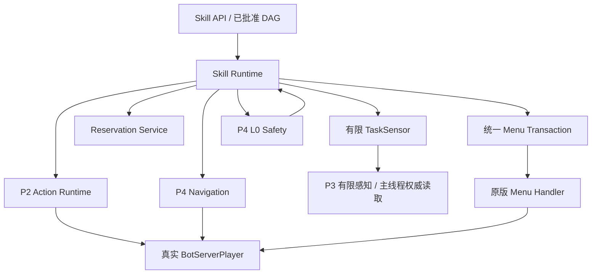
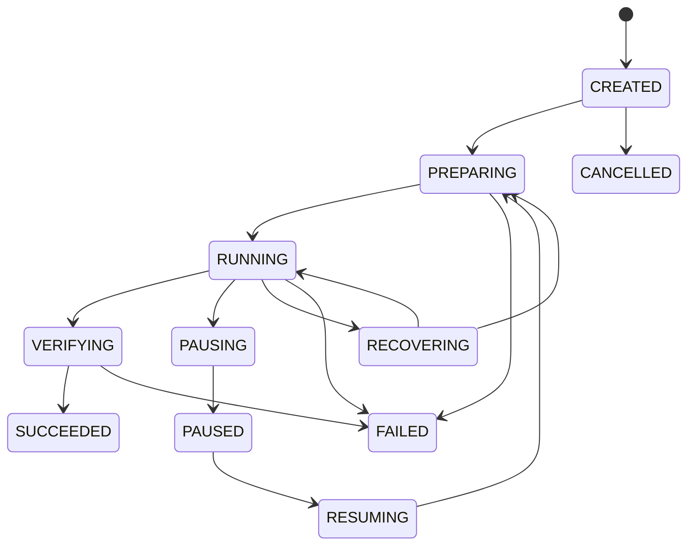

# BotPlayer P5 调研与 P5A-0 设计冻结

> 状态：P5A-0 设计已冻结；当前开发切片已编码，退出门未计数
>
> 更新日期：2026-08-01
>
> 适用版本：Minecraft Java 1.21.1、NeoForge 21.1.x、Java 21
>
> 决策记录：[ADR-0015](adr/0015-bounded-skill-runtime-and-menu-transactions.md)

本文把 P5A 从“会做一串动作”的路线图目标收敛为可编码、可恢复、可验证的运行时合同。
它同时记录 P4 退出门之后仍然存在的测试缺口，避免用 P5 的新功能掩盖 P4 的保留项。

本文是设计和验收基线，不是完成报告。某个类、枚举、测试源码或文档条目已经存在，不代表
对应能力已经通过 GameTest、重启恢复、客户端、独立专用服或多 Bot soak。

## 当前开发切片（本分支）

本分支当前实现计入有界 Skill 核心、局部 DAG 校验、TTL 资源预留原型、主动进食、扫描
carried inventory `0..35` 的基础盔甲升级，以及通用 `InventoryMenu SWAP_SEQUENCE`。
[PR #6](https://github.com/GreyTaiWolf/BotPlayer/pull/6) 的
[Build #137](https://github.com/GreyTaiWolf/BotPlayer/actions/runs/30713366812) 已通过 Java 21
`clean build`、Gradle `test`、83/83 GameTest 与 JAR 上传。源码静态计数为 380 个 JUnit
`@Test` 方法、26 个 P5 GameTest、353 个 Java 源文件；这三项不是 CI 日志逐项执行数。
“计入”不表示相关 P5A 能力、测试矩阵或退出门已经完成。

当前进食切片只接受无 `usingConvertsTo`、无声明有害效果且没有自定义完成逻辑的原版基础
`Item` 食物；腐肉、可疑炖菜、紫颂果、蜂蜜瓶和模组食物全部 fail-closed。这个保守边界
用于避免把 `FoodProperties.effects()` 误写成完整食用副作用模型，后续必须用显式消费
语义适配器扩展。

进食成功使用 `UseItem` 权威验证完成当刻冻结的 item count 与 food level 证据；下一
服务器 Tick 的活状态只用于非成功动作的保守补偿判断，不能反向改写已经完成的业务结果。

业务动作必须在独立 cleanup reserve 前结束；取消、抢占和失败后的终态延迟到临时槽位与
原快捷栏选择恢复之后。若原背包槽被原版拾取等外部行为占用，当前切片不搬动未知物品，
保留食物余量所在的临时快捷栏并以 `WORLD_CHANGED` 诚实失败；只有物品多重集无法解释或
动作补偿无法证明安全时，才通过动作运行时隔离整个 generation。

generation 生命周期关闭还必须同时取得动作运行时清理回执和独立背包布局回执；“没有
活动 action ticket/lease”不能替代此前已完成交换的补偿证明。窄化同步回执会核对
一次性 `runId` 布局租约、初始全背包结构化物品计数、同指纹食物总量、source/temp 槽、
menu cursor 与选择槽。目标食物只允许减少零或一个，非目标物品按身份聚合后的数量必须
完全相等；外部占用只有能证明为已有非目标物的槽位重排时才可提交。补偿 handler 无进展、
旧请求重放、远程查看者未关闭或任何增殖/丢失都不能取得安全回执。

该布局租约的完整不可变 payload（包括需要核对的 swap/selection 维度）与 `runId` 一起
进入一次性 fence；完成或释放后，同一 run 在该 generation 内不能重新武装。生命周期
只有在动作回执与布局回执都安全时才允许换代或复活：普通维度切换失败会直接关闭 Bot，
死亡失败会抑制自动复活；End 返回等 `ServerPlayer` replacement 只可把已取得权威的新
body 临时登记为旧 generation 的 cleanup target，不能新建租约，补偿成功后才
`attach/activate`，否则只为 teardown 绑定并断开。

断线与普通 generation 关闭的顺序不同：`ServerGamePacketListenerImpl.onDisconnect`
会保存并移除玩家，因此 listener 必须先原子撤销运行权威，再用绑定精确 body、listener、
底层 connection 与 generation 的 pending 记录执行物理补偿。只有 pre-save 回执落定后
才进入原版断线；同代回执只能保持或降级，post 阶段不得重新解释或修改已持久化布局，
只做幂等 teardown。replacement/respawn 未收敛只能排队重试一次；异常身份移除必须显式
抑制 `PlayerList.remove` 的玩家数据保存，不能把未验证的临时布局写回磁盘。

原生 `InventoryMenu` 适配器冻结 41 槽、cursor、选中槽与 stateId。通用
`SWAP_SEQUENCE` 接受 1～16 次点击、最多 8 个槽位，前向和 cleanup 每 Tick 最多派发一次
原生点击；取消、抢占和异常通过跨 Tick `PENDING` 收口到首次冻结的初始或最终安全端点，
旧 owner 与新 claimant 两张 ticket 在非端点均保持阻塞，progress revision 对每个精确
确认的物理前缀只递增一次。Build #137 的真实五步场景已验证这些合同。通用
equipment/offhand 槽仍 `UNSUPPORTED`；基础盔甲保留独立路径，热栏候选使用单击
`ClickType.SWAP`，主背包首次穿甲使用 2 步、替换已有盔甲使用 3 步。无法证明端点、权限
或布局守恒时 fail-closed；这不是无条件回滚，也不表示跨 menu 统一事务已完成。换甲按
HEAD/CHEST/LEGS/FEET 固定顺序逐件重规划，拒绝零耐久、不可装备、当前槽绑定和装备后
会绑定的候选，并在异步动作回执进入技能 FSM 后再次读取权威完整布局。

当前仍缺跨 menu 统一事务、`clicked()` 故障注入、生命周期 `PENDING` continuation、
TaskSensor/Reservation 生产接线、`Checkpoint`、工具/副手、有限自卫、
craft/chest/furnace/DAG 和完整生产链。两次服务器启动、独立专用服与多 Bot soak 也尚未
验证。上述未完成内容不得计入第 18 节退出门，能力矩阵成熟度保持不变。

## 1. 结论

P5A 的交付目标不是通用长期规划器，也不是完整原版生存 AI，而是：

1. 一个绑定 `botId + generation`、有界、确定性、可取消的 Skill 运行时；
2. 一个只编排已注册技能的局部 DAG，不承担 P7 的长期目标、承诺或记忆；
3. 一个受白名单约束的统一背包/世界 menu 事务层；
4. 一个不扩大 P3 全知范围的有限 `TaskSensor`；
5. 一个与 P4 L0 安全平面双向交接、但不允许安全代码绕过动作层的合同；
6. 一个只持久化纯数据检查点、重新上线后先复核世界再继续的恢复协议；
7. 一个带 TTL 的运行时资源预留服务；
8. 五个首批纵切片：主动进食、基础装备、撤退/有限自卫、3×9 单箱存取，以及木头到
   铁镐的第一条生产链。

范围冻结如下：

| 范围 | P5A | 延后 |
|---|---|---|
| 主动进食 | 是 | 更复杂食物生产和配餐策略可在 P5B 扩展 |
| 基础装备 | 是；盔甲、工具和普通副手选择 | 盾牌格挡、远程武器和高级战斗在 P5C |
| 撤退与自卫 | 是；单一、近距离、可安全脱战的基础近战 | 多目标、团队、PVP、Boss 和高级战斗在 P5C |
| 药水、牛奶、治疗物品 | 否 | P5B；战斗投掷药水仍在 P5C |
| 背包与 menu | 统一事务内核；背包、工作台、熔炉和 3×9 单箱白名单 | 广泛容器/工作站在 P5B，自定义 menu 在 P8 |
| 生产闭环 | 木头、工作台、木镐、石头、石镐、燃料、铁矿、熔炉、铁锭、铁镐 | 农业、畜牧、交易和全面生产在 P5B |
| 检查点恢复 | 同一 bot 重新上线后复核并恢复 | 自动上线/autoload 仍是独立生命周期前置 |
| 规划 | 当前请求内的有界 Skill DAG | 长期目标、承诺、跨会话推理在 P7 |

P5A 的中间里程碑是取得真实铁锭；阶段退出产物冻结为“从空背包取得至少三个真实铁锭，
再通过真实工作台制作一把铁镐并由权威背包核验”。铁锭里程碑和铁镐终点都必须通过同一套
故障恢复与物品守恒门。

## 2. 事实基线与调研结论

### 2.1 已经可以复用的底座

P5A 必须复用而不是重写以下已存在合同：

- P1 的 `BotServerPlayer`、稳定 bot 身份、runtime handle 与 generation；
- P2 的动作 FSM、幂等键、deadline、控制通道仲裁、原版玩家动作入口和动作证据；
- P2 的 41 格权威背包、bot 自身背包 menu 和真人访问写锁；
- P3 的有限认知快照、事件、短期事实、scoped revision 和失效语义；
- P4 的导航 session、真实玩家 follower、L0 `SafetyFrame` 和安全抢占；
- 原版 `playerdata`、配方、掉落、伤害、效果、事件和保护模组结果仍是最终权威。

技能不得创建第二份背包、第二套移动器、第二套战斗结算或绕过原版 menu 的“快捷制作”。

### 2.2 当前不能被既有测试证明的内容

截至本文冻结时，既有 55 个 GameTest 证明的是 P2–P4 的固定场景，不证明：

- Skill 运行时、DAG、检查点、资源预留或 menu 事务已经可用；
- Bot 能主动把主背包中的食物移动到快捷栏并进食；
- Bot 能自主制作、熔炼或完成木头到铁镐生产链；
- Bot 能把 P4 的敌对目标撤退升级为受约束的自卫技能；
- 同一 Bot 在服务器进程重启并重新上线后能恢复技能；
- GameTest 世界中的 Bot profile、容器或全局监听器不会跨测试污染。

因此 P5A 的测试不能只追加“快乐路径演示”，必须同时加入取消、generation 变化、外部世界
变化、菜单版本变化、物品守恒、资源冲突和双进程重启证据。

### 2.3 P4 hardening 与 P5A 的关系

以下内容仍属于 P4 hardening。它们可以与 P5A 开发并行，但必须在 P5A 总退出门之前关闭，
且不能计作 P5A 新能力：

| P4 保留项 | 当前证据缺口 | P5A 前置理由 |
|---|---|---|
| 平地 200 格 | 只有短距离 GameTest 和规划器级 frontier 测试 | 生产链会放大长距离导航问题 |
| 实体短时阻挡 | 没有通用实体占位/AABB 直接场景 | 资源点和工作站附近会频繁出现动态实体 |
| 强制 stuck 恢复 | 生产恢复已编码，缺独立强制卡住场景 | Skill 重试不能掩盖 follower 永久卡住 |
| 熔岩、窒息、冰冻 | 只有邻近安全场景 | P5A 挖矿和生产链会遇到这些危险 |
| 喷溅药水 | 只有效果/属性与动态伤害 fixture | 真实身体兼容合同仍需直接证据 |
| 伤害事件取消/改值 | 缺直接场景 | 自卫和撤退的成功不能假定固定伤害 |
| 非原版 `MobEffect` | 缺专门 fixture | P4 的“标准模组兼容”仍需边界证据 |

P4 hardening 失败时，应修复 P4 底座或明确延期，不得在 Skill 中加入传送、直接改速度、
直接清除效果等补丁。

## 3. 不可破坏的系统约束

所有 P5A 代码和 Skill Pack 必须遵守：

1. **真实玩家规则**：世界变化只能经 P2 动作、导航或真实 menu/packet handler 路径发生。
2. **主线程权威**：Minecraft 活对象只在服务器主线程读取和操作；异步任务只接收不可变
   DTO、ID、坐标、枚举、数字和受限字符串。
3. **代际隔离**：每个 run、动作、查询、事务、预留和检查点都绑定 bot 身份与 generation。
4. **有界执行**：队列、图、深度、每 Tick 工作、重试、补偿、证据、字符串和持久数据都有
   硬上限。
5. **安全优先**：P4 L0 可随时抢占；Skill 无权关闭、伪造或降低 L0 危险判定。
6. **默认拒绝**：未知 Skill、未知 schema 字段、未知 menu、过期 revision、未加载目标、
   不可解释的物品差额一律失败关闭。
7. **检查点不是世界真相**：恢复时必须重新观察、重新校验和重新取得资源，不回放旧对象。
8. **有限感知**：任务需要的信息必须通过明确、有预算的 `TaskSensor` 取得；禁止全区块扫描、
   容器透视或把内部运动网格暴露给认知层。
9. **完成必须验证**：Skill 的 `SUCCEEDED` 只能来自权威后置条件，不来自模型文字、动作提交
   成功或“预计已经完成”。
10. **不越过 P7**：P5A DAG 只服务一个已批准的本地任务，不生成长期承诺或跨任务偏好。

## 4. P5A 运行时边界

建议的依赖方向如下：



依赖方向的含义：

- Skill Runtime 可以调用动作、导航、查询和 menu 事务；
- Safety 只能请求或抢占 Skill，不能代替 Skill 提交攻击、进食或背包修改；
- TaskSensor 不向 P3 写入虚构事实，也不把任务私有扫描混入公开认知快照；
- menu 事务可以复用 P2 通道仲裁，但不能直接写 `Inventory`、`Slot` 或 `ItemStack`；
- 任何异步编排结果回到主线程后都必须重新验证 generation、revision 和 deadline。

## 5. Skill descriptor、schema 与注册

### 5.1 稳定身份

一个 Skill 由命名空间 ID 和语义版本唯一识别，例如：

```text
botplayer:eat_food@1.0.0
botplayer:equip_basic@1.0.0
botplayer:self_defend@1.0.0
botplayer:bootstrap_iron@1.0.0
```

持久检查点必须保存精确版本。恢复时找不到兼容版本应返回
`SKILL_VERSION_UNAVAILABLE`，不得悄悄使用行为不同的新版本。

### 5.2 descriptor 最低字段

| 字段 | 约束 |
|---|---|
| `skillId` / `version` | 非空、规范化、稳定；不得由用户文本临时生成类名 |
| `category` | 生存、装备、战斗、采集、制作、熔炼、存储等受限枚举 |
| `parameterSchema` | 默认拒绝未知字段；字段数、字符串、列表和数值均有上限 |
| `riskLevel` | 用于批准与策略门，不能降低 L0 安全级别 |
| `requiredCapabilities` | 只引用已注册能力；注册时检测循环和缺失 |
| `maximumRunTicks` | 绝对硬上限内由服务端进一步收紧 |
| `maximumRetries` | 有界；每次重试必须记录原因和新证据 |
| `resumable` | 明确声明；不可恢复 Skill 重启后终止而不是猜测继续 |
| `requiredReservations` | 声明资源类型、模式和最长租期 |
| `verificationContract` | 权威成功条件与允许的有界 evidence |

P5A 允许两种实现来源：

- 内建 Java Skill：实现固定、审核过的高风险原版行为；
- 声明式 Skill Pack：只能组合白名单节点和参数，不允许加载任意 Java、脚本或反射。

外部 Skill Pack 必须经过解析、schema 校验、DAG 静态检查、权限/风险检查和管理员批准。
批准绑定内容摘要与版本；任何内容变化都重新进入草案状态。

### 5.3 参数规则

参数只允许有限类型：布尔、受限整数/小数、受限字符串、注册表 ID、UUID、维度 ID、
方块坐标、枚举和有界列表。禁止：

- `Level`、`Entity`、`BlockEntity`、`ItemStack`、`Menu` 等活对象；
- 任意类名、方法名、脚本、命令或可执行表达式；
- 无上限 NBT、组件、聊天文本或递归 JSON；
- 未经权限解析的玩家名、路径或外部 URL。

目标引用应采用“ID/坐标 + 观察 revision + 可选预期指纹”，使用前重新解析和复核。

## 6. Skill FSM

### 6.1 状态集合

中央状态表冻结为：

| 状态 | 含义 |
|---|---|
| `CREATED` | 运行身份已经分配，尚未解析 Bot 或参数 |
| `PREPARING` | 校验 generation、参数、能力、预算、初始观察和预留 |
| `RUNNING` | 执行纯编排步骤，不能在一次 Tick 内无限循环 |
| `WAITING_ACTION` | 等待一个绑定 run 的 P2 动作终态 |
| `WAITING_NAVIGATION` | 等待一个绑定 run 的 P4 导航 session 终态 |
| `WAITING_MENU` | 等待一个统一 menu 事务步骤或验证 |
| `WAITING_QUERY` | 等待有限 TaskSensor 快照 |
| `WAITING_TIMER` | 等待有界原版时间，如熔炼 Tick；不得 busy-wait |
| `PAUSING` | 停止新工作并等待已提交动作安全清理 |
| `PAUSED` | 可恢复中断点；不持有输入、carried stack 或过期租约 |
| `RESUMING` | 重新解析 Bot、复核检查点和重新取得预留 |
| `RECOVERING` | 对可恢复失败执行有界重观测、补偿或替代步骤 |
| `VERIFYING` | 读取权威后置条件；只验证，不制造结果 |
| `SUCCEEDED` | 唯一成功终态 |
| `FAILED` | 不可恢复失败或恢复预算耗尽 |
| `CANCELLED` | 调用者/生命周期取消后清理完成 |
| `PREEMPTED` | 更高优先级 run 明确替代且原 run 不再恢复的终态 |

`PREEMPTED` 不是普通安全中断的默认结果。可继续的 L0 抢占必须走
`PAUSING → PAUSED → RESUMING`；只有明确放弃旧 run 时才进入终态 `PREEMPTED`。

### 6.2 合法转换



图中省略五个 `WAITING_*` 子状态和所有通向失败终态的边，以保持可读性。中央实现必须
逐项枚举合法转换，不能采用“只要不是终态就能转”的宽松规则。

详细规则：

- `RUNNING` 可进入任一 `WAITING_*`、`VERIFYING`、`PAUSING`、`RECOVERING` 或失败终态；
- 任一 `WAITING_*` 只可回到 `RUNNING/VERIFYING`、进入暂停/恢复或失败终态；
- `PAUSED` 只能 `RESUMING/CANCELLED/FAILED`；
- `VERIFYING` 失败若有新证据和恢复预算，可进入 `RECOVERING`，否则 `FAILED`；
- 四个终态不可复活；重复终态完成只能返回原结果；
- 每次转换记录单调 run revision、Tick、原因码和有界摘要；
- generation 变化使旧 run 进入清理，恢复必须创建新 generation 绑定而非修改旧动作归属。

### 6.3 run 身份与幂等

每次运行至少携带：

```text
skillRunId
botId
botGeneration
skillId + skillVersion
requestId / idempotencyKey
planId + planRevision（若由 DAG 启动）
createdTick / deadlineTick
state / stateRevision
retryBudget / recoveryBudget
```

相同幂等键和完全相同 canonical 请求返回同一 run/终态；同键不同参数返回冲突。Skill
提交的每个动作使用由 `skillRunId + nodeId + attempt + step` 派生的稳定幂等键，并在
`ActionOrigin` 中保留 `skillRunId`，以便安全、审计和清理准确归因。

### 6.4 取消与 cleanup

取消顺序固定为：

1. 标记 run 不再接受新步骤；
2. 取消未开始查询、导航和动作；
3. 若 menu 打开，安全处理 carried stack 并通过原版路径关闭；
4. 释放本 run 的全部预留；
5. 清零本 run 持有的输入/使用状态；
6. 写入终态和最后检查点/失败摘要。

cleanup 失败不能被写成成功。若无法证明手部、输入、menu 或物品状态安全，则隔离当前
generation 并报告 `INTERNAL_ERROR` 或更具体的守恒失败。

## 7. 有界局部 Skill DAG

### 7.1 定位

P5A DAG 是一个已批准请求内部的执行图。它回答“完成这次取铁任务需要哪些技能节点”，
不回答“Bot 一生应该追求什么”。后者属于 P7。

一个 plan 只包含：

- 稳定 `planId`、`botId` 和正数 `revision`；
- 有界节点列表；
- 有界有向边列表；
- 每个节点的 Skill ID/版本、参数、依赖和本地失败策略；
- 可选的最终权威验收条件。

默认上限冻结为 128 节点、512 条边、深度 32；实现保留更高的绝对防御上限，但服务器
配置只能收紧默认值，不能突破绝对值。

### 7.2 静态校验

计划进入队列前必须一次性拒绝：

- 重复/零 plan 或 node ID；
- 缺失 Skill 或版本；
- 参数 schema 错误或未知字段；
- 自环、环路、悬空边、超过节点/边/深度上限；
- 风险等级、能力、ACL 或服务器策略不允许；
- 理论最大 Tick、重试、并发或预留数量超过预算；
- 外部 pack 引用任意 Java、脚本、自定义 menu 或非白名单动作；
- 补偿节点本身形成无界补偿链。

### 7.3 调度语义

- 节点只有在所有必需前驱 `SUCCEEDED` 后才可就绪；
- 同 Tick 就绪节点按稳定 node ID 排序，结果不依赖 map 迭代顺序；
- P5A 默认每个 Bot 同时只有一个前台可变世界节点；纯查询也受独立并发和预算限制；
- 并行节点必须证明控制通道和预留不冲突，否则串行；
- 一个节点失败时，只执行声明且有界的 `RETRY/RECOVER/SKIP_OPTIONAL/FAIL_PLAN`；
- “跳过”只适用于明确 optional 节点，不能把必需生产步骤跳过后宣称计划成功；
- plan 完成还要执行最终 verifier，不能把“所有节点终态”直接等同业务成功。

### 7.4 重试、补偿与幂等

重试必须区分：

- **同条件重试**：只允许短暂后端拒绝或等待条件，次数很小并带退避；
- **重新观察后重试**：世界、背包、目标或 menu revision 变化后重新规划；
- **补偿**：关闭 menu、归还 carried stack、放弃旧目标、释放工作区；
- **不可恢复**：权限拒绝、未知 menu、守恒异常、schema/版本错误和安全策略拒绝。

补偿不是反向修改世界的万能回滚。已经合法挖下的方块、消耗的燃料或吃掉的食物不应通过
直接写世界“撤销”；恢复必须从当前真实状态继续或诚实失败。

## 8. 有限 TaskSensor

### 8.1 为什么需要独立任务传感器

P3 快照面向通用有限认知，不能为每个制作或 menu 步骤携带全部细节。P5A 允许一个任务
私有的有限查询层，但它不是新的全知 API。

`TaskSensor` 的合同是：

- 只在服务器主线程采样；
- 输入包含 `botId + generation + skillRunId + queryType + scope + budget`；
- 输出不可变 DTO、采样 Tick、scope revision、截断/不可用标记和有界证据；
- 只读取已加载、当前任务已经合法定位、距离/视线/权限允许的对象；
- 每类查询有候选数、槽位数、方块数、射线数和每 Tick 全服预算；
- 结果过期、截断或 revision 不匹配时由调用者停下并重查。

### 8.2 P5A 查询白名单

| 查询 | 最小输出 | 禁止行为 |
|---|---|---|
| 自身/背包摘要 | 41 格指纹、数量、装备、食物/生命、选中槽 | 返回可变 `ItemStack` |
| 当前任务目标方块 | 状态 ID、坐标、已加载、距离、LOS、scope revision | 扫描未加载区块 |
| 附近候选资源 | 有界候选坐标、类型、距离、可见性 | 全矿脉透视、搜索任意半径 |
| 掉落物 | 可见 ItemEntity UUID、物品指纹、数量 | 读取不可见远处掉落 |
| 威胁 | P4/P3 已有有界威胁摘要 | 枚举全维度实体 |
| 当前 menu | `containerId/stateId/menuType`、槽位摘要、carried 指纹 | 读取未打开容器 |
| 工作站状态 | 当前已打开工作站的可见槽位、进度、revision | 直接读任意 `BlockEntity` NBT |
| 配方可行性 | 原版 recipe ID、可见输入是否满足 | 预知随机战利品或未解锁私有状态 |

P5A 不增加通用容器内容事实。容器内容只在真实打开 menu 后进入一次事务快照，并随
menu 关闭、stateId 变化或距离失效。

### 8.3 失效

以下任一变化使相关查询结果失效：

- generation、维度或当前实例变化；
- 目标区块卸载、方块 revision 变化或实体 UUID 不再解析；
- menu `containerId/stateId/type` 变化；
- 背包或 carried 指纹变化；
- 预留过期、被释放或目标不再满足策略；
- Safety 将 run 暂停；
- 结果超过 query 自身最大年龄。

Skill 只能重新观察，不能“相信旧快照再试一次”。

## 9. P4 Safety 与 P5A Skill handoff

### 9.1 权力边界

L0 Safety 继续负责“必须在本 Tick 采取保守措施”的检测与输入抢占；Skill 负责需要多个
动作、物品选择、导航或业务验证的恢复行为。

固定边界：

- Safety 可以暂停任意普通 Skill，并保持导航挂起；
- Safety 可以发出不可变 handoff 请求，但不能直接提交攻击、进食、换甲或 menu 点击；
- handoff 接收方必须按 `incidentId + botId + generation + hazard` 去重；
- 接收只是表示对应 Skill 已启动或已存在，不表示危险已经解除；
- Skill 的动作带 `skillRunId` 来源，仍受 P2 仲裁、原版事件、权限和 L0 再抢占；
- L0 每 Tick 继续采样，危险升级时可以立即重新接管；
- handoff 不可用、队列满或 Skill 拒绝时，Safety 必须执行自己的保守回退。

### 9.2 P5A 危险策略表

| L0 原因 | P5A handoff | 允许条件 | 保守回退 |
|---|---|---|---|
| `FOOD_CRITICAL` | `eat_food` | 当前可安全停留；有可食用物；没有更高危险 | 停止 sprint/任务，撤到安全点并报告缺粮 |
| `HOSTILE_TARGETING` | `self_defend` 或继续撤退 | 健康/装备阈值通过；单一允许目标；近距离；存在脱战路径 | 挂起任务并撤退 |
| 低生命 | 不启动治疗 Skill | P5A 没有主动治疗物品合同 | 停止任务、避险、报告阻塞 |
| 有害效果 | 不启动牛奶/解药 Skill | P5A 不包含药物 | 避险、等待/报告；致命时按 L0 回退 |
| TNT、箭、燃烧、溺水、坠落等即时危险 | 通常不 handoff | 由 L0 即时反射先处理 | L0 保持控制 |

药水、牛奶和治疗物品冻结在 P5B。即使动作层已经能 `USE_ITEM`，没有选择策略、稀缺度、
副作用、效果冲突和专项测试时，也不能在 P5A 标记主动用药完成。

### 9.3 自卫资格

P5A 的 `self_defend` 只接受同时满足以下条件的目标：

- P4 权威威胁证据表明该实体正在攻击当前 Bot，或已对 Bot 造成近期伤害；
- 目标不是玩家、owner、trusted、同队友军、驯服生物或策略禁止实体；
- 目标 UUID、类型、维度、距离和当前 generation 可重新解析；
- 当前仅有一个主要近战威胁，不存在 TNT、熔岩、坠落等更高优先危险；
- Bot 的生命、饥饿、武器/工具和撤退路线达到服务端阈值；
- PVP、保护/领地和 NeoForge 攻击事件没有拒绝；
- 每次攻击都遵守原版距离、视线和冷却，并在攻击前后重新评估。

不满足任一条件即撤退，不以“勇敢”或模型判断覆盖安全阈值。

### 9.4 暂停与恢复

Safety 抢占时：

1. Runtime 把 run 置为 `PAUSING`；
2. 不再提交普通动作；
3. 取消或等待当前动作到安全取消点；
4. 关闭 menu、处理 carried stack、释放短租约；
5. 写入最小检查点；
6. 进入 `PAUSED`。

危险解除后不能直接回到旧 `RUNNING`。必须经 `RESUMING`：

- 解析同一 Bot 当前 generation；
- 重新读取背包、位置、目标和世界 revision；
- 重新取得预留；
- 验证旧步骤是否已实际完成；
- 从可证明的最近阶段继续，或进入 `RECOVERING/FAILED`。

## 10. 统一 Inventory / World Menu Transaction

### 10.1 一个事务内核

P5A 必须用同一个事务内核处理：

- Bot 自身 `InventoryMenu` 中主背包、快捷栏、盔甲和副手的移动；
- 2×2 背包制作；
- `CraftingMenu` 的 3×3 制作；
- `FurnaceMenu` 的输入、燃料、进度和产物；
- 一个 3×9 单箱 `ChestMenu`，用于首条“存放”纵切片。

“统一”指同一套打开、快照、规划、点击、stateId 验证、守恒、关闭和故障语义，而不是
让所有 menu 自动变成可支持。每种 menu 仍要有显式 allowlist adapter 和槽位布局。

P5A 白名单以 `InventoryMenu`、`CraftingMenu`、`FurnaceMenu` 和 3×9 单箱
`ChestMenu` 为必需。双箱/其他行数、木桶、潜影盒、末影箱、高炉、烟熏炉、交易、
铁砧、酿造等广泛驱动进入 P5B；未知和模组自定义 menu 返回 `MENU_UNSUPPORTED`。

### 10.2 事务阶段

| 阶段 | 必须完成的检查 |
|---|---|
| `OPENING` | generation、维度、目标已加载、距离、LOS、权限、预留、menu 类型 |
| `SNAPSHOT` | 捕获 `containerId/stateId/menuType`、槽位角色、每槽指纹/数量、carried、背包摘要 |
| `PLANNING` | 由纯数据 adapter 生成有界点击序列和预期数量变化 |
| `APPLYING` | 一次只发一个合法点击；走原版 serverbound handler/`AbstractContainerMenu` 路径 |
| `ACKNOWLEDGING` | 读取新的 stateId、槽位与 carried；拒绝旧 ACK 或外部突变 |
| `VERIFYING` | 验证目标后置条件、物品/容器剩余物守恒和允许的原版转换 |
| `CLOSING` | carried 安全归位或原版掉落路径、关闭 menu、释放事务预留 |
| `TERMINAL` | 唯一结果、失败码和有界 evidence |

Runtime 不能在同一时刻让两个事务操作一个 Bot 的 `INVENTORY/INTERACT` 通道。一个
事务只允许一个未确认点击，避免 stateId、carried 和外部真人点击交错。

### 10.3 快照和 revision

事务快照至少包含：

```text
transactionId
skillRunId
botId / generation
dimensionId
target blockPos（InventoryMenu 可空）
menuTypeId
containerId
stateId
snapshotTick
slotLayoutVersion
slots[] = role + itemId/componentsDigest/count
carried = itemId/componentsDigest/count
inventoryDigest
targetScopeRevision
```

不得持久化 `AbstractContainerMenu`、`Slot`、`ItemStack` 或 `BlockEntity`。组件 digest
只用于等值/守恒复核，不在日志中展开敏感或无界组件。

外部玩家、漏斗、配方进度、方块替换或模组事件导致 stateId/槽位/revision 不符合预期时，
立即停止点击，重新快照并按有界恢复策略处理。不得把最新状态覆盖到旧事务后继续执行旧
点击计划。

### 10.4 原版真实性

所有点击必须经过与真人相同的 menu 处理路径，保留：

- `containerId` 与 `stateId` 检查；
- `Slot.mayPlace/mayPickup`、最大堆叠、组件等值和剩余物规则；
- 配方、解锁、游戏模式、距离和方块有效性；
- NeoForge/保护模组事件取消或修改；
- 盔甲槽、绑定诅咒、副手和快捷栏的真实限制；
- 熔炉燃料、时间、配方输出和经验规则。

Skill 禁止调用 `Inventory#setItem`、`Slot#set`、直接缩减 `ItemStack`、直接写熔炉 NBT 或
直接生成配方产物。

### 10.5 物品守恒

每个点击和整个事务都要建立审计等式：

```text
前态物品 + 允许的世界输入 + 配方/熔炼转换
= 后态物品 + 允许的世界输出 + 原版消耗
```

“物品”比较采用注册表 ID、关键数据组件摘要和数量；配方剩余物、工具耐久、燃料容器和
经验按对应 adapter 的显式规则解释。出现无法解释的增减时：

1. 停止后续点击；
2. 尝试用原版路径归还 carried；
3. 关闭 menu；
4. 以 `ITEM_CONSERVATION_VIOLATION` 失败；
5. 将 generation 隔离到管理员检查，而不是自动重试制造复制风险。

### 10.6 取消与 carried stack

事务只有在 `carried` 为空或已经通过原版路径安全归位时才算清理完成。取消时按顺序：

1. 停止新点击；
2. 根据最新 menu 快照尝试放回原槽或合法背包槽；
3. 若原版只能在关闭时处理 carried，则调用真实关闭路径并记录结果；
4. 若物品进入世界，记录实际 ItemEntity/数量证据；
5. 无法解释时隔离，不直接清空 carried。

## 11. Checkpoint schema 与恢复

### 11.1 持久数据不是运行对象

检查点是“可复核的执行提示”，不是序列化调用栈。schema v1 冻结为下列逻辑字段：

| 字段组 | 字段 | 说明 |
|---|---|---|
| envelope | `schemaVersion`、`checkpointId`、`createdAt`、`updatedAt` | 版本、稳定 ID、时间；大小有硬上限 |
| identity | `serverInstanceId`、`botId`、`playerUuid` | 防止复制到其他服务器或身份 |
| skill | `skillRunId`、`skillId`、`skillVersion`、`state`、`stateRevision` | 只恢复声明可恢复的非终态 |
| generation | `lastObservedGeneration` | 仅作历史证据；重新上线后必须绑定新 generation |
| plan | `planId`、`planRevision`、`nodeStates` | 节点状态数量受 plan 上限约束 |
| progress | `stageId`、`attempt`、`recoveryCount`、`deadlinePolicy` | 使用语义阶段，不保存 Java 行号/闭包 |
| target refs | 维度 ID、坐标、实体 UUID、预期类型/指纹、scope revision | 恢复时全部重新解析 |
| inventory | 关键物品需求、最后已验证摘要/digest | 不保存 `ItemStack` 或第二份库存 |
| menu | menu 类型、目标坐标、最后安全阶段 | 不保存 containerId/stateId 或 carried 作为可重放状态 |
| evidence | 最近成功条件、失败码和有界摘要 | 严格限制条数和字符串长度 |
| integrity | 格式版本、内容摘要、写入序号 | 检测截断、重复或旧写覆盖 |

P5A 的恢复权威存储冻结为独立 Overworld `SavedData`：

```text
<world>/data/botplayer_skill_checkpoints.dat
```

它不嵌入 roster，不重复保存 playerdata，也不依赖 P7 才引入的 SQLite。逻辑 schema 编码为
有界 NBT primitive/list/compound；repository 以 botId 索引当前可恢复 run，并用 roster
中的 `serverInstanceId` 复核世界身份。P7 可以把完成历史和统计镜像到 SQLite，但在新增
ADR 和迁移前，恢复权威仍是该 `SavedData`。

检查点明确禁止：

- Minecraft/NeoForge 活对象、类名、对象序列化字节；
- 原始 `ItemStack`、完整 NBT、任意聊天或模型上下文；
- 运行时 lease/token、输入 owner、动作 future、menu `containerId/stateId`；
- 未加上限的列表、Map、字符串或错误堆栈；
- secret、客户端 AI 凭据或外部 Provider 数据。

### 11.2 写入时机

只在安全点写检查点：

- Skill 完成一个可重复验证的阶段；
- menu 已关闭且 carried 已处理；
- 动作/导航没有悬空所有权；
- Safety 暂停已经完成清理；
- 服务器正常保存/停服前；
- 可恢复失败已经记录真实当前状态。

不在每个动作中间把半完成 menu 点击写成可恢复阶段。repository 更新不可变记录并标记
`SavedData` dirty；世界保存、显式高优先 flush 和停服保存后才可确认已持久化。每条记录
携带写入序号、摘要和最近有效副本，读取时拒绝截断或旧写覆盖；写失败不会让内存 run
冒充已持久化。

### 11.3 恢复协议

服务器重启后的验收措辞固定为：

> 同一 Bot 通过管理员或既有生命周期入口重新上线后，Runtime 读取其检查点，绑定新的
> generation，重新观察并验证当前世界，再从最近可证明的语义阶段继续。

自动上线/autoload 仍是 P1 生命周期保留项，不属于 Skill Runtime 的职责。P5A 测试必须
分别报告：

- **进程内重生/断开后重新上线**：证明 generation 失效和恢复协议；
- **两次服务器启动**：证明检查点真正跨进程持久化；
- **autoload**：若未实现，只能由测试或管理员显式重新上线，不得宣称自动恢复。

恢复步骤固定为：

1. 校验 schema、serverInstanceId、身份、Skill 版本和大小；
2. 拒绝终态、损坏、过期或不可恢复的检查点；
3. 解析同一 Bot 当前在线实例和新 generation；
4. 确认没有打开旧 menu、旧输入、旧动作或旧导航；
5. 通过 TaskSensor 重新读取位置、背包、目标和工作站；
6. 逐阶段 verifier 判断已完成、部分完成、可重做或失败；
7. 重新取得所有资源预留；
8. 创建新 generation 绑定的 run continuation；
9. 从 `RESUMING → PREPARING/RUNNING` 继续。

旧 generation 的动作、事务、租约和事件水位永远不复活。

### 11.4 删除和保留

- `SUCCEEDED/CANCELLED` 检查点在保留短期审计摘要后删除；
- `FAILED` 只保留有界故障摘要，不能自动无限重启；
- bot 被明确删除时，检查点随 bot 身份走可审计删除流程；
- 未知版本或损坏记录隔离并报告，不自动覆盖；
- 每 Bot 的检查点数量、总字节和历史数都有配置与绝对上限。

## 12. Resource Reservation

### 12.1 租约而不是所有权

预留只是 BotPlayer 内部协调租约，不改变 Minecraft 权限或阻止真人行动。真人挖走树、
打开箱子或取走物品仍然有效；Skill 必须观察变化并恢复。

每个租约绑定：

```text
reservationId
botId / generation / skillRunId
resourceKey
mode = SHARED | EXCLUSIVE
acquiredTick / expiresTick
```

资源键只保存纯数据。P5A 至少支持：

- `BLOCK`：目标原木、矿石、工作站方块；
- `ENTITY`：目标威胁或绑定掉落物；
- `CONTAINER`：一个世界 menu 目标；
- `ITEM_STACK`：Bot 背包中的物品指纹/数量范围；
- `WORK_AREA`：有界采集或放置区域。

后续实现可以细分 inventory slot、world menu slot 或 workstation key，但必须保持稳定规范化
和明确冲突语义。

### 12.2 获取、续租和释放

- 服务仅在服务器主线程变更；
- 租约有容量与最大 TTL，过期自动清理；
- 同一 run 重复申请同模式返回已持有，不创建重复 lease；
- `EXCLUSIVE` 与任何其他持有者冲突；`SHARED` 只与其他共享租约兼容；
- 多资源申请按 canonical key 排序后原子获取；任一失败则本次不保留部分集合；
- run 在终态、暂停清理、generation 关闭、bot 卸载或停服时释放；
- 续租必须携带当前 token，旧 token 或 generation 被拒绝；
- 检查点只保存“需要哪些资源”，不保存可复活 token；恢复时重新申请。

### 12.3 死锁与饥饿

P5A 不允许无限等待资源：

- 多键 canonical 排序防止循环等待；
- 获取失败带稳定冲突摘要和有界退避；
- 等待超过 deadline 返回 `RESOURCE_RESERVED`；
- 高优先安全 Skill 可以要求普通 run 先暂停并释放，但不能直接偷取未清理的 menu/carried；
- 诊断只显示资源类型、scope 和匿名化持有者，不泄露无界物品组件。

## 13. P5A 首批纵切片

每个纵切片都必须完整走过“观察 → 计划 → 预留 → 原版动作/menu → 权威验证 →
取消/恢复”，不能只实现 happy path。

### 13.1 `eat_food`

输入：

- 可选最低食物阈值、允许食物策略和最大稀缺度；
- Safety handoff 时附带 incident ID，但不直接指定可变 `ItemStack`。

步骤：

1. 读取当前食物、饱和度、生命、效果、威胁和 41 格摘要；
2. 若不需要吃或当前不可安全进食，返回明确结果；
3. 按可食用性、负面效果、稀缺度、预计浪费和服务器策略稳定排序；
4. 食物在 9–35 主背包时，通过 `InventoryMenu` 事务移到合适快捷栏；
5. 选择槽位并用 P2 持续使用动作；
6. Safety 可在使用中抢占并释放使用状态；
7. 验证真实食物数量、food level、效果和动作结果；
8. 需要时恢复原选中槽；不保证把物品整理回原位置，除非事务明确要求。

失败包括 `MISSING_ITEM`、`DANGER_PREEMPTED`、`CONTAINER_CHANGED`、
`ACTION_REJECTED` 和超时。食物仅存在主背包槽 9+ 是必测场景。

### 13.2 `equip_basic`

P5A 只覆盖：

- 在已有装备之间选择适合的基础盔甲；
- 选择当前采集步骤需要的木/石/铁工具；
- 将普通物品移动到主手/副手或装备槽。

必须通过 `InventoryMenu` 事务，验证耐久、数据组件、槽位限制和绑定诅咒。盾牌主动格挡、
斧破盾和高级战斗策略属于 P5C；不能因为盾能被放入副手就把 `COMBAT-03` 标为完成。

### 13.3 `retreat_or_self_defend`

优先顺序固定为：

1. L0 处理即时危险；
2. 有安全路线时撤退；
3. 只有通过第 9.3 节资格门才启动有限自卫；
4. 每次攻击后重新观察；
5. 目标死亡、失去仇恨、距离拉开或出现更高危险立即脱战；
6. 以威胁解除和安全距离验证，不以攻击次数验证。

自卫仍使用 P2 `ATTACK` 和 P4 导航。P5A 不主动狩猎玩家，不追击超出局部范围的敌人，
不使用盾、弓、药水或多目标战术。

### 13.4 `store_items`

P5A 的世界储存纵切片只接受一个已合法定位、已加载、可达的 3×9 单箱：

1. 输入使用受限物品谓词和明确数量，不携带 `ItemStack`；
2. 同时预留箱子、待移动物品范围和事务所需 inventory 通道；
3. 导航到交互距离，经真实方块使用路径打开；
4. 复核 `ChestMenu` 行数、containerId、stateId、槽位和 carried；
5. 以一次一个未确认点击移动指定数量；
6. 验证 Bot 背包减少量、箱子增加量、组件摘要和总量守恒；
7. 安全关闭并释放预留。

外部真人或漏斗改变槽位时停止旧点击计划并重新快照；容量不足则部分结果只有在请求明确
允许时才可成功，否则恢复原状态或返回 `INVENTORY_FULL/CONTAINER_CHANGED`。P5A 不
承诺双箱、自动分类、跨多个箱子搜索、木桶、潜影盒或末影箱。

### 13.5 `bootstrap_iron`

首条生产链的语义阶段冻结为：

| 阶段 | 权威完成条件 |
|---|---|
| `ACQUIRE_LOGS` | 背包中存在满足后续预算的真实原木；掉落已实际拾取 |
| `CRAFT_PLANKS` | 通过 2×2 menu 取得所需木板，配方剩余物守恒 |
| `CRAFT_TABLE` | 背包中有工作台，或已放置且位置/方块状态可验证 |
| `CRAFT_WOOD_PICKAXE` | 通过真实 crafting menu 获得可用木镐 |
| `ACQUIRE_STONE` | 用合法工具取得足量圆石/石材产物 |
| `CRAFT_STONE_PICKAXE` | 获得满足铁矿挖掘等级的石镐 |
| `ACQUIRE_FUEL` | 获得可被原版熔炉接受的足量燃料；煤不是唯一强制选择 |
| `ACQUIRE_RAW_IRON` | 通过真实挖掘和掉落取得至少三个 raw iron |
| `PLACE_OR_FIND_FURNACE` | 熔炉已通过真实放置/观察验证且可合法使用 |
| `SMELT_IRON` | 真实 `FurnaceMenu` 接受输入和燃料并经过原版时间 |
| `COLLECT_INGOTS` | 背包中至少三个铁锭，事务和总物品守恒通过 |
| `CRAFT_IRON_PICKAXE` | 通过真实工作台消耗三个铁锭与两根木棍，背包中存在真实铁镐 |

“找到”只允许有限、已加载、可观察候选；P5A 不承诺在任意随机种子、任意出生点必然找到
资源。端到端 fixture 必须提供合法但非直接赠送的可达资源，并保留动态变化场景。

### 13.6 中断恢复

生产链至少处理：

- 树被真人先砍：目标 revision 失效，释放预留并选择新候选；
- 工作台/熔炉被移走：关闭旧 menu，重新观察后重新放置或寻找；
- 背包满：先合并、使用白名单最小存放或诚实返回 `INVENTORY_FULL`；
- 工具损坏：从真实耐久和配方重新计算，不直接补发；
- 保护模组拒绝：停止该目标，不无界重试、不伪装成功；
- 死亡：旧 generation 关闭；按 gamerule 和真实掉落决定是否可恢复；
- 断开/停服：只在安全检查点恢复；
- Safety 抢占：暂停，释放短租约，危险解除后重新验证阶段；
- 原版随机掉落不足：重新预算/采集，不能假定掉落数量。

## 14. 失败码与恢复分类

| 类别 | 代表失败码 | 默认处理 |
|---|---|---|
| 请求错误 | `INVALID_PARAMETERS`、未知 Skill/版本 | 不重试，向调用者说明 |
| 身份/生命周期 | `BOT_NOT_ACTIVE`、`STALE_GENERATION`、`RUNTIME_CLOSED` | 关闭旧 run；仅检查点协议可恢复 |
| 世界/目标 | `TARGET_GONE`、`WORLD_CHANGED`、`NO_PATH`、`STUCK` | 有预算地重新观察/换候选 |
| 资源 | `MISSING_ITEM`、`MISSING_TOOL`、`INVENTORY_FULL` | 调用显式前置节点或报告阻塞 |
| 权限/兼容 | `PERMISSION_DENIED`、`MENU_UNSUPPORTED`、`MOD_UNSUPPORTED` | 不重试；报告确切边界 |
| 预留 | `RESOURCE_RESERVED`、`RESERVATION_EXPIRED` | 短暂退避后重新取得；超时失败 |
| menu / 控制清理 | `CONTAINER_CHANGED`、`ITEM_CONSERVATION_VIOLATION`、`UNSAFE_CONTROL_STATE` | 外部变化可重快照；守恒或控制状态无法证明安全时立即隔离 |
| 动作/导航 | `ACTION_REJECTED/FAILED`、`NAVIGATION_FAILED` | 依具体 canonical 原因决定一次恢复或失败 |
| 安全 | `DANGER_PREEMPTED` | 可恢复则暂停；被替代则 `PREEMPTED` |
| 时间/容量 | `TIMEOUT`、`SERVER_OVERLOADED` | 清理并失败；不得放宽绝对上限 |
| 检查点 | `INVALID_CHECKPOINT`、`SKILL_VERSION_UNAVAILABLE` | 隔离记录，要求管理员处理 |
| 内部错误 | `INTERNAL_ERROR` | fail closed、清理、诊断；不自动无限重启 |

结果摘要只能包含对玩家有用、大小受限且不泄露内部对象的信息。完整管理员诊断另走有界
审计，不把异常堆栈或 menu 全内容发给模型。

## 15. 预算、线程与诊断

### 15.1 预算

生产配置必须同时有每 Bot 与全服上限：

- 活跃/排队 run 数；
- 每 Tick 状态转换和 DAG 节点调度数；
- TaskSensor 各类读取量；
- 动作、导航、menu 事务和查询并发数；
- plan 节点、边、深度和理论最大 Tick；
- 每 run 重试、恢复和补偿次数；
- reservation 数量、TTL 和总表容量；
- checkpoint 条数、单条字节、每 Bot 总量和写入频率；
- evidence、诊断历史、字符串和事件速率。

MSPT 降级时可以降低普通任务查询/调度频率，不能降低 L0 Safety。达到容量上限时新请求
明确返回背压，不通过扩容到无界集合解决。

P5A-0 核心数据结构的绝对防御上限冻结为：

| 对象 | 默认/绝对上限 |
|---|---|
| Skill 参数/schema | 最多 64 个参数/规则；名称 64 字符；字符串 1024 字符；最多 128 条校验错误 |
| Skill descriptor | 最多 64 个 required capability；单 run 最多 1,728,000 Tick；最多 16 次重试 |
| DAG | 默认 128 节点/512 边/深度 32；绝对 2048 节点/16384 边/深度 2048 |
| Signal inbox | 生产容量由配置给出；绝对最多 65,536 条/绑定 |
| Reservation table | 生产容量由配置给出；绝对最多 65,536 条；单 lease 最多 72,000 Tick |

绝对上限只防止构造级滥用，不是推荐生产配置。P5A-1 在接入 Runtime 前还必须冻结更低的
每 Bot/全服运行默认值，包括 run 队列、每 Tick 转换、TaskSensor 工作、menu 点击、
checkpoint 字节和诊断历史；这些值要由基准测试支持，配置只能在绝对上限内调整。

### 15.2 线程

| 工作 | 线程 |
|---|---|
| 解析 Bot、读取世界/背包/menu、提交动作和事务、改变 run 状态 | 服务器主线程 |
| 纯 DAG 静态校验、不可变 DTO 上的有限排序/规划、持久编码 | 受限执行器，可取消 |
| 完成 callback | 既有有界 dispatcher；回主线程后再复核 generation |
| 检查点 I/O | 有界持久队列；成功 ACK 回主线程 |

异步结果必须携带 run/state revision；迟到结果若 revision 不匹配直接丢弃并计数。

### 15.3 管理诊断

P5A 最低提供以下只读信息，具体命令名可按现有命令树确定：

- 当前 run、Skill/版本、状态、节点、attempt、deadline 和 generation；
- 等待的动作/导航/menu/query 类型，不暴露活对象；
- 当前 reservation 数、类型、过期时间；
- 最近检查点版本、阶段和持久化结果；
- 最近有限状态转换和失败码；
- Safety incident/handoff 状态；
- 每 Tick/总量预算、背压、迟到结果和 cleanup 失败计数。

诊断不得输出 AI secret、完整 NBT、无界组件、未感知容器内容或其他玩家私有数据。

## 16. 实施切片

P5A 按以下门推进；后一个切片不能用测试替代前一个合同：

| 切片 | 内容 | 退出证据 |
|---|---|---|
| P5A-0 | 本文、ADR、Skill core 类型、DAG validator、Safety handoff、reservation 原型 | 严格编译和核心单测；所有未实现能力仍标 `NONE` |
| P5A-1 | Runtime FSM、run identity、取消、预算、有限 TaskSensor 骨架 | 状态/代际/迟到结果/cleanup 单测和 GameTest |
| P5A-2 | 统一 `InventoryMenu` 事务、`eat_food`、`equip_basic` | 主背包槽 9+ 进食、取消、外部变化和守恒测试 |
| P5A-3 | 撤退/有限自卫 handoff | 健康单敌自卫、低血撤退、友军/PVP 拒绝和 L0 再抢占 |
| P5A-4 | 2×2、工作台、熔炉和 3×9 单箱 adapter | stateId、carried、剩余物、燃料时间、外部变化和关闭测试 |
| P5A-5 | 木头到铁镐完整 DAG、故障恢复、检查点 | 完整链、树/工作站变化、满包、死亡/重新上线 |
| P5A-6 | 两次启动恢复、P4 hardening、专用服/soak 基线 | 总退出门与完成报告 |

农耕、睡眠、广泛容器和工作站仍可按总路线图进入后续 P5 子阶段；它们不是首条铁镐纵切片
的前置，不能拖成一个无法验收的大爆炸发布。

## 17. 完整测试矩阵

### 17.1 纯 Java 单元测试

| 组 | 必测内容 |
|---|---|
| Descriptor/schema/registry | ID/版本、未知字段、大小上限、缺能力、重复注册、不可变集合 |
| FSM/runtime | 每条合法/非法转换、唯一终态、幂等别名/冲突、state revision、背压 |
| 等待/迟到结果 | 五个 `WAITING_*`、取消竞态、旧 revision/generation callback 丢弃 |
| timeout/cancel/cleanup | 排队/运行 deadline、逐阶段清理、cleanup 失败隔离 |
| DAG | 环/自环/悬空边、节点/边/深度、稳定拓扑顺序、optional、恢复预算 |
| Skill 动作组合 | 稳定动作幂等键、`ActionOrigin.skillRunId`、失败映射、验证器 |
| TaskSensor | scope、候选/槽位预算、截断、过期、revision、不可变 DTO |
| Checkpoint | schema/大小、原子写、损坏/旧版本/服务器不匹配、阶段 verifier |
| Reservation | shared/exclusive、重复申请、TTL、续租旧 token、generation 清理、多键原子性 |
| Menu 模型 | 布局白名单、点击计划、stateId、carried、组件等值、物品/剩余物守恒 |
| Food | 安全食物排序、负面效果、稀缺度、浪费、无食物 |
| Equipment | 盔甲/工具比较、槽位限制、耐久、绑定诅咒、盾能力不越界 |
| Self-defense | 资格门、友军/PVP/多威胁拒绝、冷却、脱战 |
| Production | 每阶段预算、配方、燃料、掉落不足、已完成阶段重验 |

### 17.2 NeoForge GameTest

#### Runtime 与生命周期

- 单节点成功只能在权威 verifier 后终态；
- 运行中取消释放输入、动作、导航、menu 和预留；
- 超时产生唯一失败终态；
- Safety 抢占进入 `PAUSED`，危险解除后重观测恢复；
- 死亡关闭旧 generation，迟到动作/查询不能影响重生身体；
- 显式断开并让同一 Bot 重新上线后恢复安全检查点；
- 两个 Bot 争用同一资源时最多一个取得 exclusive lease；
- 测试结束后没有在线 Bot、打开 menu、输入 owner、租约或 runtime run 残留。

#### 主动进食与基础装备

- 食物位于主背包槽 9+，Bot 通过真实 `InventoryMenu` 移到快捷栏再吃；
- 两种食物按安全策略选择，负面食物在正常食物存在时不选；
- 持续进食中被 TNT/敌对威胁抢占，使用状态清理且不重复消耗；
- `FOOD_CRITICAL` handoff 去重，同一 incident 只启动一个 `eat_food`；
- 装备盔甲/工具经过真实 menu，外部真人改槽导致事务重读或失败；
- 绑定诅咒、错误槽位和耐久边界不会被直接写入绕过。

#### 撤退与有限自卫

- 健康、持基础武器、单一僵尸仇恨时可按冷却自卫并成功脱战；
- 低生命或多个威胁时只撤退，不攻击；
- 玩家、owner、同队或 PVP 禁止目标不被攻击；
- 攻击事件被取消/改伤时结果与真实事件一致，不按预计伤害成功；
- 自卫中出现 TNT、熔岩或坠落风险时 L0 再抢占；
- 目标离开、死亡或失去仇恨后停止追击。

#### Menu 事务

- `InventoryMenu` 主背包/快捷栏/盔甲/副手移动；
- 2×2 合法配方和剩余物守恒；
- 真实工作台 3×3 制作并在方块移走后关闭；
- 熔炉输入、燃料、原版时间、输出和容器剩余物；
- 3×9 单箱指定数量存放和取回；
- 每种 menu 的旧 stateId、错误 containerId、错误布局和 unsupported menu；
- 外部玩家/漏斗在两次点击间改槽，旧计划停止；
- carried 非空时取消、方块移除、死亡和 generation 变化；
- 任一异常都不复制、吞掉或直接清空物品。

#### 生产链与故障

- 空背包 → 原木 → 木板/工作台 → 木镐 → 石头/石镐 → 燃料/至少三个 raw iron →
  熔炉 → 至少三个铁锭 → 铁镐；
- 树在到达前被移除，选择新目标；
- 工作台或熔炉在交互前/打开后被移除；
- 背包满时按策略存放或诚实失败；
- 保护/领地事件拒绝挖掘、放置或使用后不重复轰炸；
- 工具中途损坏，重新预算或失败；
- 死亡且 `keepInventory` 开/关分别遵守原版真实结果；
- 断开/重新上线后从已验证阶段继续；
- 最终只以真实背包中的铁镐、各阶段铁锭证据和完整守恒审计通过。

### 17.3 真重启集成测试

单个 GameTest JVM 内的 remove/respawn 不能证明持久恢复。必须有一个两次启动的 CI lane：

1. 第一次启动使用固定世界和固定 Bot 身份；
2. 运行到指定安全阶段并确认 checkpoint 已落盘；
3. 正常停服；
4. 第二次启动复用同一世界；
5. 由测试/管理员入口让同一 Bot 重新上线；
6. 断言新 generation、无旧租约/menu/action；
7. 重新验证世界后继续并取得铁镐；
8. 检查重复运行不会重复制作/复制物品；
9. 明确记录 autoload 是否实现；未实现时不把显式上线写成自动上线。

### 17.4 GameTest 隔离与可靠性

P5A 测试支持代码必须：

- 使用固定、按测试唯一的 Bot 名称，不依赖随机名；
- 在 `afterBatch`/失败 cleanup 中删除在线实例、roster 测试 profile、检查点、预留和全局监听；
- 为修改全局配置/难度/gamerule/listener 的场景使用独立 batch 并恢复原值；
- fixture-only 自定义 `DamageType/MobEffect` 只进入 `gameTestFixtures`，不进入正式 JAR；
- 声明并核对 exact required batch/test count，避免“服务器启动成功但少跑测试”；
- 静态核对每个 batch 的 Bot 需求不超过默认 8；当前 25 个 batch 均满足。Build #133/#135
  曾暴露超配，已通过拆分定向声音、绑定拒绝和生命周期场景修复，而不是提高 `maxBots`；
- 同一持久 GameTest 世界连续运行两轮，验证清理和幂等；
- 把真重启、独立专用服和 soak 与快速 GameTest lane 分开报告。

现有 `spawnBot()` 随机命名并只 remove、不删除 roster 的模式不适合持久 P5A 测试。新增
P5A fixture 必须提供稳定身份和完整清理，已有 helper 的硬化作为测试基础设施前置。

### 17.5 性能与 soak

最低 soak：

- 1 Bot 连续完成多轮生产链，检查 run/checkpoint/lease/menu 历史保持有界；
- 多 Bot 使用不同资源并发，验证公平、背压和无死锁；
- 多 Bot 争用相同工作区，验证稳定冲突而非高频重试；
- MSPT 压力下普通任务降频而 L0 Safety 仍每 Tick；
- 停服后无线程、区块票、Bot、menu、输入、动作、租约或未 flush checkpoint 残留。

每次报告 Bot 数、时长、硬件、峰值 MSPT、内存、队列、checkpoint 字节和失败数；没有这些
数据不能写“性能已验证”。

## 18. P5A 退出门

P5A 只有同时满足下列条件才能标记完成：

### 18.1 合同与代码

- [ ] ADR-0015 与本文保持一致；
- [ ] Skill descriptor/schema/registry、中央 FSM、局部 DAG 和失败码已实现；
- [ ] Runtime 所有入口绑定 botId/generation/runId/deadline；
- [ ] 有限 TaskSensor、Reservation、Checkpoint 和统一 menu 事务均有硬上限；
- [ ] Safety handoff 不绕过动作层，L0 可随时再抢占；
- [ ] 外部 Skill Pack 仅声明式、白名单、静态检查和管理员批准。

### 18.2 纵切片

- [ ] 主背包槽 9+ 的真实主动进食通过；
- [ ] 基础装备经过真实 `InventoryMenu`；
- [ ] 单一威胁可受约束自卫，低生命/多威胁只撤退；
- [ ] 木头到铁镐完整链通过，铁锭里程碑和最终铁镐均由权威背包验证；
- [ ] 3×9 单箱指定数量存取、外部变化和物品守恒通过；
- [ ] 树/工作站变化、满包、权限拒绝、取消、死亡和断开有明确恢复或诚实失败；
- [ ] 药水、牛奶、治疗物品没有被误报为 P5A 能力。

### 18.3 验证

- [ ] 严格 `compileJava/compileTestJava` 和全部单元测试通过；
- [ ] 全仓 GameTest 与 P5A exact batch count 连续两轮通过；
- [ ] 两次服务器启动的同一 Bot 恢复测试通过；
- [ ] P4 hardening 表中的前置场景关闭或有经接受的明确延期；
- [ ] 客户端、独立专用服、保护模组和多 Bot soak 分别给出证据或保持“未验证”；
- [ ] 正式 JAR 不包含测试 fixture、secret 或未经批准 Skill Pack。

### 18.4 诚实状态

在退出门全部通过前：

- 实现状态只能写“P5A 开发中”或具体切片状态；
- 原版能力矩阵相应能力保持 `NONE`，直到有直接运行期证据再逐项提升；
- 不把 P4 通用避险写成会吃饭、会用药或会战斗；
- 不把 menu adapter 的类存在写成制作/熔炼已经完成；
- 不把进程内 respawn 写成关服重启恢复；
- 不把管理员显式重新上线写成 autoload。

## 19. 与后续阶段的接口

- P5B 复用统一 menu 事务，扩展广泛原版容器/工作站、主动药物、生产和日常生活；
- P5C 复用 Safety handoff 和 Skill Runtime，加入盾、远程、药水战斗与高级战斗；
- P5D 复用 DAG、预留和 checkpoint，加入建筑/红石；
- P6 只把模型输出转换为受 schema/ACL/预算约束的已批准请求，不拥有动作权威；
- P7 在 P5A 局部 DAG 之上加入长期目标、承诺和记忆，不改变 Skill 的确定性执行合同；
- P8 为标准/自定义模组 menu 提供审核适配，不放宽未知 menu 默认拒绝；
- P9 在现有 TTL 预留基础上加入多 Bot 协调，不让单机租约冒充分布式事务；
- P10 对已经存在的能力做性能、兼容、安全和发布硬化，不首次实现核心能力。

## 20. 开发前检查清单

每个 P5A PR 至少回答：

- [ ] 这次改动属于哪个 P5A 切片和能力矩阵 ID？
- [ ] 是否仍通过 P2 动作/导航/真实 menu，而非直接写世界或背包？
- [ ] 主线程和异步边界是否只传纯数据？
- [ ] generation、revision、deadline、容量和字符串是否都有检查？
- [ ] Safety 在动作/menu 中途抢占时如何清理？
- [ ] 外部世界变化和真人操作如何使计划失效？
- [ ] 成功由什么权威后置条件证明？
- [ ] 物品如何证明守恒？
- [ ] 取消、死亡、断开、停服和恢复分别如何测试？
- [ ] 哪些能力仍未实现，文档有没有保持 `NONE/未验证`？
