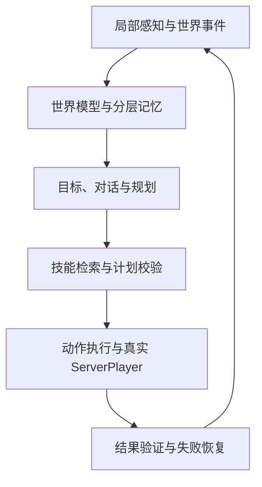
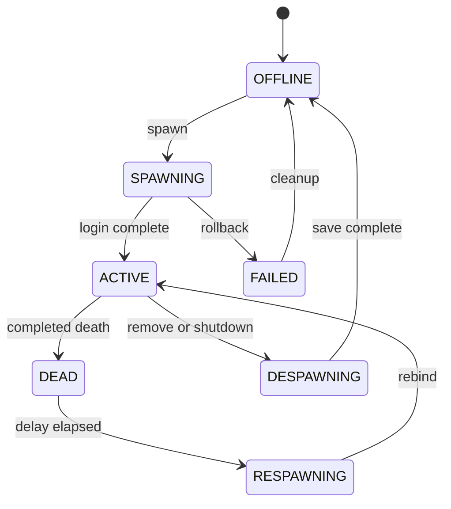

# BotPlayer：NeoForge 1.21.1 完整架构、编码规范与 P0–P10 路线图

> 文档状态：架构基线 v1.4
> 更新日期：2026-07-28
> 目标仓库：`GreyTaiWolf/BotPlayer`
> 第一目标平台：Minecraft Java 1.21.1、NeoForge 21.1.244、Java 21
> 模组 ID：`botplayer`
> 根包名：`io.github.greytaiwolf.botplayer`
> 适用范围：专用服务器与集成服务器；第一版要求服务端和参与连接的客户端均安装模组

本文档是 BotPlayer 的编码依据、阶段验收依据和后续版本迁移依据。实现与本文档发生冲突时，必须先记录架构决策（ADR）并更新本文档，不能让实际代码在没有说明的情况下偏离设计。

BotPlayer 的最终目标是让一个由 AI 控制的服务端玩家，按照普通玩家受到的规则，在 Minecraft 世界里长期生活、交流、工作、学习和协作。它不是“会回答问题的 NPC”，也不是只会执行几个命令的假人；但“玩家会的它都会”是一个持续扩大的能力覆盖目标，不是一次开发就能诚实完成的口号。本路线先把真实玩家生命周期和可靠动作打稳，再逐步覆盖生存、战斗、建造、模组玩法和长期自主行为。

本文描述的是**目标架构和验收门槛**，不是当前功能清单。当前代码事实以
[IMPLEMENTATION_STATUS_CN.md](IMPLEMENTATION_STATUS_CN.md) 为准；原版玩法逐项覆盖以
[VANILLA_CAPABILITY_MATRIX_CN.md](VANILLA_CAPABILITY_MATRIX_CN.md) 为准。P2 的调研依据、
六层状态机与重新定界见
[AI_PLAYER_RESEARCH_AND_P2_REBASELINE_CN.md](AI_PLAYER_RESEARCH_AND_P2_REBASELINE_CN.md)；
P2 实现与验证边界见 [P2_COMPLETION_REPORT_CN.md](P2_COMPLETION_REPORT_CN.md)。P3
有限感知的调研/设计与自动化验收、剩余缺口分别见
[AI_PLAYER_RESEARCH_AND_P3_DESIGN_CN.md](AI_PLAYER_RESEARCH_AND_P3_DESIGN_CN.md) 和
[P3_COMPLETION_REPORT_CN.md](P3_COMPLETION_REPORT_CN.md)。

---

## 文档导航

- 产品与总闭环：[1. 产品定义](#1-产品定义)、[2. 架构原则](#2-架构原则与强制不变量)、
  [3. 总体架构](#3-总体架构与控制闭环)
- 玩家身体：[4. ServerPlayer 内核](#4-真实-serverplayer-内核)、
  [5. 动作系统](#5-动作系统让-bot-按玩家规则操作)、
  [6. 背包 GUI](#6-空手右键打开-bot-背包)
- 智能闭环：[7. 感知与世界模型](#7-感知系统语义事件与世界模型)、
  [8. 目标与规划](#8-目标大脑与任务规划)、[9. 技能](#9-技能系统)、
  [10. 导航/安全/战斗/建造](#10-导航安全战斗和建造子系统)
- AI 与长期能力：[11. DeepSeek](#11-deepseek-接入)、
  [12. 记忆](#12-分层记忆与持久化)、[13. 模组适配](#13-模组内容理解与适配)、
  [14. 多 bot](#14-多-bot-协作)
- 工程约束：[15. 线程与预算](#15-线程模型与-tick-预算)、
  [16. 包结构](#16-推荐包结构与类职责)、[17. 配置/权限/命令](#17-配置权限命令与网络)、
  [18. 数据与诊断](#18-数据布局迁移和诊断)
- 交付门槛：[19. P0–P10](#19-p0p10-实施路线)、[20. 测试](#20-测试架构与矩阵)、
  [21. 安全](#21-安全滥用与隐私威胁模型)、[22. 许可证](#22-许可证与参考边界)、
  [23. Definition of Done](#23-代码审查与-definition-of-done)、
  [24. ADR](#24-关键架构决策记录)、[25. 当前执行基线](#25-开发顺序与当前执行基线)

---

## 1. 产品定义

### 1.1 一句话定义

BotPlayer 是进入服务器正常玩家体系的 `ServerPlayer`，由确定性的 Java 动作与技能系统操作，DeepSeek 负责语言理解、高层规划和陌生问题推理。

### 1.2 什么叫“真实服务端玩家”

本项目的 bot 必须满足以下定义：

- 在服务器 `PlayerList` 中有唯一身份；
- 核心实例继承 `ServerPlayer`，不注册新的生物 `EntityType`；
- 使用原版玩家背包、装备、生命、饥饿、经验、状态效果、碰撞与伤害规则；
- 使用原版死亡、掉落、重生、维度切换、计分板、队伍和区块跟踪流程；
- 真人客户端看到的是标准玩家模型、标准玩家动画与标准装备同步；
- 世界交互尽可能经过普通玩家会经过的服务端校验和 NeoForge 事件；
- 不能依靠传送、直接改方块 NBT、凭空增删物品来伪装正常操作；
- 保护、领地、PVP、事件监听和审计模组能够识别并约束它；
- bot 的自动化身份是可识别的，不以冒充真人来绕过服务器规则。

Minecraft 内部所有玩家也属于实体继承体系，因此“不做新实体”准确含义是：不创建自定义 Mob、不创建自定义玩家外观实体、不注册 BotPlayer 专用 `EntityType`。

### 1.3 最终能力域

“会玩 Minecraft”拆分为可测量的能力域：

| 能力域 | 最终覆盖 |
|---|---|
| 身体与移动 | 观察、转头、行走、跑、蹲、跳、游泳、攀爬、骑乘、乘船、鞘翅、穿越维度 |
| 生存 | 进食、换气、避火、避坠落、睡眠、治疗、选择装备、自卫、撤退 |
| 世界交互 | 挖掘、放置、使用方块、使用物品、与实体交互、拾取和丢弃 |
| 物品管理 | 快捷栏、装备、副手、容器、整理、保留、分配、补货、避免复制和丢失 |
| 制作生产 | 配方分析、工作台制作、熔炼、烧制、酿造、附魔、维修和流水线 |
| 资源活动 | 伐木、采矿、农耕、养殖、狩猎、钓鱼、探索、物流和仓储 |
| 战斗 | 威胁判断、近战、远程、格挡、走位、追击、守卫、团队作战和撤离 |
| 建造 | 理解需求、选址、材料预算、蓝图、分层施工、校验、修复和中断恢复 |
| 社交 | 聊天、澄清、承诺、汇报、拒绝危险任务、理解玩家当前活动和协作 |
| 长期自治 | 目标栈、任务恢复、记忆、日程、主动建议、资源维护和多 bot 分工 |
| 模组玩法 | 注册表认识、通用交互、声明式流程、专用适配器和版本重新验证 |

每个能力都必须落到“输入、前置条件、执行状态、成功验证、失败恢复、测试场景”六项，不能只存在于提示词。

更细的移动、生存、容器、工作站、生产、交易、运输、战斗、Boss、建筑和红石能力编号及
`1.0.0` 门槛见 [原版能力矩阵](VANILLA_CAPABILITY_MATRIX_CN.md)。通过“空手到铁工具”
闭环只能证明基础生存能力，不能单独代表已经“完整会玩 Minecraft”。

### 1.4 第一版明确不做

- 不让大模型逐 Tick 输出 WASD 或鼠标动作；
- 不在服务器 JVM 中执行大模型生成的 Java、JavaScript、Python、命令或脚本；
- 不把截图视觉模型作为基础感知手段；
- 不扫描并发送整个世界给外部 API；
- 不承诺自动理解任何未知模组的自定义 GUI 和隐藏机制；
- 不把 API Key 放进聊天/命令参数、普通客户端配置、Minecraft payload、服务端、世界
  NBT 或普通日志；Key 只进入 owner 客户端的独立本地凭据存储；
- 不为了“看起来聪明”绕过原版规则直接修改世界；
- P0–P2 不实现 DeepSeek、复杂寻路和长期自治。

---

## 2. 架构原则与强制不变量

### 2.1 产品与工程原则

1. **服务器权威**：所有世界事实、权限、动作结果和物品变化由服务器确认。
2. **确定性执行**：LLM 只提出目标或结构化计划，Java 执行器负责动作。
3. **真实结果验证**：模型说“完成了”不算完成，必须验证世界状态。
4. **有限知识**：普通 bot 只知道看见、听见、被告知或被授权检索到的内容。
5. **先安全后任务**：安全反射能抢占任何普通任务。
6. **可中断可恢复**：技能必须支持取消；长任务必须保存检查点。
7. **能力渐进**：未知玩法宁可询问或拒绝，也不能编造会做。
8. **线程隔离**：Minecraft 对象只在服务器主线程访问。
9. **密钥隔离**：凭据只存在于 owner 客户端的独立本地 store，与服务端、世界存档、
   Minecraft payload、对话和日志分开。
10. **版本隔离**：1.21.1 的 NMS/Mixin 细节集中在平台层，核心逻辑不散落版本判断。
11. **兼容优先**：世界变化走普通玩家入口，让保护和事件模组有机会拦截。
12. **可观测性**：每个目标、计划、技能和动作都有 ID、状态、原因和审计事件。

### 2.2 运行时强制不变量

- 一个 `botId` 在任意时刻最多对应一个权威在线实例；
- 每个世界/服务器拥有持久且不可由客户端指定的 `serverInstanceId`，客户端绑定必须与
  `(serverInstanceId, ownerUuid, botId)` 同时匹配；
- 一个 bot 的 UUID 创建后不能因改名改变；
- `BotServerPlayer.connection` 在 `ACTIVE` 期间永不为 `null`；
- 所有活动 bot 都由 `BotLifecycleManager` 持有，业务代码不能自行构造；
- 重生后任何系统不得继续保存旧 `BotServerPlayer` 引用；
- 只有服务器线程可以读写 `Level`、`Entity`、`ItemStack`、`Menu`；
- 异步线程只能持有不可变 DTO、ID、注册表字符串和序列化快照；
- 每个有副作用的动作必须有幂等键和最大持续时间；
- 每个成功结论必须绑定 `ActionOutcome` 或世界事实证据；
- 一个 bot 同时最多运行一个会改变身体/背包的前台技能；
- 背包被真人打开写入时，bot 的背包写动作必须暂停；
- LLM 无权更改调用它的 bot 身份、owner、ACL、风险上限和工具白名单；
- 未知工具、未知字段、超范围参数和过期快照一律拒绝；
- API Key 永远不进入服务器内存中的凭据对象、`SavedData`、SQLite、playerdata、玩家聊天、
  Minecraft payload、SERVER 配置、日志或 crash context。

---

## 3. 总体架构与控制闭环



### 3.1 六个边界上下文

| 上下文 | 负责 | 不负责 |
|---|---|---|
| Player Kernel | 身份、登录、在线、死亡、重生、维度、卸载 | AI 规划 |
| Action Runtime | 原子玩家动作、校验、幂等、动作结果 | 自然语言 |
| Perception & World Model | 局部观察、事件、事实、活动推断、快照 | 直接改世界 |
| Goal & Skill Runtime | 目标、承诺、DAG、技能状态、恢复 | 网络凭据 |
| AI Gateway | 客户端赞助的 Provider 请求；服务端工具编解码、预算、熔断与复核 | 让客户端或模型成为世界权威 |
| Persistence & Integration | 存档、迁移、模组适配、公开 API | 决定玩家意图 |

依赖方向必须保持：

```text
platform/neoforge ─┐
player             ├─> action/perception ─> skill/goal ─> brain/ai
integration       ─┘                     └─> memory
```

`ai` 可以依赖稳定的 API DTO，但不能依赖 `ServerPlayer`。`skill` 可以调用 `action`，但不能
直接调用 NMS 改世界。`client` 负责画面、输入、本地凭据和未来 Provider 传输，但不拥有
owner/ACL、计划接受或世界动作权威。

### 3.2 五层控制频率

| 层级 | 职责 | 触发频率 | 失败时行为 |
|---|---|---|---|
| L0 安全反射 | 火、熔岩、窒息、溺水、坠落、致命威胁、停止 | 每 Tick | 抢占普通技能 |
| L1 原子动作 | 输入、转头、攻击、使用、挖掘、菜单点击 | 每 Tick/事件 | 返回结构化失败 |
| L2 技能状态机 | 寻路、砍树、冶炼、建造一层 | 每 Tick 或降频 Tick | 局部恢复 |
| L3 目标与计划 | 优先级、前置、资源预留、DAG | 事件/状态变化 | 重排或澄清 |
| L4 LLM | 对话、复杂分解、陌生问题、失败诊断 | 异步决策点 | 本地降级 |

DeepSeek 响应期间，L0–L2 继续运行。模型永远不处于服务器 Tick 的同步调用链中。

### 3.3 一个委托的完整链路

1. 玩家说：“帮我准备两组橡木并放进仓库。”
2. `DialogueService` 解析说话者、目标 bot、可听范围与权限。
3. `IntentRouter` 判断是新任务、修改、取消、询问还是闲聊。
4. 已知模板先尝试本地解析；复杂请求才进入 DeepSeek。
5. `ContextAssembler` 只组装相关观察、记忆、技能描述和预算。
6. 模型返回结构化 `ProposedPlan`，不返回可执行代码。
7. `PlanValidator` 校验工具、参数、ACL、风险、资源和依赖。
8. `TaskPlanner` 生成计划 DAG：找到橡树 → 取得工具 → 采集 → 整理 → 找仓库 → 存入。
9. `SkillScheduler` 逐个执行确定性技能。
10. 每个技能通过 `BotActionExecutor` 操作 `BotServerPlayer`。
11. `OutcomeVerifier` 根据背包、方块和容器状态判断实际结果。
12. 失败时按局部重试、替代方案、重新规划、询问玩家的顺序恢复。
13. 成功事实写入情景记忆，向玩家报告数量、位置和剩余问题。

### 3.4 六层可组合状态机

BotPlayer 不使用一个跨越全部职责的巨型 FSM。六层状态机按不同时间尺度组合：

| 状态层 | 权威职责 | 阶段 |
|---|---|---|
| 玩家生命周期 | 当前 `ServerPlayer`、generation、死亡/重生/卸载 | P1，P2 加固 |
| 控制协调 | 身体/手/库存通道租约、优先级与抢占清理 | P2-A |
| 原子动作 | 校验、运行、验证、唯一终态、取消与幂等 | P2-A～C |
| 背包会话 | viewer 权限、距离、写锁、token 和关闭 | P2-D |
| 技能运行 | 多动作组合、检查点、补偿和资源预留 | P5A |
| Goal/计划 | 意图、承诺、DAG、阻塞与跨重启恢复 | P7；P6 只产生受限提案 |

各层只通过 ID、generation、结构化 outcome 与事件协调，禁止出现
“RESPAWNING_AND_MINING_AND_MENU_OPEN”这类组合状态。完整状态与跨层协议见
[AI 玩家调研与 P2 重新基线](AI_PLAYER_RESEARCH_AND_P2_REBASELINE_CN.md#4-六层可组合状态机)。

---

## 4. 真实 `ServerPlayer` 内核

### 4.1 包与核心类

下面按当前已落地命名展示 Player Kernel，并列出后续会加入的职责。当前 P1 没有为了目录
外观提前创建空类；实际源码结构见 [DEVELOPMENT_CN.md](DEVELOPMENT_CN.md#当前源码结构)。

```text
kernel/
  BotServerPlayer.java
  BotConnection.java
  BotGamePacketListener.java
  BotRuntimeHandle.java
lifecycle/
  BotLifecycleManager.java
  BotLifecycleState.java
  BotPlayerManagers.java
identity/
  BotIdentityIds.java
persistence/
  BotRosterSavedData.java
profile/
  BotProfile.java
future/player-profile/
  BotIdentity.java
  BotProfileStore.java
  BotRuntimeBindings.java
  BotSpawnRequest.java
  BotDespawnReason.java
  BotLifecycleState.java
```

职责：

| 类 | 唯一职责 |
|---|---|
| `BotServerPlayer` | 标记真实 bot 玩家；只放极少的玩家级钩子，不承载“大脑” |
| `BotConnection` | 提供有效虚拟 `Connection`；安全消费只发给 bot 客户端的包 |
| `BotGamePacketListener` | 保持服务器连接不变量、同步程序化移动、拒绝无意义客户端依赖 |
| `BotLifecycleManager` | 唯一创建、卸载、重生、恢复 bot 的入口 |
| `BotRuntimeHandle` | 通过 botId/generation 间接解析当前权威实例；重生后旧代际失效 |
| `BotIdentity` | 不可变 botId、UUID、当前名字、创建时间 |
| `BotProfile` | 当前持久 botId、规范名字与可选 owner；未来扩展皮肤、默认维度和行为引用 |
| `BotProfileStore` | 身份和生命周期元数据的持久化 |
| `BotRuntimeBindings` | 把控制器、感知、任务与当前玩家实例原子重绑 |

当前 P1 名称到目标职责的映射：

| 当前代码 | 当前职责 | 后续目标 |
|---|---|---|
| `BotPlayer` | 模组入口 | 保留当前类名 |
| `BotPlayerConfig` | 已实现的 server 配置 | 后续按 server/client/AI schema 拆分 |
| `BotRuntimeHandle` | 跨重生持有当前实例和 generation | 继续保持稳定 handle，不向业务层暴露长期玩家引用 |
| `BotIdentityIds` | 创建/兼容阶段的身份 ID 生成 | roster 已成为持久权威；后续补迁移与重命名 |
| `BotRosterSavedData` | 持久 `serverInstanceId`、bot/player 身份和 owner | 加入迁移、autoload、自动恢复和诊断 |
| `BotLifecycleManager` | 在线实例、生命周期和 roster 解析 | 加入 autoload、诊断和完整事务 |
| `kernel/`、`identity/`、`lifecycle/` | 当前 P1 分包 | 是否合并到 `player/` 由后续 ADR 决定 |

### 4.2 身份设计

```java
record BotIdentity(
    UUID botId,
    UUID playerUuid,
    String name,
    Instant createdAt
) {}
```

- `botId` 是 BotPlayer 业务主键；
- `playerUuid` 是进入 Minecraft 玩家体系的稳定 UUID；
- 推荐使用固定 namespace + 初始 botId 生成 UUID，而不是从可变名字生成；
- 改名只改 `GameProfile` 名字，不改变业务主键和 playerdata 归属；
- 禁止使用在线真人的 UUID；
- 创建前检查离线档案、白名单/封禁名单、当前在线玩家和已有 bot；
- 名称必须符合 1.21.1 玩家名规则，并支持配置统一前缀。

> **当前 P1/P2 生命周期状态**
>
> 当前代码已经使用 roster SavedData 持久保存 `serverInstanceId`、botId、player UUID、
> 当前名字与 owner。名字派生 ID 只保留为创建/兼容阶段的输入；条目创建后
> 以 roster 记录为权威，客户端不能通过名字或本地绑定改写身份与 owner。自动恢复、正式
> 重命名命令、旧档迁移故障注入和完整冲突回滚仍未完成，因此任何手工改名仍不受支持。
> P2 候选已让 runtime handle 在同一服务器会话内稳定保留，并在重生替换身体时递增
> generation；动作和背包会话按旧代际失效。

### 4.3 生命周期状态机

下图是 roster 和完整运行时合并后的**目标状态机**。当前内存中的
`BotLifecycleState` 只包含 `SPAWNING / ACTIVE / DEAD / RESPAWNING / DESPAWNING`：
`DEAD` 对应下图死亡等待区间；`OFFLINE` 和 `FAILED` 将属于未来持久 profile/诊断，
不属于当前 `RuntimeEntry`。



允许的外部操作：

| 状态 | 接任务 | 世界动作 | 背包 GUI | 保存 |
|---|---:|---:|---:|---:|
| `OFFLINE` | 排队可选 | 否 | 否 | 已保存 |
| `SPAWNING` | 否 | 否 | 否 | 否 |
| `ACTIVE` | 是 | 是 | 是 | 检查点 |
| `DEAD` | 否 | 仅等待重生 | 强制关闭 | 是 |
| `RESPAWNING` | 否 | 否 | 否 | 是 |
| `DESPAWNING` | 否 | 停止 | 强制关闭 | 是 |
| `FAILED` | 否 | 否 | 否 | 诊断 |

### 4.4 生成算法

伪代码：

```java
CompletionStage<SpawnResult> spawn(BotSpawnRequest request) {
    assertServerThread();
    validateNameAndAcl(request);
    BotProfile profile = profileStore.resolve(request.botId());
    ensureNotAlreadyOnline(profile.identity());
    ensureNoHumanIdentityCollision(profile.identity());

    transition(profile.botId(), OFFLINE, SPAWNING);
    SpawnTransaction tx = new SpawnTransaction(profile.botId());
    try {
        GameProfile gameProfile = profile.toGameProfile();
        BotConnection connection = connectionFactory.openVirtualConnection();
        BotServerPlayer player = playerFactory.create(server, level, gameProfile, clientInfo);
        tx.track(player, connection);

        playerList.placeNewPlayer(connection, player, loginCookie);
        require(player.connection instanceof BotGamePacketListener);
        require(playerList.getPlayer(player.getUUID()) == player);

        runtimeBindings.bind(profile.botId(), player);
        restoreTaskPointers(profile.botId());
        transition(profile.botId(), SPAWNING, ACTIVE);
        tx.commit();
        return completed(success(player));
    } catch (Throwable failure) {
        tx.rollbackInReverseOrder();
        transition(profile.botId(), SPAWNING, FAILED);
        recordLifecycleFailure(failure);
        cleanupFailedSpawn(profile.botId());
        transition(profile.botId(), FAILED, OFFLINE);
        return completed(failed(failure));
    }
}
```

`SpawnTransaction` 必须能回滚：

- 尚未完成的虚拟连接；
- `PlayerList` 中的半成品条目；
- 记分板/队伍或区块跟踪残留；
- runtime registry 条目；
- 未提交的任务恢复标志。

### 4.5 虚拟连接

`ServerPlayer.connection` 不能为 `null`。大量原版与第三方逻辑默认在线玩家有连接，简单吞掉 NPE 会留下更隐蔽的问题。

`BotConnection` 必须：

- 使用合法的虚拟通道/本地通道满足连接状态检查；
- 允许 `PlayerList` 走标准登录流程；
- 对只发给 bot 自身“客户端”的包立即、安全地完成发送回调；
- 不把包积压到无限队列；
- 不伪造来自客户端的任意网络包；
- 能在卸载时幂等关闭；
- 暴露极少量诊断指标：已丢弃包数、最后包类型、关闭原因；
- 对服务端广播给其他真人客户端的 bot 实体同步没有影响。

P2 已在合法 `EmbeddedChannel`、登录路径、幂等关闭和丢弃 bot 专属出站包之上，
补充 `PacketSendListener` callback 隔离、teleport acknowledge、进程内 keepalive 处理
记账和常量空间诊断。它没有伪造不存在的网络往返；keepalive 不调用需要私有 pending
challenge 的原版 handler。连续在线、独立专用服和多 bot soak 尚未完成，因此虚拟连接
仍不能标记为发布级验证。

`BotGamePacketListener` 不承担 AI 动作。它只用于：

- 满足在线玩家连接字段和服务器内部调用；
- 在程序化移动后更新必要的位置基线；
- 为 `teleport`/维度切换/服务器纠正位置提供一致状态；
- 防止 keepalive、断开和客户端缺席造成异常；
- 提供版本适配点，不把具体映射泄露到核心包。

### 4.6 两个 PlayerList 构造注入点、一个死亡观察点与严格消耗品围栏

第一版允许两个针对 1.21.1 的窄 `PlayerList` 构造注入点。另有一个
`ConnectionAccessor` 只负责给虚拟连接设置私有 `channel` 字段，不改变方法行为，不计入这
两个构造注入点。

死亡确认使用第三个窄观察点：在 `ServerPlayer.die` 的最终 `TAIL` 仅识别
`BotServerPlayer`。NeoForge 的死亡取消发生在早退路径，不会到达该 `TAIL`；这避免
`LivingDeathEvent` 同优先级监听器顺序造成“死亡已取消但 bot 被标记 DEAD”的竞态。该
Mixin 不修改死亡结果，只在原版死亡完整结束后通知生命周期管理器。

严格消耗品使用另有第四个窄行为围栏，详见 ADR-0018：`LivingEntity.updateUsingItem(ItemStack)`
的精确 1.21.1 `HEAD` 注入只服务活动 `BotServerPlayer` 的严格 `UseItem`。普通 Post tick 和
`PlayerTickEvent.Pre` 都无法保证位于所有第三方 effect 修改之后、原版牛奶等消耗之前；因此
围栏在内层原版消费入口复核 hand、物品、原生 inventory menu/cursor/41 槽快照和批准效果。
漂移只走既有原版 release/stop 并取消本次消费，终态仍由 Action runtime 证据处理；真人和
旧版非严格 `UseItem` 保持原版路径。该注入固定方法 descriptor 且 `require = 1`，需要目标
NeoForge 版本的干净 GameTest 验证。

若后续确实需要新的行为注入点，必须新增 ADR，说明无法通过事件、子类或访问转换解决的原因。

#### Mixin A：登录监听器替换

目标：`PlayerList.placeNewPlayer(...)` 内创建服务端游戏包监听器的位置。

行为：

- 仅当传入玩家是 `BotServerPlayer` 时，构造 `BotGamePacketListener`；
- 真人玩家完全保持原版构造路径；
- 不取消整个方法，不复制整个登录方法；
- 优先使用 MixinExtras `@WrapOperation` 替换单个构造表达式，让其他模组仍可组成调用链；
- 写死 1.21.1 的 method descriptor，并设置严格 `require = 1`；
- 启动开发环境时若注入点不唯一或失效，应立即失败，不能静默继续。

#### Mixin B：重生玩家工厂替换

目标：`PlayerList.respawn(...)` 内创建新 `ServerPlayer` 的位置。

行为：

- 旧玩家是 `BotServerPlayer` 时，新实例必须仍为 `BotServerPlayer`；
- 真人玩家保持原版；
- 原版 keepInventory、掉落、床/重生锚、游戏模式、维度和事件流程完整执行；
- 只替换对象构造，不复制整个重生实现；
- 设置严格版本 descriptor 与 `require = 1`；
- GameTest 必须断言重生后运行时类型、连接类型和 manager 绑定。

当前 1.21.1 实际 Mixin 布局：

```text
mixin/ConnectionAccessor.java
mixin/PlayerListMixin.java
mixin/ServerPlayerDeathMixin.java
mixin/LivingEntityUseItemMixin.java
```

`PlayerListMixin` 内含两个精确构造包装；`ServerPlayerDeathMixin` 只观察成功完成的
`die` TAIL；`LivingEntityUseItemMixin` 仅围栏严格 Bot 消耗；`ConnectionAccessor` 只写入连接 channel。以后迁移到
`platform/neoforge/mixin/` 可以单独重构，但禁止业务系统直接依赖 Mixin 类。

### 4.7 死亡与重生

正确流程：

1. L0 安全反射未能避免死亡；
2. 让原版 `die`、死亡事件、死亡消息、掉落与经验逻辑完成；
3. `BotInventorySessionManager` 强制关闭 GUI；
4. 计划进入 `PAUSED_BY_DEATH`，保存当前技能检查点；
5. `BotLifecycleManager` 在配置的延迟 Tick 后调用权威重生入口；
6. Mixin B 确保新实例仍为 `BotServerPlayer`；
7. `BotRuntimeBindings` 通过 botId 原子替换旧实例引用；
8. 清除旧实例上的动作、导航和菜单引用；
9. 检查连接、维度、出生位置与 playerdata；
10. 重新评估任务前置条件，再决定恢复、重规划或报告失败。

业务组件持有：

```java
interface BotRuntimeHandle {
    UUID botId();
    Optional<BotServerPlayer> resolveActive();
    long generation(); // 每次重生/重新登录递增
}
```

不得长期持有 `BotServerPlayer` 字段。执行动作前比较 `generation`，防止对死亡前实例继续操作。

### 4.8 卸载、关服与重新加载

卸载顺序：

1. 将状态改为 `DESPAWNING`，拒绝新任务；
2. 取消或检查点化当前动作与技能；
3. 关闭背包会话；
4. 刷新记忆写入队列和关键 SavedData；
5. 走玩家保存与移除流程；
6. 关闭虚拟连接；
7. 清理区块跟踪、共享资源锁与 runtime bindings；
8. 验证 `PlayerList`、level players 和 manager 中无残留；
9. 改为 `OFFLINE`。

关服采用同一流程，但设置有上限的总刷新时间；超时后至少保证关键 SavedData 和追加日志落盘。

重启恢复不能在世界尚未完全可用时过早生成。建议在 Server Started 后按配置恢复，并限制每 Tick 生成数量，避免多个 bot 同时登录造成尖峰。

### 4.9 维度和区块

- 维度切换使用原版 `changeDimension`/传送流程；
- 维度切换前暂停动作，关闭需要近距离的 GUI；
- 切换后从方法返回值或 listener 当前 player 解析权威实例；
- bot 作为在线玩家自然参与 view distance 与 simulation distance；
- 默认不创建永久 force-load ticket；
- 长途任务只加载普通玩家会加载的附近区块；
- 程序化移动后调用平台适配器更新 chunk tracking；
- 未加载区块的信息不能被当成当前观察事实；
- 可配置最大在线 bot 数、每 bot 感知半径和每 Tick 路径预算；
- TPS 降低时先降低感知、规划与路径重算频率，不降低 L0 安全反射。

区块验收必须区分“普通在线玩家 ticket”和“永久强加载”：

- 真人离开后，活动 bot 附近区块仍达到普通玩家应有的 ticking 状态；
- 方块实体和实体 Tick 在 simulation distance 内继续；
- bot 跨区块后旧 ticket 被释放；
- 死亡、卸载、换维度和停服后没有 ticket 泄漏；
- 不把离线 bot 或远方任务区域永久 force-load。

### 4.10 玩家内核验收不变量

P1 完成前，下列断言必须自动化：

- 生成后只存在一个玩家实例；
- `connection` 非空且类型正确；
- `PlayerList`、level players、chunk tracking 对实例认识一致；
- 保存后卸载再加载，背包、位置、经验、状态效果一致；
- 玩家死亡后确实创建了新实例，且仍为 `BotServerPlayer`；
- 重生后 controller 和 task handle 指向新 generation；
- 下界与末地往返不丢失控制；
- 服务器停止后无悬挂异步任务和数据库写入；
- UUID/名字冲突失败时没有半个 bot 留在世界里。

---

## 5. 动作系统：让 bot 按玩家规则操作

### 5.1 调用链

```text
Goal / Skill
  → Typed ActionRequest
  → ActionSchemaValidator
  → PermissionGuard
  → State/Reach/LOS/Inventory/Revision Guards
  → BotActionExecutor
  → NeoForge 1.21.1 PlayerActionBridge
  → ServerPlayer / ServerPlayerGameMode / Menu
  → ActionOutcome
  → OutcomeVerifier
```

任何技能绕过此链路直接 `setBlock`、直接修改容器或直接设置背包，都属于架构违规。

### 5.2 核心接口

```java
interface BotActionExecutor {
    ActionTicket submit(BotRuntimeHandle bot, ActionRequest request);
    ActionStatus tick(ActionTicket ticket, ServerTickContext tick);
    void cancel(ActionTicket ticket, CancelReason reason);
}

sealed interface ActionRequest permits
    LookAtAction, MoveInputAction, JumpAction, AttackEntityAction,
    UseItemAction, UseOnBlockAction, BreakBlockAction,
    InteractEntityAction, SelectSlotAction, ContainerClickAction,
    DropAction, ChatAction, StopAction {}

record ActionEnvelope(
    UUID actionId,
    UUID botId,
    UUID planId,
    UUID skillRunId,
    long botGeneration,
    long snapshotId,
    long worldRevision,
    String idempotencyKey,
    RiskLevel risk,
    int maxTicks,
    ActionRequest action,
    SuccessCondition expected
) {}
```

`ActionOutcome`：

```java
record ActionOutcome(
    UUID actionId,
    ActionState state,
    ActionFailureCode failure,
    int startedTick,
    int finishedTick,
    long observedWorldRevision,
    List<EvidenceRef> evidence,
    Map<String, Object> measurements,
    String safeSummary
) {}
```

状态：`QUEUED`、`VALIDATING`、`RUNNING`、`VERIFYING`、`SUCCEEDED`、`FAILED`、
`CANCELLED`、`PREEMPTED`、`STALE`。

> **P2 的实际边界**
>
> 当前 `BotActionRuntime` 已实现上述中央状态表、有界 mailbox/ledger/completion、
> generation 校验和通道仲裁；`WAIT / LOOK_AT / MOVE_INPUT / JUMP / STOP` 以及 P2-C
> 基础交互已接入 Minecraft backend。Goal、Skill、snapshot/world revision 与完整 ACL
> 仍属于后续阶段，不能因 envelope 已有扩展点而写成现有能力。最终验证结果见
> [P2 完成报告](P2_COMPLETION_REPORT_CN.md)。

### 5.3 Guard 固定顺序

1. 请求结构和大小；
2. botId 与当前实例 generation；
3. 生命周期必须为 `ACTIVE`；
4. caller/owner/ACL；
5. 风险策略和服务器规则；
6. 快照/世界 revision 是否仍可接受；
7. 同维度、目标存在、区块加载；
8. 距离、视线和可达性；
9. 游戏模式、冷却、状态效果；
10. 物品、槽位、工具、耐久和容量；
11. 保护/领地/PVP 预检查；
12. 幂等键是否已执行；
13. 时间和每 Tick 预算。

Guard 通过不代表动作一定成功，最终仍以原版/NeoForge 返回和世界变化为准。

### 5.4 原子动作清单

| 类别 | 动作 |
|---|---|
| 视角 | `look_at`、`turn_relative` |
| 移动输入 | `move_forward`、`move_strafe`、`jump`、`sprint`、`sneak`、`swim` |
| 战斗 | `attack_entity`、`release_use`、`swap_weapon`、`block` |
| 方块 | `start_break`、`continue_break`、`abort_break`、`use_on_block` |
| 物品 | `use_item`、`select_hotbar`、`equip`、`drop`、`pickup_wait` |
| 实体 | `interact_entity`、`interact_at`、`mount`、`dismount` |
| 容器 | `open_container`、`container_click`、`quick_move`、`close_container` |
| 社交 | `chat`、`whisper_status`、`stop` |

高级能力只能组合这些动作或调用同样受控的平台桥，不得创造“采集一组钻石”这种不可验证的超级动作。

### 5.5 移动实现

Bot 没有真实客户端输入包，因此需要 `PlayerInputController` 在服务器 Tick 内模拟玩家输入状态：

- 输入是前进/横移/跳跃/蹲伏/疾跑等意图，不是位置坐标；
- 每 Tick 根据当前姿态、流体、碰撞和导航 steering 更新；
- 位置变化使用玩家物理入口和版本桥；
- 只允许传送动作处理管理员明确传送、原版传送门、末影珍珠等合法来源；
- 超过服务器移动容差的纠正必须记录；
- 动画由姿态、挥手、装备和实体同步自然产生；
- 导航到达判定使用容差、速度和可站立面，不能只比较整数方块。

每次移动动作都有：

- 目标方向或短期 waypoint；
- 最大 Tick；
- 预计最大位移；
- 卡住窗口；
- 危险约束；
- 取消时输入归零。

### 5.6 方块破坏与放置

破坏：

- 检查距离、视线、游戏模式和世界边界；
- 选择工具后走 `ServerPlayerGameMode` 的破坏阶段；
- 按硬度、工具、附魔、状态效果逐 Tick 推进；
- 发出正常挥手和破坏进度；
- 允许保护模组取消事件；
- 方块改变、掉落和工具耐久由游戏决定；
- 目标方块中途改变时返回 `WORLD_CHANGED`。

放置/使用：

- 构造明确的手、命中面、命中位置；
- 走物品/方块正常 use 入口；
- 放置前做碰撞和权限预检；
- 放置后验证方块状态、物品数量和事件结果；
- 禁止直接 `setBlock` 完成普通建造。

### 5.7 攻击与交互

- 攻击必须满足普通攻击距离、可见性、冷却和 PVP 规则；
- 选择目标时保存 entity UUID，不长期依赖 runtime entity id；
- 每 Tick 重新确认目标存活、同维度和可攻击；
- 友军、owner 和配置保护实体默认不得攻击；
- 不把一次伤害调用等同于击杀；
- `interact_entity` 与攻击是不同动作；
- 骑乘、牵引、交易等需要对应技能和成功验证。

### 5.8 容器事务

本节描述目标事务协议。P2-D 只实现真人查看/编辑 bot 自身 41 格玩家库存的专用 menu，
不实现箱子、工作站或模组容器自动化。首条生存闭环所需的最小原版世界容器驱动进入 P5A，
更广泛原版容器/工作站进入 P5B，模组和自定义 menu 进入 P8。

所有容器动作绑定：

- 当前 `containerId`；
- 当前 menu 类型；
- `stateId`/revision；
- 输入槽位摘要；
- 期望点击类型；
- 期望最小/最大物品差量。

容器变化后 revision 不一致，动作应重新读取，不可照旧点击。每次事务验证物品守恒：

```text
bot + 打开容器 + carried stack + 合法消耗/产出
```

若检测到非预期增减，立即关闭容器、暂停技能并记录高优先级诊断。

---

## 6. 空手右键打开 bot 背包

### 6.1 交互规则

只参考旧 `FakeAiPlayer` 的背包交互概念和原版资源组合绘制思路，新项目在 1.21.1
clean-room 重写；没有复制其代码或 PNG：

- 真人玩家使用主手；
- 主手必须为空；
- 副手交互不触发；
- 入口统一使用 NeoForge `PlayerInteractEvent.EntityInteract`，不同时覆写
  `BotServerPlayer.interact`，避免一次右键重复打开；
- 主手空时消费本次交互以及随后可能发生的副手 fallback，副手物品不能继续作用于 bot；
- viewer 与 bot 同维度；
- 直线距离不超过默认 8 格；
- 双方存活，bot 生命周期为 `ACTIVE`；
- P2 当前 viewer 是持久 owner 或服务器 OP；trusted/observer 与细粒度 ACL 后续实现；
- 同一 bot 同时只有一个可写 viewer；
- 打开期间暂停所有会改 bot 背包的动作；
- 危险反射可抢占 GUI，并向 viewer 说明关闭原因；
- 死亡、重生、换维度、距离超限、退出和卸载强制关闭；
- menu 真正关闭后才能恢复被暂停的技能。

### 6.2 客户端布局与资源边界

- screen 固定为 `176×256`，上方组合原版 `inventory.png` 的玩家背包区域，下方组合
  `generic_54.png` 的 viewer 物品栏区域；
- 上方按原版玩家背包风格显示盔甲、副手、3D bot 模型、主背包和快捷栏；bot 当前选中
  快捷栏由服务端同步，并使用原版 HUD 选中框只读高亮；
- 原版 2×2 合成输入、箭头和结果区域由同一原版背景覆盖，menu 不创建任何合成槽，因此
  既不显示假槽也不可交互；
- 不在 `assets/botplayer` 复制或打包 Mojang PNG；screen 只在运行时引用 Minecraft
  1.21.1 客户端现有 GUI/HUD 资源，因此替换相同资源的资源包能够接管外观；
- 画布需要至少 256 个逻辑 GUI 像素的垂直空间；小窗口或过高 GUI Scale 下由用户降低
  “界面尺寸”，本阶段不增加紧凑或左右并排布局；
- 用户已在真实客户端确认本轮视觉修复有效；多语言、资源包与全部 GUI Scale 组合仍需
  专项验收，自动化构建不替代这些扩展场景结论。

### 6.3 槽位布局

权威库存是 `BotServerPlayer#getInventory()` 的 41 格，不复制到临时容器：

- bot 主背包和快捷栏 36 格；
- bot 盔甲 4 格；
- bot 副手 1 格；
- viewer 自己背包和快捷栏 36 格；
- bot 当前选中的快捷栏槽只读高亮，不额外复制槽位。

推荐的 77 个 menu slot ID 与原版 `Inventory` 映射：

| Menu slot | 数量 | 所有者 | 映射 |
|---:|---:|---|---|
| `0..3` | 4 | bot 盔甲 | 头、胸、腿、脚 → unified inventory `39,38,37,36` |
| `4` | 1 | bot 副手 | unified inventory `40` |
| `5..31` | 27 | bot 主背包 | inventory `9..35` |
| `32..40` | 9 | bot 快捷栏 | inventory `0..8` |
| `41..67` | 27 | viewer 主背包 | inventory `9..35` |
| `68..76` | 9 | viewer 快捷栏 | inventory `0..8` |

盔甲 menu 顺序按界面从头到脚展示，但原版统一 inventory 的盔甲索引方向相反，不能简单
使用连续正序。服务端构造器绑定真实 bot/player inventory；客户端 41 格占位容器只负责
创建相同槽位结构，权威内容仍由原版 menu 同步。

`quickMoveStack` 区间：

- bot `0..40` → viewer `[41,77)`；
- viewer `41..76` 先尝试空且合法的 bot 装备槽，再进入 bot `[5,41)`；
- 不自动把普通物品塞入副手；
- 移动前后必须比较原栈、更新 slot、验证总数量守恒；
- 任何部分移动、拒绝或 menu 状态变化都不能重复执行。

要求：

- Shift 快速移动方向正确；
- 盔甲槽通过原版装备槽判定和 NeoForge 可装备钩子；
- 非创造模式 viewer 不能取下受绑定诅咒约束的装备；
- 不允许不合法堆叠；
- `stillValid` 每 Tick 检查距离、维度、生命周期和会话 token；
- viewer 断线时释放写锁；
- 服务端重载或 bot 重生时旧 token 立即失效。
- menu 关闭时，viewer 的 carried stack 通过原版归还/掉落语义处理，不能写进 bot 库存；
- P2 用测试替身调用 `forceClose(DANGER)`；真正的 L0 危险触发在 P4 做集成验收。

### 6.4 相关类

```text
inventory/
  BotInventoryLayout.java
  BotInventoryMenu.java
  BotInventorySession.java
  BotInventorySessionManager.java
  BotInventoryLock.java
  BotPlayerMenus.java
  InventoryMutationGate.java
client/screen/
  BotInventoryScreen.java
```

`BotInventorySessionManager` 是唯一写锁管理者。技能只向 `InventoryMutationGate` 询问是否可写，不直接读取 GUI 状态。

1.21.1 实现使用注册的 `MenuType<BotInventoryMenu>`。服务端构造器直接绑定
`BotServerPlayer#getInventory()`，客户端构造器用 41 格占位容器，原版菜单同步会传递权威
物品栈。77 槽自定义布局需要客户端 `AbstractContainerScreen`，但不需要额外传 bot UUID
或自定义同步 payload。纯服务端退化成箱子菜单会丢失正确的装备/副手语义，因此不采用。

---

## 7. 感知系统、语义事件与世界模型

### 7.1 权威事件与感知事件分离

必须维护两条不同含义的记录：

- **AuthorityEvent**：服务器真正发生的事件，可用于结果验证和审计；
- **PerceivedEvent**：某个 bot 当时实际可见、可听、被告知或获准查询的事件。

全服审计不能自动变成 bot 的知识。管理员可以开启调试全知模式，但生成的事实必须标注来源为 `ADMIN_OMNISCIENT`，普通玩法默认关闭。

P3 实现进一步固定：

- 普通 authority audit、独立 spatial authority projection 与 routed sound audit 三环
  保存，但共享运行时 `sessionId + eventSeq` 唯一序号；定向/声音洪泛不挤出空间候选，
  跨重启不冒充连续；
- 每个 `(botId, generation)` 的非声音语义/声音认知分环保存，并共享从 1 递增的 local
  `perceivedSeq`；声音洪泛不逐出动作、方块、伤害或活动证据；
- `PerceivedEvent` 只保留 opaque `authorityEventId` 与重新构造的有界认知载荷，不嵌入
  完整 `AuthorityEvent`，不暴露 authority session/sequence/revision；
- 认知通道为 `SELF / DIRECT / VISUAL / AUDIBLE / ADMIN`；
- `SELF/DIRECT` 在权威发布时按精确 actor/target 可靠路由；`VISUAL/AUDIBLE` 从独立
  spatial ring 尾部取有界窗口且只允许 same-tick 投影；同 Tick 超预算只选最新窗口并计
  管理员 coverage，积压、预算延迟和晚到声音 fail-closed；
- `SELF` 只保留 bot 自身 actor；`VISUAL` 对 actor 逐个复核视距、视锥、已加载和遮挡，
  两类投影删除未由对应通道证明的通用身份 delta；
- break/place/toss 待复核候选在捕获时冻结 bot generation，内部 `routing.*` 只用于
  投给原 generation，不得进入认知载荷；critical outcome ingress 与 P2 最大 canonical
  吞吐对齐，成功 break 按 2 个发布单位计，其他终态按 1 个单位计；
- 完全未感知的 scope 变化不触碰该 bot 的事实、认知水位或公开传感器预算，避免泄露
  隐藏变化的发生时刻；已投影但结果不确定的变化或 TTL 才能令事实变为
  `STALE_UNKNOWN`。authority coverage gap 只进入管理员私有诊断并快进内部 cursor。

规范性边界见
[ADR-0013](adr/0013-finite-perception-two-plane-world-model.md)；具体自动化覆盖与退出门
缺口见 [P3 完成验收报告](P3_COMPLETION_REPORT_CN.md)。

### 7.2 语义事件结构

```java
record SemanticEvent(
    UUID sessionId,
    long eventSeq,
    UUID eventId,
    ResourceKey<Level> dimension,
    long gameTick,
    Instant wallTime,
    EventType type,
    Vec3 position,
    RegionRef region,
    List<ActorRef> actors,
    List<RegistryRef> objects,
    StateDelta delta,
    EventSource source,
    Visibility visibility,
    float confidence,
    Set<String> tags
) {}
```

上面是长期概念结构。当前候选将原始语义载荷放在有界 `SemanticEventDraft`，再由
`SemanticEventBus` 包装为 `AuthorityEvent`；认知侧使用独立 `PerceptionProjection` 和
`PerceivedEvent`。权威读取窗口的容量 gap 只进入管理员私有 coverage 诊断并快进内部
cursor，不改变认知事件、事实、local perceived watermark、公开传感器预算或 AI-safe
快照。`VISUAL/AUDIBLE` 候选位于独立 spatial projection ring，定向洪泛不会挤出；
routed sound audit 位于另一独立审计 ring。声音与非声音认知也分别保留，再按共享 local
`perceivedSeq` 提供有序视图。

事件类型至少包含：

- 方块放置、破坏、重要状态变化；
- 物品拾取、丢弃、制作、熔炼、装备和容器转移；
- 伤害、攻击、击杀、死亡、爆炸和危险；
- 玩家聊天、委托、修改、取消、确认；
- 进入区域/维度、发现结构、睡眠、天气和进度；
- 技能开始、暂停、恢复、完成、失败；
- 权限拒绝、保护拦截、世界 revision 变化。

禁止逐 Tick 把完整区块或所有实体写入长期日志。

### 7.3 传感器

```java
interface BotSensor {
    SensorId id();
    SensorSchedule schedule();
    SensorCost estimatedCost();
    SensorResult sample(SensorContext context, PerceptionBudget budget);
}
```

内置传感器：

| 传感器 | 当前 P3 候选内容 | 正常/降级/临界默认频率 |
|---|---|---|
| `SelfStateSensor` | 生命、饥饿、空气、火、水、状态、位置、速度与姿态 | `1 / 1 / 1` Tick |
| `InventorySensor` | 原版背包槽位的有界物品摘要与 digest | `1 / 5 / 20` Tick |
| `VisionRaySensor` | 注视方块/实体、遮挡与未加载边界 | `1 / 2 / 5` Tick |
| `NearbyThreatSensor` | 已加载局部敌对/危险实体 | `3 / 5 / 5` Tick |
| `LocalEntitySensor` | 已加载且有视线的局部实体摘要 | `5 / 10 / 暂停` |
| `LocalBlockSensor` | 注视点、脚下半径 `0..2` 小邻域和事件焦点；仅实际支撑块免 LoS | `10 / 20 / 暂停` |
| `SoundEventSensor` | 已投影给当前 bot 的定向声音事件 | `1 / 2 / 5` Tick |

`TaskSensor` 是 P5/P7 目标，不属于当前 P3 候选。

所有局部扫描都必须：

- 有半径上限；
- 有每 Tick 方块/实体预算；
- 优先扫描视锥和任务相关区域；
- 缓存不变结果；
- 不强制加载区块；
- TPS 压力下可降频。

“不强制加载”是可测试不变量：视觉射线在第一个未加载区块边界停止并返回
`UNKNOWN_UNLOADED`；方块/实体读取先检查已加载，不调用 `getChunk` 制造观察。实体枚举
必须达到预算立即中止，不能先构造无界候选列表；实体索引每次原始回调扣
`ENTITY_SCAN`，selector 匹配后才扣 `ENTITY_READ`，两者都计入全服工作池。含
`BlockEntity` 的方块只输出 opaque 标记，不读取对象/内容。

### 7.4 不可变观察快照

```java
record ObservationSnapshot(
    UUID streamId,
    long snapshotId,
    long perceivedWatermark,
    UUID botId,
    long botGeneration,
    String dimension,
    long gameTick,
    SelfObservation self,
    InventoryObservation inventory,
    VisionObservation vision,
    List<EntityObservation> entities,
    List<ThreatObservation> threats,
    List<BlockObservation> blocks,
    List<PerceivedEvent> recentSounds,
    List<PerceivedEvent> recentEvents,
    List<ActivityHypothesis> activities,
    PerceptionLimits limits
) {}
```

快照在服务器线程构造，随后可以安全地交给异步规划和 AI。DTO 不能包含 `Level`、`Entity`、`ItemStack`、`BlockEntity`、`Menu` 的活动引用；`ItemStack` 只能转成受限的不可变摘要。
候选快照只暴露 generation-local cognitive stream/snapshot/perceived 水位、当前压力、
本 bot 分类预算及哪些传感器被采样/截断；不暴露 authority session/seq、全局
`worldRevision` 或全服预算计数。下游不能把截断快照描述成完整世界。

SELF 状态必须在当前快照 Tick 成功采样，背包必须是一次完整 41 槽采样且成功时间不超过
20 Tick；否则撤下最新快照。视觉异常返回 `Unavailable` 并且不能刷新成功时间，旧视觉
超过新鲜度窗口后显式转为 `UNKNOWN_STALE`。实体读取预算进一步分给威胁、视觉和普通
实体，威胁先采样；多 bot 的共享工作预算逐 Tick 轮转采样起点。
`globalWorkPerTick` 最小为 64，保证 1/4、3/4 分池后公开池可原子读取 41 槽背包。

定向声音候选按 `(botId, generation)` 分队列，单 generation 受动态公平份额约束；消费
按 generation round-robin 并轮转起点，单队列保持封包顺序。历史声音 ring 在快照预算
不足时先选最新事件，再按 local `perceivedSeq` 恢复时间顺序。该机制只定义有界公平
策略，发布级多 bot 公平性仍需 soak 证明。

### 7.5 世界模型

`WorldModelService` 将短期观察变成带来源和有效期的事实：

```java
record WorldFact(
    UUID factId,
    FactKey key,
    FactValue value,
    RevisionScope scope,
    RevisionStamp revision,
    long firstObservedTick,
    long lastConfirmedTick,
    float confidence,
    FactSource source,
    List<EvidenceRef> evidence,
    FactStatus status,
    InvalidationRule invalidation
) {}
```

事实状态：`ACTIVE`、`STALE`、`STALE_UNKNOWN`、`SUPERSEDED`、`RETRACTED`、
`UNVERIFIED`。`ACTIVE` 表示该事实仍是 bot 在 TTL 内的当前认知，不保证隐藏世界没有
变化；`STALE_UNKNOWN` 只表示已投影事件的结果不确定或 TTL 到期使旧认知不再可靠。
完全未感知的变化和 authority coverage gap 都不会改变事实状态。

示例：

- “主基地入口在主世界 (120, 64, -30)”；
- “我看到东侧仓库坐标有一个箱子；内容未知”；
- “玩家 Angelo 最近 20 秒正在建造石墙，置信度 0.86”；
- “矿井入口可能被堵住，最后确认时间为两天前”。

新事实和旧事实冲突时，保留两者和证据，把旧事实标为 superseded；不能悄悄覆盖历史。
当前 P3 只保存运行时短期事实，不跨重启持久化；P7 才处理长期记忆、保留、删除与迁移。
revision 在服务器内部使用维度和 target scope，事实失效优先比较精确 scope；全局内部
计数不进入 AI-safe 快照。容器只保留 opaque 位置/方块事实和 scope 失效，不生成内容
digest，不读取 `BlockEntity`、槽位或 menu 状态。

### 7.6 玩家活动理解

`ActivityInferenceService` 使用滑动时间窗口聚合多项证据：

| 候选活动 | 典型证据 |
|---|---|
| 挖矿 | 连续破坏石头/矿石、手持镐、地下移动、拾取矿物 |
| 建造 | 重复按空间规律放置材料、脚手架、在固定区域移动 |
| 合成/冶炼 | 打开工作台/熔炉、材料转移、产物出现 |
| 战斗 | 攻击、受伤、切换武器、追逐、格挡、敌对实体 |
| 农耕 | 耕地、播种、收割、补种、搬运作物 |
| 探索 | 连续进入新区域、无重复工作行为、发现结构 |

输出：

```java
record ActivityHypothesis(
    UUID actorId,
    ActivityType type,
    long startedTick,
    long lastEvidenceTick,
    float confidence,
    ActivityConfidenceBand band,
    List<EvidenceRef> evidence
) {}
```

只有达到阈值才使用肯定表达；低置信度应说“看起来可能在挖矿”，并允许玩家纠正。玩家纠正会成为标注事件，但不直接修改历史证据。

当前 P3 候选只从已感知事件确定性推断，支持证据最完整的挖矿、建造、战斗、农耕和探索
候选；枚举中存在合成/冶炼不代表已经接入容器/工作站事件。相同事件回放必须产生相同
活动类型、置信区间和 generation-local `perceivedSeq`；证据不能反推出 authority 顺序。
滑动窗口每 Tick 严格剔除过期事件；推断单次按 actor 聚合，候选只从窗口内事件产生并按
新近证据优先，压力分级上限为 `NORMAL 64 / DEGRADED 16 / CRITICAL 4`；
`use_on_block` 单独不足以证明建造，必须有 `BLOCK_PLACED` 等已验证专门事件。

---

## 8. 目标、大脑与任务规划

### 8.1 大脑不等于 LLM

`BotBrain` 是本地协调器，DeepSeek 只是其中一个异步规划提供者：

```text
brain/
  BotBrain.java
  BrainTickScheduler.java
  IntentRouter.java
  DialogueService.java
  ContextAssembler.java
  LocalIntentParser.java
  PlanValidator.java
  OutcomeVerifier.java
goal/
  Goal.java
  GoalStack.java
  Commitment.java
  TaskPlan.java
  PlanNode.java
  TaskPlanner.java
  PlanRepository.java
  PriorityPolicy.java
```

### 8.2 目标类型

- `SafetyGoal`：避免死亡或重大损失；
- `DirectCommandGoal`：owner 的明确命令；
- `CommitmentGoal`：已经答应但未完成的任务；
- `MaintenanceGoal`：补食物、维修、整理、基地维护；
- `CooperationGoal`：共享任务板分配；
- `AutonomyGoal`：经配置允许的自主探索或改善；
- `ConversationGoal`：回答、汇报和澄清。

默认优先级：

```text
紧急安全
> owner 当前直接命令
> 已确认且临近的承诺
> 多 bot 协作子任务
> 生存维护
> 自主目标
> 闲聊和探索
```

### 8.3 承诺模型

```java
record Commitment(
    UUID commitmentId,
    UUID botId,
    ActorRef requester,
    String normalizedObjective,
    CommitmentState state,
    Instant acceptedAt,
    Optional<Instant> dueAt,
    RiskLevel maxRisk,
    List<Constraint> constraints,
    List<EvidenceRef> sourceDialogue
) {}
```

状态：`PROPOSED`、`NEEDS_CLARIFICATION`、`ACCEPTED`、`IN_PROGRESS`、`PAUSED`、`BLOCKED`、`FULFILLED`、`CANCELLED`、`FAILED`。

Bot 在答应前必须确认：

- 指令来自有权限的人；
- 目标不是明显不可能或越权；
- 风险不超过策略；
- 关键对象明确；
- 与当前高优先级承诺不冲突；
- 需要大量破坏、稀有物品或长时间时先确认范围。

### 8.4 计划 DAG

```java
record TaskPlan(
    UUID planId,
    UUID goalId,
    long revision,
    PlanState state,
    Map<UUID, PlanNode> nodes,
    Set<PlanEdge> dependencies,
    PlanBudget budget,
    List<SuccessCondition> completion
) {}

record PlanNode(
    UUID nodeId,
    SkillRef skill,
    JsonObject parameters,
    NodeState state,
    Set<ResourceReservation> reservations,
    RetryPolicy retry,
    List<SuccessCondition> success
) {}
```

计划提交前必须：

- DAG 无环；
- 技能存在且版本兼容；
- 参数通过 schema；
- 风险在授权范围；
- 前置条件可满足或有获取节点；
- 资源预留无冲突；
- 最大节点数、预计时间和世界改动量不超预算；
- 每个叶子节点有成功条件；
- 可取消和补偿路径明确。

### 8.5 状态变化触发规划

不得固定每 Tick 调模型。触发点包括：

- 新的复杂委托；
- 玩家修正目标；
- 技能返回不能本地恢复的失败；
- 关键世界事实改变；
- 计划资源被占用；
- 长任务达到检查点；
- 重要未知模组交互；
- 玩家主动询问解释。

---

## 9. 技能系统

### 9.1 统一契约

```java
interface BotSkill<P extends SkillParameters, C extends SkillCheckpoint> {
    SkillDescriptor descriptor();
    PreconditionResult check(BotSkillContext context, P parameters);
    SkillRun<C> start(BotSkillContext context, P parameters);
    SkillTickResult<C> tick(BotSkillContext context, SkillRun<C> run);
    PauseResult<C> pause(BotSkillContext context, SkillRun<C> run, PauseReason reason);
    SkillRun<C> resume(BotSkillContext context, C checkpoint);
    CancelResult cancel(BotSkillContext context, SkillRun<C> run, CancelReason reason);
    VerificationResult verify(BotSkillContext context, SkillRun<C> run);
}
```

描述：

```java
record SkillDescriptor(
    ResourceLocation id,
    SemanticVersion version,
    SkillCategory category,
    JsonSchema parameterSchema,
    RiskLevel risk,
    Set<Permission> permissions,
    Set<ResourceLocation> requiredCapabilities,
    MinecraftCompatibility compatibility,
    EstimatedCost cost,
    boolean resumable
) {}
```

技能不得以“没有抛异常”作为成功。`verify` 必须返回证据。

### 9.2 技能运行状态

`CREATED → PREPARING → RUNNING → VERIFYING → SUCCEEDED`

旁路：

- 动作、导航、menu、查询和计时分别进入有界 `WAITING_*` 状态；
- 可恢复安全抢占走 `PAUSING → PAUSED → RESUMING`，恢复前重新验证世界；
- `RUNNING → RECOVERING → PREPARING/RUNNING`
- 任意可取消状态 → `CANCELLED`
- 任意运行状态 → `FAILED`
- 只有更高优先级运行明确替代且旧运行不再恢复时才进入终态 `PREEMPTED`

检查点只保存可序列化 ID、坐标、计数、阶段和资源引用，不保存活动 Minecraft 对象。

### 9.3 标准失败码

- `NO_PATH`
- `STUCK`
- `TARGET_GONE`
- `TARGET_NOT_VISIBLE`
- `OUT_OF_REACH`
- `MISSING_ITEM`
- `MISSING_TOOL`
- `MISSING_RECIPE`
- `INVENTORY_FULL`
- `WORLD_CHANGED`
- `PERMISSION_DENIED`
- `DANGER_PREEMPTED`
- `TIMEOUT`
- `RESOURCE_RESERVED`
- `CONTAINER_CHANGED`
- `MOD_UNSUPPORTED`
- `INVALID_CHECKPOINT`
- `SERVER_OVERLOADED`

恢复顺序：

```text
安全局部重试
→ 换角度/工具/短路径
→ 受控替代技能
→ 释放并重新获取资源
→ 高层重规划
→ 向玩家澄清或报告阻塞
```

### 9.4 内部 Java 技能目录

```text
skill/builtin/
  safety/
  movement/
  resource/
  survival/
  crafting/
  combat/
  building/
  social/
```

首批能力：

| 类别 | 技能 |
|---|---|
| 安全 | `stop_all`、`escape_fire`、`seek_air`、`avoid_fall`、`eat_food`、`retreat`、`self_defend` |
| 移动 | `go_to`、`follow_player`、`return_home`、`cross_water`、`bridge_gap`、`unstuck` |
| 资源 | `find_resource`、`break_targets`、`collect_drops`、`deposit_items`、`fetch_items` |
| 生存 | `chop_tree`、`mine_tunnel`、`farm_crop`、`hunt_food`、`sleep` |
| 制作 | `craft_recipe`、`smelt_recipe`、`equip_best_tool`、`repair_item` |
| 战斗 | `assess_threat`、`melee_target`、`ranged_target`、`guard_area`、`flee_combat` |
| 建造 | `place_blueprint_layer`、`verify_blueprint`、`repair_region` |
| 社交 | `ask_clarification`、`report_progress`、`confirm_risk`、`explain_failure` |

### 9.5 外部 Skill Pack

位置：

```text
data/<namespace>/botplayer/skills/<skill>.json
```

这里的“外部”只表示技能定义位于 BotPlayer JAR 外，由服务器管理员本地安装和审核；它
不是远程在线技能市场，也不允许 bot 或 LLM 在运行时联网下载技能。

只允许声明式 DAG 组合已注册技能。禁止：

- 任意 Java/JS/Python；
- 服务器命令；
- 文件系统；
- 反射；
- 任意 HTTP；
- 动态下载；
- 未注册 NMS 方法；
- 直接世界修改。

启用流程：

```text
草案
→ JSON Schema
→ DAG/上限/权限静态检查
→ GameTest 或隔离测试世界
→ 管理员批准
→ 版本化启用
```

LLM 可以提出草案，但不能自行批准。

### 9.6 资源预留

长任务必须避免两个 bot 同时抢同一资源：

```java
record ResourceReservation(
    ReservationId id,
    UUID ownerSkillRun,
    ResourceKey key,
    int quantity,
    ReservationMode mode,
    long expiresAtTick
) {}
```

资源可以是物品数量、容器槽、方块区域、实体目标、工作站或建筑分区。预留必须有 TTL，技能结束/失败/重启恢复后能够释放或重新确认。

---

## 10. 导航、安全、战斗和建造子系统

### 10.1 导航

```text
navigation/
  NavigationService.java
  RoutePlanner.java
  LocalPathfinder.java
  PathSegment.java
  MovementCostModel.java
  HazardMap.java
  PathFollower.java
  StuckDetector.java
  NavigationCheckpoint.java
```

采用分层路线：

1. **区域路线**：跨较远距离，基于已知地点、维度和粗粒度可通行区域；
2. **局部路径**：在已加载区块内做有预算的 A* 或等价搜索；
3. **steering**：每 Tick 把短 waypoint 转成玩家输入；
4. **动态重算**：方块改变、实体堵塞、危险出现时局部重算。

成本至少考虑：

- 行走、跳跃、落差和游泳；
- 方块破坏时间、工具耐久；
- 放置/搭桥材料；
- 熔岩、火、仙人掌、粉雪、深水、窒息、悬崖；
- 敌对实体威胁；
- 光照、剩余生命、食物和装备；
- 保护区域和明确禁止区域；
- 返回路径与补给距离。

不能为了更短路径无脑拆墙。破坏和放置必须由任务策略明确允许，并有数量上限。

卡住检测使用移动进展窗口、碰撞、重复路径节点和输入历史。恢复顺序：

`重新转向 → 短跳/后退 → 邻近节点重算 → 合法挖/放 → 回退检查点 → 报告 NO_PATH`。

### 10.2 L0 安全反射

每 Tick 快速评估：

- 当前/下一步是否进入熔岩、火或危险流体；
- 空气值与最近可换气位置；
- 脚下支撑、预计坠落伤害与落地点；
- 窒息和方块挤压；
- 生命、护甲、食物、治疗物品；
- 附近敌人、弹射物、爆炸倒计时；
- 当前动作是否阻止逃生；
- 背包 GUI 是否必须强制关闭。

L0 只能调用白名单安全技能，并有冷却和循环检测，防止反复左右横跳。它不能借“安全”名义执行普通采集。

### 10.3 战斗

战斗分四层：

1. `ThreatAssessment`：敌我、伤害潜力、距离、数量、地形和逃生路线；
2. `CombatTactic`：近战、远程、格挡、风筝、守点、撤退；
3. `CombatController`：瞄准、攻击冷却、移动和物品使用；
4. `CombatVerifier`：目标死亡、脱离、任务保护对象存活。

默认规则：

- 不主动攻击 owner、队友、驯服实体和非敌对生物；
- PVP 默认关闭，需服务器与 owner 双重允许；
- 低生命优先撤退而不是硬拼；
- 追击有距离、时间和区域边界；
- 不为追击进入已知致命环境；
- 无法判断模组生物关系时先防御或撤退。

### 10.4 建造

建造流程：

```text
需求规范化
→ 选址与边界检查
→ 蓝图版本
→ 材料清单
→ 区域锁
→ 分层/分区施工
→ 每层校验
→ 缺料恢复
→ 最终差异检查
```

`Blueprint` 必须是可版本化的数据结构，方块状态、方块实体数据和替换策略分开。普通放置仍走玩家 use 入口。只对管理员明确允许的世界生成/修复工具开放直接方块写入，且不属于普通 bot 游戏能力。

施工中记录：

- 蓝图 hash；
- 当前层/区域；
- 已验证位置；
- 缺失与冲突方块；
- 材料预留；
- 不可替换方块；
- 玩家修改过的保护位置。

若真人在施工区改方块，默认视为世界变化并暂停相关分区，不能立刻把玩家作品改回去。

---

## 11. DeepSeek 接入

### 11.1 Provider 抽象

```text
ai/                         # 服务端稳定 DTO、校验、预算与熔断
  AiProvider.java
  AiCapabilities.java
  AiRequest.java
  AiResponse.java
  ModelPolicy.java
  RequestScheduler.java
  AiCircuitBreaker.java
  ToolCallCodec.java
  ToolFirewall.java
  ContextBudget.java
  CostBudget.java
  RedactionFilter.java
  ScriptedAiProvider.java
  ChaosAiProvider.java
client/ai/                  # P6：使用本地凭据的客户端 Provider 传输
  DeepSeekProvider.java
client/credential/          # 已实现基础：本地 profile、binding 与 agentId
```

```java
interface AiProvider {
    CompletionStage<AiResponse> complete(AiRequest request, CancellationToken token);
    CompletionStage<AiCapabilities> probeCapabilities();
    ProviderHealth health();
}
```

通用模型名和能力必须配置化。不能把某个模型别名永久写死进业务代码；P6 建立授权客户端会话后
由客户端探测 Provider 能力，只把不含 secret 的 thinking、工具调用、JSON 输出和上下文
上限返回服务端策略层。当前代码已有有界 P6 Provider/codec/firewall/context 与客户端传输基础。
例外的 P6-R1 是默认关闭、固定策略的 owner 只读审阅路径：真实持久 owner 在本地显式
opt-in 后，固定 Provider 会在客户端发起受限 HTTPS 请求，回传只生成安全摘要并丢弃。它不是
通用模型策略、聊天或世界执行；[Build #354](https://github.com/GreyTaiWolf/BotPlayer/actions/runs/31756795111)
已完成其 Java 21 自动验证，真实客户端/Provider E2E 仍待验证。

### 11.2 DeepSeek 的职责

适合交给模型：

- 自然语言理解与多轮澄清；
- 复杂任务分解；
- 从候选技能中选择组合；
- 对陌生模组描述进行推理；
- 对多次结构化失败做诊断；
- 生成面向玩家的解释和摘要。

不交给模型：

- 每 Tick 移动；
- 直接伤害、改方块、改物品；
- 权限判断最终决定；
- API Key 选择；
- 自行启用外部技能；
- 把模型文本当作世界事实；
- 处理必须在主线程完成的对象访问。

### 11.3 请求上下文

`ContextAssembler` 按需组成：

1. 固定系统规则摘要；
2. bot 身份、owner 和当前风险策略；
3. 当前目标和计划状态；
4. 有界观察快照；
5. 检索出的相关记忆，附来源与置信度；
6. 当前可用技能的精简描述；
7. 最近结构化失败；
8. 对话窗口和历史摘要；
9. 输出 JSON Schema 与工具约束；
10. token、时间和成本预算。

P6 首次接入时，记忆接口使用有界内存对话窗口和可选的空 `MemoryRetriever`；只有 P7
长期存储通过后，才允许向上下文加入跨重启检索结果。P6 不能提前依赖尚未验收的 SQLite
长期记忆。

不发送：

- API Key；
- 无关玩家私聊；
- 整个世界存档；
- 未经需要的精确坐标和 UUID；
- 服务端路径、环境变量和日志；
- 任意 Minecraft 活动对象序列化。

### 11.4 异步请求生命周期

1. 服务器线程创建 `ObservationSnapshot`；
2. 服务端 `RequestScheduler` 绑定 owner、botId、agentId、nonce、deadline 和 revision，并把
   最小化、不含 secret 的请求 DTO 发送给已授权 owner 客户端；
3. 客户端从本地 credential profile 解析 Key，在客户端 AI executor 使用 Java 21
   `HttpClient.sendAsync`；
4. SSE/JSON 在客户端异步线程解析为受限 DTO，原始 Key 不进入 Minecraft payload；
5. 客户端回传模型结果以及不可伪造为权限的会话关联字段；
6. 服务端 `ToolCallCodec` 做语法与 schema 验证；
7. 重新解析持久 owner、bot generation、目标 revision 和 world revision；
8. `PlanValidator` 做权限、风险与能力校验；
9. 过期、重放或 owner 已离线的结果标记 `STALE`/拒绝；
10. 只把合法 `ProposedPlan` 交给计划系统。

客户端赞助的通用请求必须先由服务器 gate 生成唯一 `requestId + nonce`，再以同一不可变绑定
同时构造客户端 dispatch、Scheduler `AiRequest` 与精确取消 payload；请求模板的 ID 不得进入
关联。完整关联、gate terminal receipt、Scheduler 清理和后续实时世界复核缺一不可。该绑定只
解决身份与取消，不授权 Tool、Skill、Action 或世界执行，详见
[ADR-0021](adr/0021-client-sponsored-request-correlation.md)。

ADR-0022 的 server-thread binding 账本只持有上述不可变关联，并在显式替换、TTL、bot retirement
和 shutdown 时返回精确旧 binding。ADR-0024 已将 gate+ledger 收敛到一个 owner-thread coordinator：
它在 mutation 前预检真实 client epoch deadline，限制全局活动 binding，并提供只含完整 receipt 与
安全 terminal status 的有界、非阻塞 mailbox。ADR-0028 另让 coordinator 在完整 ledger correlation
预检成功后才调用 gate review；gate terminal receipt 必须 exact-close 同一 ledger binding。分歧只会
精确清理已预检 ledger binding 并保持 coordinator fail-closed，绝不按 botId 猜测关闭。drain 仅供未来
lifecycle 观察，绝不自动关闭 gate/ledger；迟到或伪造 terminal 因而没有会话清理权。该阶段仍不发送
网络包、不创建 Client/Provider/Scheduler，也不接触 Minecraft，详见
[ADR-0022](adr/0022-client-sponsored-request-ledger.md)、
[ADR-0024](adr/0024-client-sponsored-request-coordinator.md) 与
[ADR-0028](adr/0028-client-sponsored-proposal-review-transaction.md)。

任何客户端或异步回调都不得直接调用 `ServerPlayer`。上述通用 client-sponsored 网络请求流
（gate→dispatch→Scheduler lifecycle→计划接收）仍未实现；ADR-0028 的本地 review transaction
既不是 network handler，也不启动该流。P6-R1 是独立、固定且只读的实际 HTTPS 例外，不构成通用聊天、
计划或世界执行入口。

### 11.5 Tool Firewall

每个模型工具调用必须校验：

- 工具属于当前请求白名单；
- botId 由服务器绑定，模型不能覆盖；
- 参数类型、枚举、长度、坐标范围、集合大小；
- 未知字段拒绝；
- owner/ACL 和风险级别；
- 距离、维度、视线、区块状态；
- 最大破坏/放置/转移数量；
- 不允许命令、文件、HTTP、脚本；
- planId、snapshotId、worldRevision；
- 幂等键和调用次数；
- 聊天、书本、告示牌、物品名中的提示注入不能改变系统策略。

### 11.6 API Key

凭据模式采用 [ADR-0012](adr/0012-client-sponsored-ai-credentials.md)：

- Key 只在持久 owner 客户端的独立本地凭据文件中保存；
- 当前本地文件是明文，优先原子替换（不支持时同目录覆盖）并尽力收紧权限，不宣称加密
  或系统 keychain；
- Key 只从客户端 Screen 输入，不提供 `/botplayer apikey <key>`；
- Key 和可还原值不进入聊天/命令参数、Minecraft payload、服务端、SERVER 配置、世界、
  SQLite、日志、crash report 或模型上下文；
- 一个 `credentialProfileId` 可供多个 bot 使用，但
  `(serverInstanceId, ownerUuid, botId)` 各自绑定独立 `agentId` 和状态；
- 只有服务端 roster 的持久 owner 可以配置或建立未来通用 AI 会话；P6-R1 的固定只读
  审阅同样要求该 owner、活动 binding 与本地显式 opt-in；
- owner 离线时，P6-R1 与未来使用这个 Key 的 client-sponsored LLM 均不可用；
- P6-R1 与未来通用 Provider HTTP 都在客户端运行；服务端始终把未来通用响应当作不可信
  计划重新校验。

当前实现已有本地 credential profile、binding、agentId，以及 P6-R1 的固定 DeepSeek
review-only 请求；R1 不开放能力探测、可配置模型/endpoint、通用聊天或计划接收。
ADR-0010 的历史门禁仍禁止在 P0–P2 阶段提前接入 Provider。

`RedactionFilter` 必须在客户端 Provider、Minecraft payload 编解码边界和服务端日志再次
脱敏，包括 Authorization header、常见 Key 模式和任何凭据字段。状态界面只显示用户设置的
profile 名称与不含 secret 的可用状态；不需要把 Key 指纹或末四位发送给服务端。

### 11.7 故障和降级

| 故障 | 行为 |
|---|---|
| 401/403 | 凭据熔断，不重试，管理员状态提示 |
| 402/余额不足 | 暂停新 AI 请求，本地技能继续 |
| 429 | 有上限指数退避 + jitter |
| 5xx/网络超时 | 有限重试，禁止重复副作用 |
| 空/截断/非法 JSON | 结构化失败，不执行 |
| 未知工具/越权参数 | Tool Firewall 拒绝并记录 |
| 响应迟到 | revision 复核，过期即丢弃 |
| provider 长期不可用 | 只运行安全反射和已批准的确定性任务 |

Bot 应向玩家诚实报告“AI 服务暂时不可用，但我会先保证安全/继续已确认动作”，不能假装仍在推理。

---

## 12. 分层记忆与持久化

### 12.1 记忆层

| 层 | 内容 | 生命周期 |
|---|---|---|
| 工作记忆 | 当前目标、最近观察、工具链、对话窗口 | RAM，分钟级 |
| 情景记忆 | 何时何地和谁做了什么、结果 | 长期，压缩与衰减 |
| 语义记忆 | 基地、规则、容器用途、玩家偏好 | 长期，来源和置信度 |
| 空间记忆 | 地点、路线、资源区、危险点、结构 | 随世界变化失效 |
| 社交记忆 | owner、信任、称呼、承诺、纠正 | 长期，按玩家隔离 |
| 技能记忆 | 技能版本、成功率、失败模式 | 版本化，环境变化重验证 |

### 12.2 存储分工

- `DataAttachment`：少量玩家运行标记，不存大日志；
- Overworld `SavedData`：`serverInstanceId`、bot 身份、player UUID、owner 和生命周期
  索引的权威源；autoload 是后续扩展；
- SQLite WAL：语义事件、情景、事实、空间索引、对话摘要、技能统计；
- SQLite FTS5/BM25：第一版文本检索；
- 可选 `EmbeddingProvider`：以后接本地或独立服务，不与 DeepSeek 强耦合。

数据库建议位于：

```text
<world>/botplayer/
  botplayer.db
  botplayer.db-wal
  botplayer.db-shm
  migrations/
  export/
```

不得把数据库放入模组 JAR 或客户端目录。服务器复制世界备份时应包含该目录。

阶段职责：

- P1 已建立最小 roster `SavedData`，负责服务器实例、身份、owner、版本和 playerdata
  关联；autoload、自动恢复和迁移硬化仍待完成；
- P7 扩展计划/承诺/记忆指针，并加入 SQLite 与迁移；
- SQLite `bots` 行只是查询和外键副本，不是身份权威源；
- SavedData 与 SQLite 不一致时禁止自动覆盖，先进入诊断/迁移流程。

客户端 credential profile 与 agent binding 不属于世界记忆，也不能写进 SQLite。它们留在
owner 客户端，并通过 `serverInstanceId` 与服务端世界命名空间隔离。

### 12.3 核心表

```sql
bots(
  bot_id TEXT PRIMARY KEY,
  player_uuid TEXT UNIQUE NOT NULL,
  current_name TEXT NOT NULL,
  owner_uuid TEXT,
  created_at INTEGER NOT NULL,
  profile_revision INTEGER NOT NULL
)

semantic_events(
  event_seq INTEGER PRIMARY KEY AUTOINCREMENT,
  event_id TEXT UNIQUE NOT NULL,
  bot_id TEXT,
  game_tick INTEGER NOT NULL,
  dimension TEXT NOT NULL,
  x REAL, y REAL, z REAL,
  event_type TEXT NOT NULL,
  source TEXT NOT NULL,
  confidence REAL NOT NULL,
  payload_json TEXT NOT NULL
)

facts(
  fact_id TEXT PRIMARY KEY,
  bot_id TEXT NOT NULL,
  fact_key TEXT NOT NULL,
  value_json TEXT NOT NULL,
  status TEXT NOT NULL,
  confidence REAL NOT NULL,
  first_tick INTEGER NOT NULL,
  last_confirmed_tick INTEGER NOT NULL,
  source_json TEXT NOT NULL,
  invalidation_json TEXT NOT NULL
)

episodes(
  episode_id TEXT PRIMARY KEY,
  bot_id TEXT NOT NULL,
  started_tick INTEGER NOT NULL,
  ended_tick INTEGER,
  summary TEXT NOT NULL,
  outcome TEXT,
  evidence_json TEXT NOT NULL
)

commitments(...);
plans(...);
skill_runs(...);
dialogue_summaries(...);
locations(...);
```

SQLite 中的 `bots` 必须记录与 SavedData 对应的 `profile_revision`；不能单独通过数据库
修改 UUID、owner 或 autoload。具体 SQL 由 migration 管理，业务代码使用 repository
接口，不拼接 SQL。

### 12.4 写入模型

- 服务器线程生成事件 DTO 并加入有界队列；
- 单独 DB writer 串行批量提交；
- 重要状态（承诺接受、计划检查点、卸载）使用高优先级 flush；
- 队列达到上限时，先丢弃可重建的低价值观察采样，不能丢关键生命周期/物品事务；
- 数据库不可用时进入降级状态，并明确报告长期记忆暂停；
- DB writer 不读取 Minecraft 对象；
- WAL checkpoint 在保存、关服和配置周期执行；
- schema migration 必须先备份并记录版本。

### 12.5 检索与事实写入

检索流程：

```text
bot/玩家/维度/时间/事实类型结构过滤
→ FTS/BM25 文本召回
→ 新鲜度、置信度、来源、任务相关性重排
→ 去重与 token 预算裁剪
```

模型输出不能直接写入 `ACTIVE` 权威事实：

- 观察或动作结果可直接形成有证据事实；
- 玩家明确告知形成 `USER_REPORTED` 事实；
- 模型推断先进入 `UNVERIFIED`；
- 后续观察可确认或撤回；
- 冲突事实保留 provenance。

### 12.6 数据保留与隐私

配置：

- 事件保留天数；
- 对话原文是否保存；
- 对话摘要保留天数；
- 精确坐标是否降精度；
- 玩家可否查询/删除自己的社交记忆；
- 管理员导出、清理和数据库压缩。

删除操作必须可审计，且不能意外删除 bot 的身份/playerdata。记忆删除与 bot 删除是不同命令。

---

## 13. 模组内容理解与适配

### 13.1 四级兼容

| 级别 | 能力 | 实现 |
|---|---|---|
| C0 静态认识 | registry ID、名称、标签、配方、属性、数据组件 | 自动索引 |
| C1 通用交互 | 标准 use、普通容器、物品 handler/capability | 通用 driver |
| C2 声明式玩法 | 已知输入输出、步骤、危险、成功条件 | Knowledge/Skill Pack |
| C3 深度适配 | 自定义机器 GUI、网络、魔法系统、特殊时序 | Java `BotModAdapter` |

看到注册表不等于会玩。未知自定义菜单和隐藏协议默认：

1. 只读识别；
2. 查询已安装适配器；
3. 检索经过批准的知识/技能包；
4. 向玩家询问；
5. 在测试世界验证；
6. 正式世界中拒绝盲目破坏性试验。

### 13.2 环境指纹

```text
Minecraft 版本
+ NeoForge 版本
+ 模组 ID/版本排序列表
+ registry 摘要
+ tags/recipes/datapack 摘要
+ BotPlayer skill pack 摘要
```

启动和 `/reload` 后计算指纹。变化后：

- C0 索引重建；
- C2/C3 能力按声明的兼容范围重新验证；
- 旧技能统计不直接继承为“已验证”；
- 正在运行的相关计划进入 `REVALIDATION_REQUIRED`；
- 不兼容适配器禁用并报告，不让服务器崩溃。

### 13.3 公开 API

```java
interface BotSkillProvider {
    void registerSkills(BotSkillRegistry registry);
}

interface BotSensorProvider {
    void registerSensors(BotSensorRegistry registry);
}

interface BotContentDescriptorProvider {
    Stream<ContentDescriptor> describe(BotEnvironment environment);
}

interface BotMenuAdapter {
    boolean supports(MenuDescriptor menu);
    MenuAffordances inspect(MenuSnapshot snapshot);
    MenuActionPlan plan(MenuIntent intent, MenuSnapshot snapshot);
}

interface BotModAdapter {
    ResourceLocation id();
    CompatibilityRange compatibility();
    void register(BotIntegrationContext context);
}
```

NeoForge 注册事件建议：

- `RegisterBotSkillsEvent`
- `RegisterBotSensorsEvent`
- `RegisterBotModAdaptersEvent`
- `RegisterBotContentDescriptorsEvent`

公开 API 只暴露稳定 DTO 和服务接口，不能要求第三方依赖 Mixin 或内部 `BotBrain`。

### 13.4 声明式知识包

```text
data/<namespace>/botplayer/knowledge/
  items/*.json
  blocks/*.json
  menus/*.json
  processes/*.json
```

知识条目必须声明：

- 适用模组及版本；
- 对象 registry ID 或 tag；
- 玩家可见描述；
- affordances（可吃、可种、可燃料、可插入等）；
- 前置和危险；
- 证据/来源；
- 可用于模型的简短文本；
- 是否经过测试。

---

## 14. 多 Bot 协作

每个 bot 仍有独立 botId、agentId、背包、目标和记忆。多个 bot 可以引用 owner 客户端的
同一 credential profile，但不能因此合并对话或运行状态。协作通过服务器内部共享任务板，
不通过公共聊天循环对话。

```text
coordination/
  SharedTaskBoard.java
  WorkAssignment.java
  ReservationService.java
  RegionLockService.java
  BotMessageBus.java
  DeadlockDetector.java
```

共享：

- 任务分解和负责人；
- 接受/拒绝/完成确认；
- 资源和容器预留；
- 建筑区域锁；
- 危险广播；
- 经 ACL 授权的地点和路线事实。

不默认共享：

- 私聊；
- 玩家偏好；
- 未验证推断；
- owner 未授权的容器位置；
- 完整工作记忆。

防循环：

- 结构化内部消息，不让两个 LLM 自由互聊；
- 每个任务 revision 最多一次接受/拒绝；
- 消息带 hop count 和 dedup key；
- 锁有 TTL 和固定排序；
- 检测等待环并取消最低优先级预留。

---

## 15. 线程模型与 Tick 预算

### 15.1 执行域

| 执行域 | 可以做 | 禁止做 |
|---|---|---|
| Server main thread | Minecraft 对象、动作、快照、状态提交 | HTTP、阻塞 DB、长路径搜索 |
| Planning executor | DTO 上计划、DAG、重排 | 访问 Level/Entity/ItemStack |
| Navigation executor | 不可变局部网格上的路径搜索 | 读当前世界对象 |
| Client AI HTTP executor | 使用本地凭据请求、SSE/JSON、重试 | 访问 Minecraft 活动对象或执行动作 |
| DB writer | SQLite 批量写入 | 回调操作世界 |
| DB reader | FTS/事实检索 | 返回活动 Minecraft 对象 |

### 15.2 主线程消息边界

```java
interface ServerMailbox {
    <T> CompletionStage<T> submit(ServerCommand<T> command);
}

interface ServerCommand<T> {
    T execute(MinecraftServer server);
}
```

异步结果必须携带：

- botId；
- bot generation；
- goal/plan revision；
- snapshotId；
- worldRevision；
- deadline。

主线程提交前逐项复核。迟到或版本不符返回 `STALE_RESULT`。

### 15.3 建议预算

以下是默认起点，最终以性能测试调整：

| 项目 | 默认上限 |
|---|---:|
| L0 每 bot 每 Tick | 0.10 ms 目标值 |
| 普通传感器总计每 bot 每 Tick平均 | 0.20 ms |
| 动作/技能调度每 bot 每 Tick平均 | 0.20 ms |
| 主线程单次快照构造 | 1.0 ms 硬警告 |
| 局部扫描方块 | 配置化、分 Tick |
| 路径搜索单任务 | 有节点上限和 deadline |
| 同时 AI 请求 | 全服与每 bot 双重上限 |
| DB 写入队列 | 有界，分关键/可丢弃级别 |

当 MSPT 超阈值：

1. 暂停自主探索；
2. 降低非关键传感器频率；
3. 降低路径并发和重算；
4. 延后 LLM 请求；
5. 保持安全反射、当前短动作和生命周期；
6. 长期过载时让低优先级 bot 安全停止，而非偷偷传送完成。

---

## 16. 推荐包结构与类职责

本节是概念职责分组，不要求 P0–P2 先创建空包。具体文件名以当前代码和 4.1 映射为准；
新增包时保持依赖方向即可，是否移动已有类必须单独重构并更新文档。

```text
src/main/java/io/github/greytaiwolf/botplayer/
  BotPlayer.java
  api/
    action/
    skill/
    sensor/
    integration/
    event/
  platform/neoforge/
    NeoForgeBootstrap.java
    event/
    mixin/
    network/
    registry/
    bridge/
  kernel/
  identity/
  profile/
  persistence/
  lifecycle/
  action/
  inventory/
  navigation/
  perception/
  worldmodel/
  brain/
  goal/
  skill/
    builtin/
    external/
  memory/
    repository/
    sqlite/
    migration/
  ai/
    mock/
  permission/
  coordination/
  integration/
  command/
  config/
  diagnostics/
  client/
    credential/
    screen/
    ai/
      deepseek/

src/main/resources/
  META-INF/neoforge.mods.toml
  botplayer.mixins.json
  assets/botplayer/
  data/botplayer/

src/test/java/
docs/
```

当前 NeoForge P2 GameTest 位于主源码的 `gametest/` 包，结构位于
`src/main/resources/data/botplayer/structure/`；未来是否拆独立 source set 由构建验证后
决定，不能在不存在时把 `src/gametest/java` 写成当前事实。

### 16.1 关键类清单

| 包 | 类 | 职责 |
|---|---|---|
| root | `BotPlayer` | 模组入口，仅完成装配 |
| config | `BotPlayerConfig` | 当前服务端行为与上限；后续可分 schema |
| config | `BotPlayerClientConfig` | 仅客户端显示偏好 |
| profile | `BotProfile` | roster 中 botId、规范名字和持久 owner 的记录 |
| persistence | `BotRosterSavedData` | `serverInstanceId`、身份与 owner 的权威索引 |
| client credential | `ClientCredentialStore` | 本地明文 credential profile、binding、schema 与原子保存 |
| client screen | `BotCredentialScreen` | 只在客户端输入/替换 Key并绑定/解绑；profile 删除未实现 |
| player | `BotLifecycleManager` | 生命周期唯一入口 |
| player | `BotServerPlayer` | ServerPlayer 子类标记 |
| player | `BotConnection` | 虚拟连接 |
| player | `BotGamePacketListener` | bot listener |
| lifecycle | `BotRuntimeHandle` | 当前实例间接引用、generation 与旧代际关闭 |
| action | `BotActionRuntime` | 有界动作队列、FSM、仲裁、Tick、取消和 completion |
| action | `ControlArbiter` | 动作通道租约、优先级和抢占 |
| action | `ActionLedger` | 幂等与结果 |
| action input | `PlayerInputController` | generation/action owner 绑定的输入状态 |
| action minecraft | `MinecraftActionBackend` | 1.21.1 玩家输入与世界交互入口 |
| inventory | `BotInventorySessionManager` | GUI 会话和锁 |
| inventory | `BotInventoryMenu` | bot 41 槽与 viewer 36 槽的权威 menu |
| client screen | `BotInventoryScreen` | bot 自身背包客户端 screen |
| navigation | `NavigationService` | 路线请求与执行 |
| navigation | `StuckDetector` | 卡住检测 |
| perception | `PerceptionService` | generation 绑定的传感器、事件投影、预算、快照与事实编排 |
| perception | `AuthorityEventCollector` | 动作终态、NeoForge 候选与 post-state 验证 |
| perception event | `SemanticEventBus` | 有界权威/认知双事件平面、序号与 gap |
| perception sensor | `BotSensor` 与内置实现 | 主线程读取已加载世界并输出有界不可变 DTO |
| worldmodel | `WorldRevisionTracker` | 全局、维度与 target scope revision |
| worldmodel | `WorldModelService` | 短期事实来源、冲突、TTL 与认知侧失效 |
| worldmodel | `ActivityInferenceService` | 基于感知事件的确定性玩家活动推断 |
| goal | `GoalStack` | 目标优先级 |
| goal | `TaskPlanner` | 计划 DAG |
| goal | `PlanRepository` | 检查点与 revision |
| skill | `BotSkillRegistry` | 技能注册与版本 |
| skill | `SkillScheduler` | 技能运行、暂停、恢复 |
| skill | `SkillVerifier` | 成功证据 |
| skill external | `SkillPackLoader` | 声明式技能加载 |
| brain | `BotBrain` | 本地总协调 |
| brain | `IntentRouter` | 指令/修改/取消/闲聊 |
| brain | `PlanValidator` | 模型计划验证 |
| ai | `RequestScheduler` | AI 并发、预算、取消 |
| ai | `ToolFirewall` | 模型工具安全边界 |
| client ai deepseek | `DeepSeekProvider` | P6 客户端固定端点 HTTP/SSE 传输与受限本地凭据生命周期已通过 Build #354 Java 21 自动基线；通用聊天、模型策略、真实客户端/Provider E2E 仍待完成 |
| memory | `MemoryService` | 分层记忆门面 |
| memory sqlite | `SqliteMemoryStore` | 数据库生命周期 |
| memory migration | `MigrationRunner` | schema 迁移 |
| permission | `BotAclService` | owner、授权、OP |
| permission | `RiskPolicyService` | 风险规则 |
| coordination | `SharedTaskBoard` | 多 bot 任务 |
| integration | `BotIntegrationRegistry` | 模组适配器 |
| diagnostics | `BotDiagnosticsService` | 状态、指标、诊断导出 |
| command | `BotPlayerCommands` | `/botplayer` 命令树 |

### 16.2 平台桥

所有 1.21.1 映射敏感调用集中在接口后：

```java
interface PlayerActionBridge {
    BreakHandle startBreaking(BotServerPlayer player, BlockHitResult hit);
    InteractionResult useOn(BotServerPlayer player, InteractionHand hand, BlockHitResult hit);
    InteractionResult interact(BotServerPlayer player, Entity target, InteractionHand hand);
    void applyInput(BotServerPlayer player, PlayerInputState input);
    void syncProgrammaticMovement(BotServerPlayer player);
}

interface PlayerLifecycleBridge {
    BotServerPlayer respawnViaPlayerList(BotServerPlayer oldPlayer);
}
```

核心技能只看到 `BotActionExecutor`，不直接看到任何 bridge。
`PlayerLifecycleBridge` 只允许 `BotLifecycleManager` 调用；动作或技能层无权主动绕过死亡
状态机请求重生。

---

## 17. 配置、权限、命令与网络

### 17.1 配置分层

**当前实现**有 NeoForge `SERVER` 配置，以及不属于 TOML 的客户端本地 credential
profile/binding store。P2 新增
`actions.mailboxCapacity / ledgerCapacity / commandsPerTick / activeCapacity /
completionCapacity` 与 `inventory.viewDistance`；P3 候选新增 `perception.*` 的范围、
读取预算、事件/事实/revision 容量、活动窗口和 MSPT 滞回阈值。准确默认值、范围和边界见
[CONFIGURATION_CN.md](CONFIGURATION_CN.md)。下面的 common/client 配置与其他 TOML
示例仍是 P4–P10 逐步实现的**目标 schema**，当前加入这些目标键不会生效。

建议文件：

```text
config/botplayer-common.toml
<world>/serverconfig/botplayer-server.toml
config/botplayer-client.toml
<client-game-dir>/config/botplayer/credentials-v1.json
<client-game-dir>/config/botplayer/bindings-v1.json
```

服务端配置大类：

```toml
[limits]
max_active_bots = 4
max_ai_requests_global = 2
max_ai_requests_per_bot = 1
perception_radius = 32
max_path_nodes = 50000

[lifecycle]
auto_restore = true
respawn_delay_ticks = 60
show_in_tab_list = true

[safety]
pvp_enabled = false
allow_breaking = true
allow_placing = true
allow_bridge_building = true
max_fall_damage = 4.0

[inventory]
open_distance = 8.0
owner_only_write = true

[ai]
client_sponsored_enabled = false
request_timeout_seconds = 60
monthly_budget = 0

[memory]
enabled = true
store_raw_chat = false
event_retention_days = 30

[performance]
degrade_mspt = 45.0
pause_autonomy_mspt = 50.0
```

未来客户端非 secret AI 偏好可以选择 provider/model policy，但 Key 始终留在独立
credential store，不进入 TOML。任何模型名、限额和默认值都应在配置 schema 中有说明和
范围校验。

### 17.2 权限模型

角色：

- owner：创建者或管理员指定主人；当前已持久化并用于凭据配置授权；
- trusted：可聊天、下普通任务、按 ACL 查看/编辑背包；
- observer：只看状态；
- operator：服务器管理员；
- untrusted：只能进行普通社交，不能下任务。

权限：

```text
botplayer.create
botplayer.remove
botplayer.command
botplayer.inventory.read
botplayer.inventory.write
botplayer.memory.inspect
botplayer.memory.delete
botplayer.config.reload
botplayer.debug
```

原版 OP level 与外部权限模组通过适配层映射。所有动作还要经过世界保护事件，ACL 通过不代表可绕过领地保护。

### 17.3 命令设计

当前代码只有：

```text
/botplayer spawn <name>
/botplayer list
/botplayer remove <name>
/botplayer settings <name>
/botplayer perception inspect <name>
/botplayer perception correct <bot> <actor> <activity>
```

`/botplayer` 是永久 canonical root；`remove` 只卸载在线 bot，不删除 playerdata。
`spawn/list/remove` 使用配置的原版权限等级；`settings` 不接受 Key、不要求 OP，只允许
活动 bot 的精确持久 owner，OP 也不能绕过。两个 P3 `perception` 子命令固定要求原版权限
等级 2，不随可降低的生命周期命令配置降级；它们是有界管理诊断/纠正入口，不是 bot
聊天能力。`correct` 只接受在线 actor 和固定活动枚举/`none`。
下面是在同一 root 上逐阶段扩展的目标接口，当前不可用的子命令不能提前宣传：

```text
/botplayer create <name> [owner]
/botplayer spawn <bot>
/botplayer despawn <bot>
/botplayer remove <bot> confirm
/botplayer list
/botplayer status <bot>
/botplayer stop <bot>
/botplayer follow <bot> <player>
/botplayer task <bot> <text...>
/botplayer cancel <bot> [task]
/botplayer owner <bot> set <player>
/botplayer trust <bot> add|remove <player>
/botplayer ai status [bot]
/botplayer ai test [bot]
/botplayer memory inspect <bot> [query]
/botplayer memory forget <bot> <scope> confirm
/botplayer skills list [bot]
/botplayer skills inspect <skill>
/botplayer diagnostics <bot>
/botplayer reload
```

危险命令要求明确确认 token。API Key 不提供聊天命令输入。

聊天寻址建议：

- 直接点名 bot；
- 近距离对话且只有一个 bot；
- 私聊/命令指定；
- 多 bot 同时附近时不猜测，要求明确对象。

### 17.4 网络 payload

当前与第一版客户端 payload 仅用于：

- 显示 bot 状态/进度；
- 协议版本协商。
- 为当前 owner 提供不含 secret 的 `serverInstanceId`、botId、显示名和授权状态，以打开
  本地凭据 Screen；

背包 `MenuType` 的打开、槽位和点击同步使用原版 menu 协议，不另造 payload。后期若状态
Screen 需要客户端请求操作，服务端仍须重新做 ACL、距离、生命周期和参数验证。

要求：

- 服务端重新校验每个 payload；
- 有长度、频率和枚举限制；
- 不信任客户端传来的 botId、槽位和权限；
- 不同步 API Key、Key 指纹/末四位、完整记忆、内部提示词或本地 credential profile；
- 本地 `(serverInstanceId, ownerUuid, botId)` binding 不能代替服务端 roster owner 校验；
- 客户端缺失或协议不兼容时给出清楚断开原因。

---

## 18. 数据布局、迁移和诊断

### 18.1 世界内文件

```text
<world>/
  playerdata/<bot-player-uuid>.dat
  data/botplayer_roster.dat
  data/botplayer_skill_checkpoints.dat
  botplayer/
    botplayer.db
    migrations.lock
    export/
```

- 普通玩家属性和背包继续使用原版 playerdata；
- BotPlayer roster SavedData 是 `serverInstanceId`、bot/player 身份与 owner 的权威源；
- P5A 独立 Skill checkpoint SavedData 只保存有界恢复记录，不嵌入 roster、不复制背包；
- 长期记忆进 SQLite；
- 不重复保存同一权威背包；
- 删除 bot 时 playerdata、业务身份、记忆是否删除必须分别确认。

客户端 credential profile、binding 与 Key 位于 owner 客户端，不属于世界文件，也不能被
服务端备份或 diagnostics 导出。

### 18.2 迁移规则

- 每个 schema 变更一个单调 migration；
- 启动先读取版本，再创建备份，再事务迁移；
- 新版本写入前确保旧版本能被明确拒绝或迁移；
- 迁移失败进入只读/禁用 bot 状态，不继续半迁移运行；
- 计划和技能检查点带 `schemaVersion` 与技能版本；
- 无法恢复的旧检查点转为 `BLOCKED`，保留原始数据供诊断。
- 客户端凭据 schema 独立版本化；未知版本或损坏文件安全失败，不向服务端请求恢复 Key。

### 18.3 可观测性

指标：

- 活动 bot 数；
- 各生命周期状态；
- 每 bot 主线程耗时；
- 传感器降频次数；
- 路径搜索时间/节点/失败；
- 动作成功率和失败码；
- 技能运行时长/恢复次数；
- AI 请求延迟、错误、token、预算；
- DB 队列长度和 flush 延迟；
- 过期异步结果数量；
- 背包守恒异常；
- 资源锁和死锁。

日志必须结构化包含：

`botId, generation, goalId, planId, skillRunId, actionId`

日志不包含：

- API Key；
- Authorization；
- 本地 credential profile 内容、Key 指纹和末四位；
- 完整模型上下文；
- 默认情况下的私聊原文；
- 无必要的玩家真实标识。

`/botplayer diagnostics` 导出经过脱敏的状态、最近失败码、版本和环境指纹，不导出 secret。

---

## 19. P0–P10 实施路线

每个阶段都要满足：

- 代码完成；
- 单元测试/GameTest 按要求完成；
- 文档和变更日志更新；
- 无已知 P0/P1 级缺陷；
- 前一阶段验收不回归；
- 合并前 CI 全绿。

复选框表示对应代码或文档是否进入当前分支，不等于整个阶段验收通过。“部分已编码但尚未
自动验证”的项目会拆成已完成的首版入口和未完成的测试/硬化项。

### P0：工程基线

**目标**：得到可构建、可启动、可测试、可持续开发的 NeoForge 1.21.1 工程。

任务清单：

- [x] 初始化 Gradle、NeoForge 1.21.1、Java 21 toolchain；
- [x] 固定可复现的 NeoForge 与插件版本；
- [x] 设置模组 ID、包名、版本和 MIT license；
- [x] 建立 P0/P1 当前所需包；
- [ ] 加入包依赖方向的自动检查；后续阶段按需创建目标职责包；
- [x] 建立当前 server 配置注册；
- [ ] 建立后续 common/client 配置和配置迁移；
- [x] 建立客户端本地 credential profile、bot binding、agentId 与 GUI 基础；不含 Provider；
- [x] 建立基础日志；
- [ ] 建立统一脱敏工具；
- [x] 建立 `src/test` 与首批客户端凭据单元测试；
- [x] 建立 NeoForge GameTest 类与 structure fixture；当前放在 NeoForge 可发现的主源码集中；
- [x] 添加首批 P2 生命周期、移动、交互和库存 GameTest 来源；
- [ ] 添加 dedicated server 启动 smoke test；
- [x] 建立 GitHub Actions 编译与构件上传；
- [x] 单元测试随 `clean build` 进入 CI；
- [x] 把 `runGameTestServer` 加入 CI 配置；P2 Build #18 与 P3 Build #28 均绿色通过；
- [ ] 建立代码格式和依赖锁；Java 编译候选已启用 `-Xlint:all -Werror`；
- [x] 添加 `THIRD_PARTY_NOTICES.md` 研究与发布审查基线；
- [x] 添加架构决策目录 `docs/adr/`；
- [x] 记录开发命令和 Java 21 要求。

验收：

- `./gradlew build` 通过；
- `runClient` 能进入主界面；
- `runServer` 能启动并正常关闭；
- 最小 GameTest 通过；
- CI 在干净环境通过；
- 产出 JAR 能被 NeoForge 识别；
- 日志中无 secret 和开发绝对路径泄漏。

退出产物：P0 可启动、可测试的工程基线；当前开发版本号不作为验收依据。

### P1：真实服务端玩家内核

**目标**：bot 可以可靠登录、保存、卸载、死亡、重生和跨维度。

任务清单：

- [x] 实现临时名字派生 UUID；
- [x] 实现最小 roster SavedData，持久 bot/player 身份、owner 与 `serverInstanceId`；
- [ ] 实现独立 `BotIdentity`、正式 profile store、旧身份迁移与重命名；
- [x] 实现在线名字/UUID/真人冲突检查；
- [ ] 实现离线 roster、playerdata、白名单/封禁 profile 冲突检查；
- [x] 实现 `BotServerPlayer` 首版内核；
- [x] 实现 `BotConnection` 和 `BotGamePacketListener` 首版；
- [x] 完成发送 callback、keepalive/teleport 处理和常量空间连接指标候选；
- [x] 实现 `BotLifecycleManager` 与首版生成失败回滚；
- [ ] 完成所有故障点的事务回滚、残留诊断和故障注入测试；
- [x] 实现跨重生 `BotRuntimeHandle`；
- [x] 加入 generation 和旧实例引用失效检测；
- [x] 完成登录监听器窄 Mixin；
- [x] 完成重生实例窄 Mixin；
- [x] 完成正常死亡 TAIL 观察 Mixin；
- [x] 接入标准 playerdata 登录/断开路径并保留既有保存位置；
- [ ] 完成 playerdata 保存/恢复 GameTest；
- [x] 实现 `/botplayer spawn|remove|list`；
- [ ] 实现 roster 后的 create/despawn/status/永久删除确认命令；
- [x] 实现关服幂等卸载、逐 bot 异常隔离和 manager 清理；
- [ ] 完成关服保存、异常和重启恢复测试；
- [ ] 实现自动恢复和每 Tick 生成限流；
- [x] 实现死亡延迟重生；任务暂停占位待动作运行时；
- [x] 写入主世界/下界/末地切换首版内核路径；
- [ ] 完成三维度 GameTest；
- [x] 写入连接位置与区块跟踪刷新；
- [ ] 完成普通玩家 ticket、方块实体 Tick、旧 ticket 释放和残留诊断；
- [x] 添加有界 lifecycle 转换诊断候选；
- [ ] 完成完整生命周期/三维度/保存恢复与残留诊断验收。

GameTest（复选框表示来源已加入，最终结果仍以 P2 完成报告为准）：

- [ ] 创建与生成；
- [ ] 同一 bot 重复生成被拒绝；
- [ ] UUID/名字冲突回滚干净；
- [ ] 保存、卸载、加载后背包/位置/经验一致；
- [ ] `keepInventory` true/false 死亡；
- [x] 100 次死亡后新实例仍为 `BotServerPlayer`；同一持久世界连续两轮通过；
- [x] generation 递增、旧引用/动作/会话失效；同一测试连续两轮通过；
- [ ] 下界/末地往返；
- [ ] 服务器停止与恢复；
- [ ] 零真人玩家时持续存在；
- [ ] 多 bot 依次生成无冲突；
- [x] 无客户端玩家连接阶段每服务器 Tick 至多运行一次；连续两轮通过；
- [ ] 连接非空、无包队列泄漏的长时间验收；
- [ ] 卸载后 PlayerList/level/chunk 无残留。

验收：连续 100 次生成—卸载和 100 次死亡—重生无泄漏、无重复实例、无 playerdata 损坏。

退出产物：可作为普通在线玩家存在的内核。

### P2：原子动作与背包 GUI

**目标**：bot 能以玩家规则完成基础身体和世界动作，真人能安全操作其背包。

P2 根据调研拆成五个子阶段；详细理由与阶段门见
[AI 玩家调研与 P2 重新基线](AI_PLAYER_RESEARCH_AND_P2_REBASELINE_CN.md)。

#### P2-A：确定性动作脊柱

- [x] `ActionEnvelope`、`ActionOutcome`、中央状态表和结构化失败码；
- [x] 有界 mailbox、每 Tick 命令预算与活跃动作容量；
- [x] `ActionLedger` canonical 幂等、别名加入、终态重放和有界淘汰；
- [x] `MOVE/LOOK/HAND/INVENTORY/INTERACT/CHAT` 通道仲裁和优先级抢占；
- [x] deadline、`maxTicks`、取消、shutdown、一次性 cleanup 和安全 reset；
- [x] generation 权威实例解析、旧代际拒绝与生命周期同步关闭；
- [x] 有界 completion dispatcher、callback 线程隔离与取消保留容量；
- [x] `WAIT / LOOK_AT / STOP` 最小 Minecraft 纵切片；
- [x] 动作核心纯 Java 测试来源；
- [x] 主线严格编译、140/140 单元测试与连续两轮 19/19 GameTest；
- [x] 远端 GitHub Actions Build #18 绿色终态回写。

#### P2-B：输入与短程移动

- [x] generation/action owner 绑定的 `PlayerInputController`；
- [x] 有界前后/横向、跑、蹲、跳输入和主动停止；
- [x] 每个绝对服务器 Tick 只应用一次输入与玩家物理阶段；
- [x] 取消、租约过期、死亡、卸载与抢占主动清零输入；
- [x] 位置、速度、落地/离地、姿态、碰撞和水中状态证据；
- [x] 一格跳跃、静止蹲姿、浅水前移、撞墙不穿透、空中跳跃拒绝 GameTest 来源；
- [ ] P4 长距离寻路、动态重规划、门/梯子/脚手架和危险成本。

#### P2-C：基础世界交互

- [x] 选择快捷栏、使用/持续使用/释放物品；
- [x] 使用方块、分阶段破坏、STOP/ABORT；
- [x] 攻击、实体交互；
- [x] 丢弃和按明确 ItemEntity UUID 等待拾取；
- [x] 维度、方块/实体/物品指纹、距离、视线和冷却前置条件；
- [x] 普通服务端玩家入口与方块、实体、物品世界证据；
- [x] 放置、破坏、保护拒绝、攻击、丢弃和拾取 GameTest 来源；
- [ ] 完整保护/领地/PVP/反作弊模组兼容矩阵；
- [ ] 通用世界容器与工作站；明确延期到 P5A/P5B。

#### P2-D：bot 自身背包会话

- [x] 空主手、主手右键入口；副手与持物品不误触；
- [x] 41 格 bot 真实库存 + 36 格 viewer 库存的 77 槽 menu 与客户端 screen；
- [x] owner/OP 权限、同维度/存活/距离和 generation 校验；
- [x] 每 bot 单 viewer 写锁、每 viewer 单会话、nonce token 与有界关闭墓碑；
- [x] 打开前同步排空动作、打开期间 `InventoryMutationGate`；
- [x] Shift 移动、盔甲/副手语义、关闭确认和物品数量守恒；
- [x] 死亡、重生、换维度、超距、退出、menu 替换和停服关闭；
- [x] 入口、权限、锁、距离/生命周期、77 槽与 mutation gate GameTest 来源；
- [ ] trusted/observer 与细粒度背包 ACL；
- [ ] 箱子、木桶、潜影盒和工作站 menu；不属于 P2-D。

#### P2-E：集成、故障注入与验收

- [x] 动作、输入、交互、背包会话与生命周期接入同一服务端 Tick；
- [x] 虚拟连接 callback、keepalive/teleport 处理和常量空间 telemetry；
- [x] generation、生命周期转换诊断与无客户端玩家两阶段 Tick；
- [x] 生命周期、移动、交互和库存四组 GameTest 来源与 structure fixture；
- [x] 严格 Java 编译警告和 CI `runGameTestServer` 门禁配置；
- [x] 重复/取消/抢占/回调背压/cleanup 失败/死亡重入/停服竞态测试来源；
- [x] 主线 `compileJava / compileTestJava / test / runGameTestServer / clean build` 全部通过；
- [x] 推送后 GitHub Actions Build #18 到达绿色终态；
- [ ] 客户端 screen 手工验收、独立专用服和多 bot 长时间 soak。

验收：所有 P2 基础世界变化可追溯到唯一动作结果；旧 generation 无副作用；取消后输入/
持续交互清零；背包会话与动作库存写互斥；自动测试与 CI 有明确绿色证据。

退出产物：`0.1.0-alpha.N` 系列达到 P2 完成门槛。当前本地与远端自动化退出门均已
通过；实时结果与仍未验证边界见 [P2 完成报告](P2_COMPLETION_REPORT_CN.md)。

### P3：感知、事件和玩家活动理解

**目标**：bot 能结构化描述自己附近发生了什么，并区分事实与推断。

任务清单：

- [x] AuthorityEvent 与 PerceivedEvent；
- [x] `SemanticEventBus`、运行时 session、递增序号与 gap；
- [x] 自身、注视、威胁、附近实体、局部方块、声音、背包传感器；
- [x] 权威投影与公开传感器分池预算；传感器侧每 bot/全局限额和 EWMA MSPT 降级；
- [x] 有界不可变 `ObservationSnapshot`；
- [x] `WorldModelService`、事实来源、冲突、TTL 与认知侧失效；
- [x] 服务器内部维度/target scope revision；全局计数不进入 AI-safe 快照；
- [x] 确定性 `ActivityInferenceService` 与证据化置信表达；
- [x] 玩家纠正反馈事件；
- [x] 有界管理诊断与纠正命令；
- [x] 不强制加载区块的扫描约束；
- [x] P3 不读取容器内容；P5A/P5B/P8 边界固定。

以上生产代码/接口已通过 Build #28 自动化退出门；勾选不表示每个行为都有直接
GameTest，也不覆盖客户端、独立专用服或 soak。验证状态以
[P3 完成验收报告](P3_COMPLETION_REPORT_CN.md) 为准。

测试：

- [x] 视线遮挡时看不到目标的 GameTest 来源；
- [ ] 听觉范围内外事件不同；
- [x] 定向声音只进入目标 bot generation 的 GameTest；
- [x] 全服事件不会默认进入 bot 知识的 GameTest 来源；
- [x] 已感知 committed 方块变化使旧事实 stale 的 GameTest；P3 不读取容器内容；
- [x] 挖矿、建造、战斗、农耕 canonical evidence 纯单元测试来源；运行期行为场景仍可扩充；
- [x] 低置信度使用不确定表达的单元测试来源；
- [x] 严格滑动窗口、新近 actor 选择与 `use_on_block` 不证明 building 的单元测试来源；
- [x] TPS 压力下降低非关键感知频率的单元测试来源；L0 不受影响的集成验收放到 P4；
- [x] 同一回放产生确定活动推断的单元测试来源。
- [x] generation 轮换新 stream 与超远焦点不强制加载区块的 GameTest 来源。

Build #28 已执行并通过当前纯 Java 测试与 8 个 P3 GameTest。未勾选项仍是直接运行期
覆盖缺口；定向声音目标 generation 隔离已直接验证，但声音队列公平份额/round-robin
没有直接运行期压力场景。验收：管理诊断可引用事件证据说明“刚才发生了什么/我在做
什么”，且不会声称知道未感知事件；管理诊断命令本身不等于 P6 对话能力。

### P4：导航与安全反射

**目标**：bot 能稳定到达目标并在危险和动态世界中保护自己。

实施前详细调研、状态机、预算、P4/P5A 边界与逐项验收计划见
[P4 导航与安全反射调研设计](AI_PLAYER_RESEARCH_AND_P4_DESIGN_CN.md)。实际落地范围、
Build #97 的 55/55 GameTest 证据与保留边界见
[P4 完成验收报告](P4_COMPLETION_REPORT_CN.md)。

任务清单：

- [x] 滚动局部 frontier 的分段路线；
- [x] 不可变局部网格快照；
- [x] 有预算 A*；
- [x] 成本模型；
- [x] path follower 和玩家输入 steering；
- [x] 动态方块 revision 失效与局部重算；通用移动实体占位仍待专项扩展；
- [x] stuck detector 与有限恢复；
- [x] 基础游泳、梯子、门、简单搭桥；
- [x] 经请求与服务端双重明确允许的挖掘路径；
- [x] 熔岩、坠落、溺水、窒息、弹射物等危险分类与通用反射；直接场景覆盖其中核心子集；
- [x] 食物/生命/装备安全策略；
- [x] 原版伤害、护甲、吸收、状态效果与属性 Buff 的真实玩家规则继承；
- [x] 动态模组 `DamageType`、标准 NeoForge 玩家 Tick 链和未知类型保守策略；
- [x] 安全抢占、稳定恢复和有界干预；
- [x] 快照/规划/实体读取/结果队列硬预算与规划队列过载失败；多 Bot MSPT 自适应
  导航降级仍属于后续性能硬化。

场景验收：

- [ ] 平地 200 格；当前直接 GameTest 验证短平地，分段 frontier 由规划器单测覆盖；
- [x] 一格跳跃、门、梯子和基础水域；楼梯/脚手架组合仍待扩展；
- [x] 动态封路后重算；
- [ ] 实体短时堵路；
- [x] 悬崖前抢占；熔岩岔路的直接路线选择场景仍待扩展；
- [x] 允许时搭一段受限四格桥；
- [x] 允许时挖开可破坏双格身体阻挡；
- [ ] 卡住后在限定时间恢复；生产恢复有界，仍缺独立强制卡住 GameTest；
- [x] 无路可走时诚实返回 `NO_PATH`；
- [x] 原版伤害、护甲和状态效果对 bot 的最终身体结果与真人规则一致；喷溅药水实体仍待扩展；
- [x] 非 `minecraft` 命名空间伤害通过标准接口生效且 ID 不被丢弃；自定义效果语义留给 P8；
- [x] 所有 P4 GameTest 在没有任何 AI Provider/active binding 的环境下运行并避险。

### P5：技能系统与原版能力扩展

**目标**：先完成可组合、可恢复、可验证的技能运行时和第一条生存闭环，再沿 P5B–P5D
扩展原版玩法。P10 只硬化已经存在的能力，不能第一次实现核心玩法。

P5A-0 的冻结合同、Safety handoff、统一 menu 事务、checkpoint schema、有限
`TaskSensor`、reservation、纵切片和测试矩阵见
[AI_PLAYER_RESEARCH_AND_P5_DESIGN_CN.md](AI_PLAYER_RESEARCH_AND_P5_DESIGN_CN.md)。

#### P5A：技能运行时与第一条生存闭环

任务清单：

- [ ] 技能注册、descriptor、schema；
- [ ] start/tick/pause/resume/cancel/verify；
- [ ] 检查点持久化；
- [ ] DAG scheduler；
- [ ] 资源和容器预留；
- [ ] 实现首条生存闭环所需的最小原版世界容器驱动：真实 menu、stateId/revision、
  carried stack、关闭和物品守恒；
- [ ] 超时、重试、补偿和恢复；
- [ ] 声明式 Skill Pack loader；
- [ ] 草案、静态检查、测试、管理员批准流程；
- [ ] 主动进食、基础装备选择；
- [ ] 砍树、收集、制作、熔炼、存放；
- [ ] 首条木头到铁镐闭环所需的基础挖矿；
- [ ] 基础近战、自卫和撤退；低生命/有害效果只避险与报告，不在 P5A 主动用药；
- [ ] 进度汇报与阻塞说明；
- [ ] 技能统计。

端到端验收：

- [ ] 新世界空背包；
- [ ] 找到树并合法取得木头；
- [ ] 制作木板和工作台；
- [ ] 制作木镐；
- [ ] 找到石头并制作石镐；
- [ ] 找到至少三个 raw iron 和足量燃料；
- [ ] 建/用熔炉取得至少三个真实铁锭；
- [ ] 通过真实工作台制作铁镐；
- [ ] 中途关服重启后，由管理员或既有生命周期入口让同一 Bot 重新上线；绑定新
  generation、重新验证世界和背包后从检查点继续；
- [ ] 自动上线/autoload 仍是独立生命周期前置，不把显式重新上线冒充自动恢复；
- [ ] 背包满、树被玩家砍走、工作台被移走时能恢复；
- [ ] 最终通过实际背包验证，不通过模型文本。

退出产物：`0.2.0-alpha` 的本地智能执行基础。

#### P5B：生产、工作站与日常生活

任务与验收：

- [ ] 从 P5A 的 3×9 单箱扩展到双箱、木桶、潜影盒等广泛原版储存容器，支持读取、
  指定数量存取、Shift 移动、并发变化重读和物品守恒；
- [ ] 完善 P5A 的 2×2/3×3 制作与熔炉驱动，并扩展到高炉、烟熏炉；
- [ ] 切石、锻造、铁砧、砂轮、附魔、酿造、织布和制图；
- [ ] 作物、树苗、甘蔗、竹子、仙人掌等种植与补种；
- [ ] 驯服、喂养、繁殖、剪毛、挤奶、蜂蜜、拴绳和圈养；
- [ ] 农耕、睡眠、钓鱼、狩猎、食物与工具维护；
- [ ] 主动选择药水、牛奶和治疗物品；战斗投掷/范围药水仍在 P5C；
- [ ] 村民和流浪商人交易；
- [ ] 水桶/流体、打火石、告示牌和书等普通物品交互；
- [ ] 所有工作站通过真实菜单、经验、燃料、时间和物品守恒验证。

#### P5C：运输、探索、进程与高级战斗

当前只有一个未验收的窄实现切片：已有有限自卫已经授权的一次 `MELEE_ATTACK` 可经
不可变 `AttackEntity` 绑定进入单 child Technique，并在 owner-thread 的单一
`TechniqueLifecycleCoordinator` 回收 Action 结果。当前有限自卫 bridge 只是该协调器的一条
受限路由，不拥有第二个 runtime；它不含目标选择、移动、装备、重试、连击或泛化战斗路由，
不能关闭本节任一任务或退出门。

任务与验收：

- [ ] 船、矿车、坐骑和鞘翅；
- [ ] 地图、指南针、磁石、末影珍珠和其他移动物品；
- [ ] 下界交通、要塞、末地进入与返回；
- [ ] 盾、弓、弩、三叉戟、战斗投掷/范围药水和团队战斗；
- [ ] 袭击、试炼密室、考古和主要 Boss；
- [ ] 经验、配方书、统计和进度的保存与验收；
- [ ] 资源准备、失败撤退、死亡恢复和安全返程。

#### P5D：建筑与红石

任务与验收：

- [ ] 小型蓝图、选址、材料预算和分层施工；
- [ ] 方块旋转、镜像、连接、含水和其他 BlockState；
- [ ] 脚手架、拆除、世界差异检测、中断和重启恢复；
- [ ] 杠杆、按钮、压力板及红石组件状态理解；
- [ ] 按已验证蓝图构建基础电路并做功能测试；
- [ ] 大型模块化建筑、种子和修复流程；
- [ ] 真人修改施工区时暂停并重新确认，不覆盖玩家作品。

P6 可以在 P5A 通过后开始；P5B–P5D 可与 P6–P9 的基础设施并行推进，但所有
[原版能力矩阵](VANILLA_CAPABILITY_MATRIX_CN.md) 中的 REQUIRED ID 必须在进入 P10
发布硬化前已经实现并有自动测试。

### P6：DeepSeek、聊天和工具防火墙

**目标**：中文自然语言委托能安全转成已注册技能计划，API 故障不影响服务器 Tick。

任务清单（以下复选框是发布退出门，而非“仓库中完全没有对应代码”的断言；当前已编码模块已由
Build #354 完成 Java 21 自动基线，但仍须真实客户端/Provider 和端到端安全验证）：

- [ ] `AiProvider` 与 capability probe；
- [ ] DeepSeek Java 21 async HTTP/SSE；
- [ ] 配置化模型策略；
- [ ] request scheduler、并发、取消和 deadline；
- [ ] context assembler 和 token budget；
- [ ] 有界内存对话窗口与可选空 `MemoryRetriever`；P7 后再启用长期检索；
- [ ] ToolCallCodec 与严格 schema；
- [ ] ToolFirewall；
- [ ] prompt injection 防线；
- [ ] snapshot/revision 迟到复核；
- [ ] 401/429/5xx/超时/非法 JSON 故障策略；
- [ ] 熔断、退避、可选模型降级；
- [x] 建立 ADR-0012 客户端本地凭据与每 bot 独立 agent binding 基础；受限 Provider/HTTP 传输与默认关闭的 R1 审阅路径已编码，通用 Provider/chat/执行仍待 P6 退出门；
- [ ] 把 client-sponsored credential 接入客户端 Provider 请求生命周期；
- [ ] 全链路日志脱敏；
- [ ] `ScriptedAiProvider`；
- [ ] `ChaosAiProvider`；
- [ ] 中文对话、澄清、汇报；
- [ ] 预算统计与上限。

验收：

- [ ] “准备两组橡木放进木材箱”生成合法 DAG；
- [ ] 歧义目标先询问；
- [ ] 越权/超大破坏请求被拒绝；
- [ ] 告示牌提示注入不能改变工具权限；
- [ ] 未知工具、错类型、超长参数全部拒绝；
- [ ] 迟到响应不在旧世界状态执行；
- [ ] API 断开时 MSPT 不被阻塞；
- [ ] API Key 不出现在命令、聊天、Minecraft payload、服务端、日志、世界、数据库和
  crash report；
- [ ] 模型声称完成但世界未变时任务不成功。

### P7：长期记忆、目标与主动性

**目标**：bot 在重启后记得地点、承诺和关系，并能在受限策略下主动维护生存与任务。

任务清单：

- [ ] 扩展 P1 roster SavedData：加入计划、承诺、记忆指针与迁移；
- [ ] SQLite WAL、migration、repository；
- [ ] DB writer/reader 线程；
- [ ] 工作、情景、语义、空间、社交和技能记忆；
- [ ] FTS/BM25 检索与重排；
- [ ] 来源、置信度、冲突、失效；
- [ ] goal stack 和 commitment；
- [ ] 目标修改、取消和恢复；
- [ ] 维护目标；
- [ ] 长任务检查点；
- [ ] 记忆查询、导出、删除；
- [ ] 对话隐私和保留策略；
- [ ] provider context 最小化。

验收：

- [ ] 重启后记得已确认基地；
- [ ] 重启后恢复未完成承诺；
- [ ] 箱子搬走后旧位置事实失效；
- [ ] 玩家纠正后保留来源链；
- [ ] 模型推断不会直接变权威事实；
- [ ] 不同玩家的私有社交记忆隔离；
- [ ] 删除请求按范围生效；
- [ ] DB 损坏/不可写时安全降级；
- [ ] 长时间无目标时只执行允许的自主行为。

### P8：模组适配 API

**目标**：在不硬编码具体内容的前提下，通过 C0–C3 扩展到其他模组。P2 的 bot 自身
背包与 P5 的原版容器不会自动证明模组 menu 兼容；标准 item handler/container 属于 C1，
自定义 menu/机器语义必须通过版本化 C3 适配器。

任务清单：

- [ ] registry/tag/recipe/data component 索引；
- [ ] 环境指纹；
- [ ] `/reload` 重建和技能重验证；
- [ ] content descriptor API；
- [ ] sensor/skill/adapter 注册事件；
- [ ] 模组标准 item handler/container driver（C1）；
- [ ] Knowledge Pack；
- [ ] Skill Pack 兼容范围；
- [ ] 自定义 menu/机器语义的 `BotMenuAdapter`（C3）；
- [ ] `BotModAdapter` SPI；
- [ ] 兼容失败隔离；
- [ ] 测试用示例模组/测试 fixture。

验收 fixture：

- [ ] 新矿物、新工具和新配方自动 C0 认识；
- [ ] 标准容器可通过 C1 操作；
- [ ] 数据包声明的机器流程通过 C2 完成；
- [ ] 自定义菜单通过 C3 适配器完成；
- [ ] 模组版本变化使旧技能进入重验证；
- [ ] 未知机器不盲目点击或破坏；
- [ ] 第三方适配器异常不会让主服务器崩溃。

退出产物：`0.3.0-beta`。

### P9：多 bot 协作

**目标**：多个真实服务端玩家能稳定分工，不重复抢占和循环对话。

任务清单：

- [ ] shared task board；
- [ ] 工作分配和接受协议；
- [ ] 物品/容器/区域预留；
- [ ] 建筑分区锁；
- [ ] 结构化内部 message bus；
- [ ] hop/dedup/TTL；
- [ ] deadlock detector；
- [ ] 危险广播；
- [ ] 共享事实 ACL；
- [ ] 角色与负载均衡；
- [ ] 多 bot 性能配额。

验收：

- [ ] 两 bot 分工采集木头和石头；
- [ ] 一个制作、一个搬运；
- [ ] 不重复砍同一目标；
- [ ] 不同时写同一容器槽；
- [ ] 一个 bot 死亡后任务重新分配；
- [ ] 资源不足时无死锁；
- [ ] 内部消息不进入公共聊天循环；
- [ ] 未授权私有地点不共享。

### P10：硬化、性能与发布

**目标**：验证和硬化已经实现的能力，达到可公开测试和长期运行的质量。P10 不接受把
尚未开发的 REQUIRED 原版玩法临时塞入发布范围。

任务清单：

- [ ] dedicated server 多小时/多天 soak；
- [ ] TPS/MSPT/内存/线程基线；
- [ ] 堆分析和连接/实例泄漏检查；
- [ ] 崩溃恢复、强制关服恢复；
- [ ] 数据库备份、迁移和恢复演练；
- [ ] 大世界和高延迟 API；
- [ ] 保护、权限、常见服务端模组兼容；
- [ ] 所有命令权限审计；
- [ ] 隐私、数据删除和 secret 审计；
- [ ] fuzz/Chaos AI；
- [ ] 客户端协议兼容提示；
- [ ] 用户、管理员、适配器开发文档；
- [ ] 完整 `THIRD_PARTY_NOTICES.md`；
- [ ] 发布 JAR、校验和、已知限制；
- [ ] 1.0 迁移策略和支持矩阵。
- [ ] 原版能力矩阵所有 REQUIRED ID 达到 `VERIFIED`；
- [ ] OUT_OF_SCOPE/POST_1_0 项目在发布说明中逐项列明。

正式发布门槛：

- 8 小时以上多 bot soak 无崩溃、无物品复制、无实例泄漏；
- 重启和故障注入恢复通过；
- API 故障不阻塞 Tick；
- 性能达到配置目标；
- P0–P9 回归全部通过；
- P5A–P5D 与所有 REQUIRED 原版能力回归通过；
- 第三方许可证与 notice 审核完成；
- 文档不承诺尚未实现的能力。

退出产物：`1.0.0`。

### 19.1 版本节点

版本号表示开发序列，不单独证明能力已完成；具体成熟度必须同时查看实现状态、能力矩阵、
测试和对应 Release 说明。`0.1.0-alpha.N` 是历史 P0–P2 开发序列；当前开发标识为
`0.2.0-alpha.1`；P3 Build #28 自动化退出门已通过，但尚未因此成为正式 Release。

| 版本序列 | 阶段目标 | 用户可见含义 |
|---|---|---|
| `0.1.0-alpha.N`（历史） | P0–P2 开发 | 从内核快照逐步达到稳定真实玩家、基础动作和背包 |
| `0.2.0-alpha.N`（当前开发序列） | P3–P5 | 感知、导航、第一条生存闭环 |
| `0.3.0-beta` | P6–P8 | DeepSeek、记忆、模组适配 |
| `0.4.0-beta` | P9 | 多 bot 协作 |
| `1.0.0` | P10 + 原版能力矩阵 | 所有 REQUIRED ID 已验证；仅明确 OUT_OF_SCOPE 可排除 |

---

## 20. 测试架构与矩阵

### 20.1 测试层

| 层 | 负责 |
|---|---|
| 纯 Java 单元测试 | schema、DAG、状态机、权限、记忆、路径成本、解析 |
| NeoForge GameTest | 玩家生命周期、世界动作、菜单、维度、事件 |
| 集成测试 | SQLite、HTTP mock、配置、模组适配 fixture |
| 回放测试 | 语义事件 → 活动/目标/计划的确定性 |
| Chaos/Fuzz | 非法模型输出、迟到、重复、权限和边界 |
| 手工客户端测试 | Screen、动画、Tab、交互体验 |
| Soak/性能 | 多 bot、长任务、重启、内存、MSPT |

### 20.2 生命周期矩阵

下表中的 `✓` 表示**必须覆盖的测试组合**，不表示当前已经通过。P2 的生命周期、移动、
交互和 bot 自身背包 19 项 GameTest 已连续两轮通过，但只覆盖矩阵的一部分；结果与缺口
以 [P2 完成报告](P2_COMPLETION_REPORT_CN.md) 为准。

| 用例 | 单人集成服 | 专用服 | 零真人 | 多 bot |
|---|---:|---:|---:|---:|
| 生成/卸载 | ✓ | ✓ | ✓ | ✓ |
| 保存/重启 | ✓ | ✓ | ✓ | ✓ |
| 死亡/重生 | ✓ | ✓ | ✓ | ✓ |
| 主世界/下界/末地 | ✓ | ✓ | ✓ | ✓ |
| 关服中动作 | ✓ | ✓ | ✓ | ✓ |
| 冲突/回滚 | ✓ | ✓ | ✓ | ✓ |

### 20.3 动作与物品矩阵

下表同样是必测矩阵，不是当前结果：

| 场景 | 正常 | 保护拒绝 | 世界中途改变 | 重复请求 | 取消 |
|---|---:|---:|---:|---:|---:|
| 破坏 | ✓ | ✓ | ✓ | ✓ | ✓ |
| 放置 | ✓ | ✓ | ✓ | ✓ | ✓ |
| 攻击 | ✓ | ✓ | ✓ | ✓ | ✓ |
| 容器点击 | ✓ | ✓ | ✓ | ✓ | ✓ |
| 制作/熔炼 | ✓ | ✓ | ✓ | ✓ | ✓ |
| 丢弃/转移 | ✓ | ✓ | ✓ | ✓ | ✓ |

### 20.4 AI 安全矩阵

| 输入 | 预期 |
|---|---|
| 合法计划 | 校验后执行 |
| 未知工具 | 拒绝 |
| 已知工具未知字段 | 拒绝 |
| 错误类型/超长集合 | 拒绝 |
| 模型更换 botId | 忽略并拒绝 |
| 请求破坏超上限 | 拒绝/要求确认 |
| 告示牌要求泄露系统提示 | 视为不可信 |
| 旧 snapshot 响应 | stale |
| 同一 action 重试 | 只执行一次 |
| 模型虚报成功 | verifier 判失败 |
| 401/429/5xx | 熔断或退避，不卡 Tick |
| 客户端试图在 payload 中发送 API Key | 编解码边界拒绝、脱敏且不进入服务端 |
| 非 owner/伪造本地 bot binding | 服务端 roster owner 复核并拒绝 |
| `serverInstanceId` 不匹配 | 不读取或使用其他服务器的 binding |
| owner 在请求期间离线 | 取消 client-sponsored 请求并丢弃迟到结果 |
| 模型输出疑似 secret | 脱敏并阻止持久化 |

### 20.5 必须提供的 Mock

`ScriptedAiProvider`：

- 固定合法意图；
- 固定澄清；
- 固定多步计划；
- 可设定延迟。

`ChaosAiProvider`：

- 非法 JSON；
- 截断 JSON；
- 未知工具；
- 错类型；
- 超大参数；
- 提示注入服从；
- 重复 actionId；
- 迟到响应；
- 无休止重新规划。

`ReplayWorld`：

- 从语义事件 DTO 重放；
- 无活动 `Level`；
- 相同输入得到相同状态变化；
- 用于活动推断、记忆和目标回归。

### 20.6 性能验收

测试至少记录：

- 1、2、4 个 bot 的平均和 P95 MSPT；
- 空闲、寻路、战斗、感知、AI 返回、DB flush 场景；
- 每小时堆增长；
- `BotServerPlayer`、listener、path job、AI request 的存活数；
- SQLite 文件和 WAL 增长；
- 路径节点吞吐；
- 感知扫描量；
- 物品守恒异常数必须为 0。

---

## 21. 安全、滥用与隐私威胁模型

| 威胁 | 防线 |
|---|---|
| 玩家通过聊天劫持 bot | 寻址 + ACL + owner 优先级 |
| 告示牌/书本提示注入 | 世界文本一律不可信，Tool Firewall 不可覆盖 |
| 模型越权破坏 | 风险上限、数量上限、保护事件、二次确认 |
| 模型执行任意代码 | 仅声明式技能，禁止脚本/命令/文件/HTTP |
| 服务端或服主取得 API Key | Key 只在 owner 客户端本地 store；永不进入 Minecraft payload/服务端/世界 |
| 客户端本地 Key 泄漏 | 明文风险提示、最小权限、原子文件、支持包排除，并在 provider 端立即撤销；profile 删除待实现 |
| 篡改本地 binding 冒充 owner | roster 持久 owner 与 `serverInstanceId` 服务端复核 |
| 重试导致重复副作用 | action 幂等 ledger |
| 迟到规划破坏新世界状态 | snapshot/world/plan revision |
| 背包 GUI 复制物品 | 一人写锁、mutation gate、stateId、守恒验证 |
| 假人绕过领地规则 | 普通玩家动作入口、公开 bot 标记 |
| 全知监控玩家 | 感知范围、来源隔离、数据最小化 |
| 数据库中的私人对话 | 默认不存原文、保留策略、查询/删除权限 |
| 多 bot 资源死锁 | TTL、固定锁顺序、deadlock detector |
| 服务器过载 | 配额、降频、暂停自主目标 |

默认风险分级：

- `SAFE`：观察、聊天、状态、短距离跟随；
- `LOW`：普通采集、制作、存放；
- `MEDIUM`：较大区域挖掘、建造、战斗；
- `HIGH`：稀有物品消耗、大范围拆除、跨维度长任务；
- `FORBIDDEN`：任意代码、绕过保护、秘密泄漏、管理员权限提升。

高风险动作必须由明确配置和当前 owner 确认共同允许。

---

## 22. 许可证与参考边界

本仓库使用 MIT License，但 MIT 许可证不自动允许直接合并任何许可证的代码。研究相似项目时执行以下边界：

| 项目/类型 | 固定 commit 或参考入口 | 可借鉴 | 代码处理 |
|---|---|---|---|
| [用户旧 FakeAiPlayer](https://github.com/GreyTaiWolf/FakeAiPlayer) | `b1a0597a21a26f054784b5d1284343aae28c59f9` | 空手右键交互、原版资源组合与背包绘制思路 | 不参考其他架构；未复制代码或 PNG |
| [Fabric Carpet](https://github.com/gnembon/fabric-carpet) | `6f607be9f353f0244e1c0f2053f319b99affada6` | `ServerPlayer`、虚拟连接、ActionPack 思路 | 仅研究；复制前重新做许可证审查 |
| [SiliconeDolls](https://github.com/Anvil-Dev/SiliconeDolls) | `439d9aae7665df99bfd4a742afc928d72aff0ae0` | NeoForge 假玩家生命周期思路 | 研究公开架构；未复制代码 |
| [Mineflayer](https://github.com/PrismarineJS/mineflayer) | 2026-07-26 访问默认分支 | 能力分类、插件/技能边界 | 外部 Node 客户端代码不并入核心 |
| [prismarine-world API](https://github.com/PrismarineJS/prismarine-world/blob/master/docs/API.md) | 2026-07-28 访问公开 API 文档 | 未知/未加载世界表达、有界增量读取 | 只借鉴语义；未复制 Node.js 源码 |
| [Baritone](https://github.com/cabaletta/baritone) | 2026-07-26 访问默认分支 | 分层寻路、成本、动态重算 | 不把源码直接并入 MIT 核心，优先独立实现 |
| [Voyager](https://github.com/MineDojo/Voyager) | 2026-07-26 访问论文与公开仓库 | 技能库、环境反馈、自验证 | 不执行模型生成脚本；复用前核对许可 |
| [STEVE-1](https://arxiv.org/abs/2306.00937) | 2026-07-28 访问论文 | 时序观察对活动理解的价值 | 不引入模型权重、训练数据或源码 |
| [W3C PROV-DM](https://www.w3.org/TR/prov-dm/) | 2026-07-28 访问公开规范 | 来源、证据和派生关系 | 只借鉴公开数据溯源概念 |
| [Mindcraft](https://github.com/mindcraft-bots/mindcraft) | 2026-07-26 访问默认分支 | 多模型、对话、循环检测 | 不采用任意代码执行；复用前核对许可 |
| [CraftAssist](https://github.com/facebookresearch/craftassist) | 2026-07-26 访问默认分支 | Dialogue/Task/Memory 分层 | 以 Java 独立实现 |
| [Project Malmo](https://github.com/microsoft/malmo) / [MineDojo](https://github.com/MineDojo/MineDojo) | 2026-07-26 访问论文与公开仓库 | 观察—动作—成功条件和测试场景 | 用作测试设计，不作为运行时 |
| 无明确许可证仓库 | 固定 URL/commit | 产品思想和公开行为观察 | 不复制代码、资源、文本或数据 |

工程基线来自
[NeoForge 1.21.1 ModDevGradle MDK commit `3e2e23d`](https://github.com/NeoForgeMDKs/MDK-1.21.1-ModDevGradle/commit/3e2e23df8e18c7e39c0bcb007fae8b3f423246e1)，
随后固定到本仓库声明的 NeoForge 21.1.244。MDK 模板与研究项目不是同一类来源，均须在
发布前按其许可证和实际复制范围复核。

发布前必须：

- 对每个生产依赖生成许可证清单；
- 建立并核对 `THIRD_PARTY_NOTICES.md`；
- 保留实际复制/修改代码的版权头和许可证文本；
- 对 LGPL 依赖评估链接与分发义务；
- 不把非商业数据集或素材放进 MIT 发布物；
- 记录“独立重写”的设计来源和实现者；
- 对模型生成代码按与项目相同标准做来源检查，不能假设自动无版权风险。

本项目自己的新代码可以采用 MIT；依赖或资源仍按各自许可证分发。

---

## 23. 代码审查与 Definition of Done

一个功能只有同时满足以下条件才算完成：

- 有明确的产品行为和失败行为；
- 有类型化输入和输出；
- 有权限、风险和线程边界；
- 有取消、超时或恢复策略；
- 有真实世界成功验证；
- 有结构化日志且经过脱敏；
- 有单元测试或 GameTest；
- 不破坏既有阶段回归；
- 配置和命令有说明；
- 对公共 API 或持久化的变更有迁移/兼容说明；
- 没有新增绕过 `BotActionExecutor` 的普通世界写入；
- 没有在异步线程访问 Minecraft 活动对象；
- API Key 只进入 owner 客户端专用凭据 store，没有进入命令、聊天、Minecraft payload、
  服务端、存档、日志或诊断；
- 相关文档和阶段清单同步更新。

代码审查特别检查：

1. 是否缓存了可能在重生后失效的 `ServerPlayer`；
2. 是否可能执行同一副作用两次；
3. 是否把模型输出当作事实或成功；
4. 是否有未设上限的扫描、队列、重试或计划；
5. 是否在主线程做 HTTP/DB/长计算；
6. 是否跳过了 NeoForge/保护模组事件；
7. 是否可能复制、吞掉或覆盖物品；
8. 是否泄露 API Key、私聊或完整上下文；
9. 是否让未知模组内容触发破坏性猜测；
10. 是否有生命周期失败时的回滚。

---

## 24. 关键架构决策记录

初始 ADR：

- ADR-0001：bot 主体使用 `BotServerPlayer extends ServerPlayer`；
- ADR-0002：AI 只做高层决策，世界操作由确定性技能执行；
- ADR-0003：1.21.1 允许两个窄 PlayerList 构造注入点及经 ADR 审核的观察点；
- ADR-0004：客户端参与仅用于 UI，AI 和 secret 只在服务端；已由 ADR-0012 取代，保留为历史；
- ADR-0005：长期记忆使用 SavedData 索引 + SQLite WAL/FTS；
- ADR-0006：外部技能只允许声明式 DAG；
- ADR-0007：世界知识默认遵循有限感知；
- ADR-0008：模组兼容采用 C0–C3；
- ADR-0009：第一版不内嵌 LGPL 寻路源码；
- ADR-0010：P0–P2 通过前不接 DeepSeek。
- ADR-0011：以 `ServerPlayer.die` TAIL 观察确认死亡，消除可取消事件的同优先级竞态。
- ADR-0012：API Key 只在 owner 客户端本地保存；credential profile 可共享，但每 bot
  agentId 独立；服务端继续权威校验。ADR-0010 仍有效。
- ADR-0013：P3 采用有限感知、权威/认知双事件平面、有界 DTO 与 scoped revision；
  AI-safe 快照不暴露 authority/global counters；不强制加载区块，视觉/听觉仅同 Tick，
  声音优先服从原版定向包，容器内容延期到 P5/P8。

新增或变更 ADR 时包含：

- 背景和问题；
- 决策；
- 被否决方案；
- 兼容、性能、安全和许可影响；
- 迁移方案；
- 日期和责任人。

---

## 25. 开发顺序与当前执行基线

发布验收采用严格顺序：

```text
P0 工程
→ P1 真实玩家
→ P2 动作与背包
→ P3 感知
→ P4 导航安全
→ P5A 技能运行时与基础生存
→ P6 DeepSeek
→ P7 记忆目标
→ P8 模组适配
→ P9 多 bot
→ P10 硬化
```

研发可以在前一阶段验收未完成时提前实现下一阶段的独立内核、接口和测试夹具；但不能把
后一阶段演示当作前一阶段通过，也不能为了展示 AI 聊天而跳过玩家生命周期、动作校验或
结果验证。当前 P2-A～P2-E 的严格编译、140/140 单元测试、连续两轮 19/19 GameTest 和
干净构建已在本地通过，远端 GitHub Actions Build #18 也已全绿。

P3 有限感知已完成双事件平面、传感器、预算、快照、scoped revision、短期事实、活动
推断、纠正与管理诊断的代码接线；开发版本标识为 `0.2.0-alpha.1`。PR #4 的 Build #28
使用 Temurin Java 21.0.11 通过严格编译、Gradle `test`、27/27 GameTest、clean build
与 JAR upload，P3 自动化退出门已关闭。客户端、独立专用服和多 bot soak 仍未验证。

P4 已完成有界分段导航、真实输入 follower、L0 安全、真实玩家规则兼容和默认关闭的
Terrain Assist。PR #5 的 Build #97 使用 Temurin Java 21.0.11 通过严格编译、Gradle
`test`、55/55 GameTest、clean build 与 JAR upload，其中 P4 有 28 个直接场景。自动
进食、主动用药、正式战斗、复杂载具/跨维度路线和多 Bot soak 不在本结论内。

P5B–P5D 是横向原版能力扩展轨：在各自依赖完成后可与 P6–P9 并行，但所有 REQUIRED
能力必须在 P10 前完成，P10 不能承担首次功能开发。

第一轮 P0/P1 的完成标准不是“bot 出现在世界里”，而是它可以反复生成、保存、卸载、
死亡、重生、跨维度和重启恢复，且始终保持真实 `BotServerPlayer`、有效虚拟连接、唯一
实例和干净的区块/运行时引用。autoload、完整保存恢复、三维度与残留诊断仍需独立收口，
不能由 P2 动作测试代替。

第二轮 P2 通过后，项目才拥有可以信任的“身体”。P3–P5A 让它具备本地感知和第一条
游戏技能闭环。最小原版世界容器在 P5A，广泛原版容器/工作站在 P5B，自定义模组 menu
在 P8。P6 才把 DeepSeek 接到已经受控的身体上；P5B–P5D 与 P7–P9 扩展完整原版、
长期记忆、模组和多 bot 能力，最后由 P10 统一硬化。

当前完成度和下一批任务始终以
[IMPLEMENTATION_STATUS_CN.md](IMPLEMENTATION_STATUS_CN.md) 为准；原版玩法广度以
[VANILLA_CAPABILITY_MATRIX_CN.md](VANILLA_CAPABILITY_MATRIX_CN.md) 为准。

---

## 26. 主要技术资料

- [NeoForge 1.21.1 Getting Started](https://docs.neoforged.net/docs/1.21.1/gettingstarted/)
- [NeoForge 1.21.1 Menus](https://docs.neoforged.net/docs/1.21.1/gui/menus/)
- [NeoForge 1.21.1 Networking](https://docs.neoforged.net/docs/1.21.1/networking/payload/)
- [NeoForge 1.21.1 Data Attachments](https://docs.neoforged.net/docs/1.21.1/datastorage/attachments/)
- [NeoForge 1.21.1 SavedData](https://docs.neoforged.net/docs/1.21.1/datastorage/saveddata/)
- [NeoForge 1.21.1 GameTest](https://docs.neoforged.net/docs/1.21.1/misc/gametest/)
- [Minecraft 1.21.1 ServerPlayer mappings](https://mappings.dev/1.21.1/net/minecraft/server/level/ServerPlayer.html)
- [Minecraft 1.21.1 PlayerList mappings](https://mappings.dev/1.21.1/net/minecraft/server/players/PlayerList.html)
- [DeepSeek API 文档](https://api-docs.deepseek.com/)
- [DeepSeek Tool Calls](https://api-docs.deepseek.com/guides/tool_calls/)
- [DeepSeek Context Caching](https://api-docs.deepseek.com/guides/kv_cache/)
- [Voyager 论文](https://arxiv.org/abs/2305.16291)

---

## 27. 最终质量宣言

BotPlayer 的“聪明”不以说得像人来衡量，而以以下事实衡量：

- 它确实是受服务器规则约束的玩家；
- 它知道自己真正看见和不知道的内容；
- 它能把复杂目标拆成可验证动作；
- 它失败时能恢复或诚实说明；
- 它不会因模型幻觉破坏世界；
- 它不会泄露密钥和玩家隐私；
- 它重启、死亡、换维度后仍能继续长期生活；
- 每新增一种“玩家会做的事”，都有可靠技能、失败分类和自动测试。

这套架构的价值不在于最快做出一个会走会聊的演示，而在于为最终“彻底玩 Minecraft”的长期目标提供一副不会随着能力增加而崩塌的骨架。
